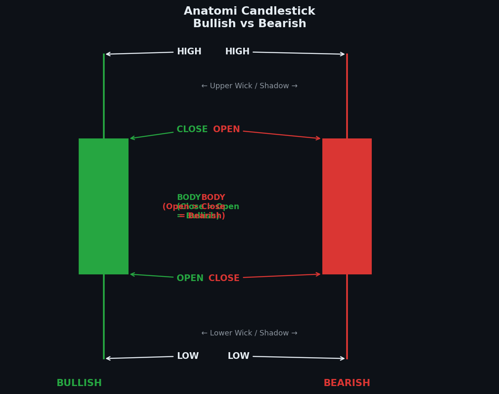

# Modul 01 — Anatomi Candlestick

> **Level**: 🟢 LOW | **Estimasi belajar**: 1 hari | **Latihan pair**: XAUUSD

---

## 1.1 Apa Itu Candlestick?

Candlestick adalah representasi visual dari pergerakan harga dalam satu periode waktu tertentu. Satu candle merekam empat informasi utama:

- **Open (O)** — harga pembukaan
- **High (H)** — harga tertinggi yang dicapai
- **Low (L)** — harga terendah yang dicapai
- **Close (C)** — harga penutupan

Candle pertama kali digunakan oleh pedagang beras Jepang pada abad ke-18. Hari ini, candlestick adalah standar visualisasi harga yang digunakan oleh hampir semua trader di seluruh dunia.

---

## 1.2 Open, High, Low, Close — Definisi Lengkap

### Open (O) — Harga Pembukaan

Harga Open adalah harga pertama transaksi yang terjadi saat periode candle dimulai.

Contoh XAUUSD H1:
- Candle jam 08:00 dibuka pada harga **2.045,50**
- Artinya: pada tepat jam 08:00:00, transaksi pertama terjadi di harga 2.045,50

**Apa yang mempengaruhi Open?**
- Open = Close dari candle sebelumnya (dalam kondisi normal)
- Jika ada gap (loncat harga), Open berbeda dari Close sebelumnya
- Di XAUUSD, gap sering terjadi saat market buka Senin (dari penutupan Jumat)

### High (H) — Harga Tertinggi

High adalah harga tertinggi yang dicapai selama periode candle berlangsung.

Contoh XAUUSD H1:
- Candle jam 08:00–09:00 mencapai harga tertinggi **2.051,80**
- Artinya: ada satu momen dalam satu jam itu buyer berhasil mendorong harga sampai 2.051,80
- Tapi kemudian harga turun kembali sebelum jam 09:00

**Penting:** High tidak harus berada di ujung candle. Bisa terjadi di menit pertama atau menit terakhir.

### Low (L) — Harga Terendah

Low adalah harga terendah yang dicapai selama periode candle berlangsung.

Contoh XAUUSD H1:
- Dalam periode yang sama, harga sempat turun ke **2.039,20**
- Seller berhasil mendorong harga turun sejauh itu
- Tapi buyer kemudian mendorong balik

### Close (C) — Harga Penutupan

Close adalah harga terakhir transaksi saat periode candle berakhir.

Contoh XAUUSD H1:
- Tepat jam 09:00:00, transaksi terakhir terjadi di harga **2.048,30**
- Ini menjadi harga penutupan candle jam 08:00

**Mengapa Close paling penting?**
Close adalah "keputusan akhir" dari pertarungan buyer vs seller dalam periode tersebut. Banyak sinyal teknikal bergantung pada posisi Close relatif terhadap Open.

---

## 1.3 Body vs Wick — Komponen Visual Candlestick

### Body (Badan Candle)

Body adalah area persegi panjang yang terbentuk antara harga Open dan harga Close.

```
Contoh Bullish Candle (Close > Open):

   |        ← Wick atas (Upper Shadow)
   |
┌──┴──┐
│     │    ← Body (dari Open ke Close)
│     │
└──┬──┘
   |        ← Wick bawah (Lower Shadow)
   |

Open  = bagian bawah body (misal: 2.045,50)
Close = bagian atas body  (misal: 2.048,30)
```

**Arti Body:**
- Body besar = pergerakan yang signifikan antara Open dan Close
- Body kecil = pergerakan minimal, ketidakpastian atau keseimbangan
- Posisi Close relatif terhadap Open menentukan warna candle

### Wick (Bayangan / Shadow)

Wick adalah garis tipis yang memanjang di atas dan/atau di bawah body.

**Upper Wick (Wick Atas):**
- Menunjukkan sampai mana harga berhasil naik sebelum ditolak
- Panjang upper wick = seberapa kuat penolakan dari atas
- Upper wick panjang = seller agresif menolak kenaikan

**Lower Wick (Wick Bawah):**
- Menunjukkan sampai mana harga berhasil turun sebelum ditolak
- Panjang lower wick = seberapa kuat penolakan dari bawah
- Lower wick panjang = buyer agresif menolak penurunan

**Rumus:**
```
Upper Wick = High - max(Open, Close)
Lower Wick = min(Open, Close) - Low
Body Size  = |Close - Open|
```

Contoh XAUUSD:
```
O = 2.045,50
H = 2.051,80
L = 2.039,20
C = 2.048,30

Body Size  = |2.048,30 - 2.045,50| = 2,80
Upper Wick = 2.051,80 - 2.048,30   = 3,50
Lower Wick = 2.045,50 - 2.039,20   = 6,30
```

Interpretasi: Lower wick paling panjang (6,30 poin) → ada penolakan kuat dari bawah → buyer menang saat harga turun ke 2.039,20.

---

## 1.4 Bullish vs Bearish Candle

### Bullish Candle (Candle Hijau / Putih)

**Kondisi:** Close > Open

```
   |
┌──┴──┐
│ +++ │    ← Bullish (warna hijau/putih)
│ +++ │
└──┬──┘
   |

Open  = 2.045,50 (bawah)
Close = 2.048,30 (atas)
```

Artinya: Harga penutupan LEBIH TINGGI dari harga pembukaan. Buyer menang dalam periode ini.

### Bearish Candle (Candle Merah / Hitam)

**Kondisi:** Close < Open

```
   |
┌──┴──┐
│ --- │    ← Bearish (warna merah/hitam)
│ --- │
└──┬──┘
   |

Open  = 2.048,30 (atas)
Close = 2.042,10 (bawah)
```

Artinya: Harga penutupan LEBIH RENDAH dari harga pembukaan. Seller menang dalam periode ini.

### Doji — Candle Netral

**Kondisi:** Close ≈ Open (hampir sama)

```
   |
   |
───┼───   ← Body sangat tipis atau tidak ada
   |
   |
```

Artinya: Buyer dan seller seimbang. Tidak ada pemenang. Sinyal ketidakpastian.

---

## 1.5 Ukuran Body dan Wick — Apa yang Ditunjukkan

### Ukuran Body

| Ukuran Body | Interpretasi |
|-------------|--------------|
| Besar (> 60% dari range candle) | Momentum kuat, satu pihak dominan |
| Sedang (30–60% dari range) | Pergerakan normal, ada perlawanan |
| Kecil (< 30% dari range) | Ketidakpastian, keseimbangan buyer-seller |
| Hampir tidak ada | Doji, keseimbangan sempurna |

Contoh XAUUSD:
- Candle dengan range 2.040–2.060 (20 poin)
- Body besar: Open 2.041, Close 2.058 (17 poin body = 85% dari range)
- Ini adalah candle momentum yang sangat kuat

### Ukuran Wick

| Ukuran Wick | Interpretasi |
|-------------|--------------|
| Wick atas panjang | Penolakan dari atas, seller kuat di area itu |
| Wick bawah panjang | Penolakan dari bawah, buyer kuat di area itu |
| Wick sangat kecil | Harga bergerak searah tanpa perlawanan |
| Kedua wick panjang | Ada pertarungan sengit di kedua arah |

**Wick di XAUUSD khususnya penting:**
- Gold sering membuat wick panjang karena volatilitasnya tinggi
- Wick di level round number (2.000, 2.050, 2.100) sering menandai area rejection institusional
- Wick panjang di area resistance = sinyal sell yang kuat
- Wick panjang di area support = sinyal buy yang kuat

---

## 1.6 Timeframe dan Artinya

Setiap candle mewakili satu periode waktu penuh. Pemahaman timeframe sangat penting karena ukuran "besar" itu relatif.

| Timeframe | Satu candle = | Digunakan untuk |
|-----------|---------------|-----------------|
| M1 | 1 menit | Scalping, eksekusi ultra-presisi |
| M5 | 5 menit | Scalping, entry presisi |
| M15 | 15 menit | Scalping-intraday, konfirmasi entry |
| M30 | 30 menit | Intraday analysis |
| H1 | 1 jam | Intraday, analisis struktur harian |
| H4 | 4 jam | Swing trading, analisis mingguan |
| D1 | 1 hari (24 jam) | Posisi trading, analisis bulanan |
| W1 | 1 minggu | Investment horizon |
| MN | 1 bulan | Macro analysis |

### D1 Candle XAUUSD — Satu Hari Penuh Aksi

Candle D1 pada XAUUSD merekam seluruh aktivitas trading dalam 24 jam, termasuk:
- Sesi Asia (volatilitas rendah, range sempit)
- Sesi London (volatilitas naik, sering terjadi breakout)
- Sesi New York (volatilitas tertinggi, sering ada pembalikan atau konfirmasi)

Satu candle D1 dengan range 2.030–2.080 (50 poin) berarti dalam satu hari ada pergerakan 50 poin atau $500 per lot standar.

### Hubungan Antar Timeframe

```
1 candle D1  = 6 candle H4
1 candle H4  = 4 candle H1
1 candle H1  = 4 candle M15
1 candle M15 = 3 candle M5
```

Implikasi: Jika kamu melihat candle H4 yang bullish besar, itu terdiri dari 4 candle H1. Mungkin saja 3 candle H1 bearish dan 1 candle H1 bullish yang sangat besar — hasilnya tetap H4 bullish.

---

## 1.7 Cara Membaca Candle Secara Cepat

Ketika melihat candle baru, tanyakan dalam urutan ini:

1. **Apa warnanya?** → Bullish atau Bearish?
2. **Seberapa besar bodynya?** → Kuat atau lemah?
3. **Ada wick?** → Di mana? Seberapa panjang?
4. **Di mana ini di chart?** → Support? Resistance? Tengah range?
5. **Apa candle sebelumnya?** → Konfirmasi atau kontradiksi?

---

## 📊 Chart: Anatomi Candlestick


*Gambar: Diagram lengkap komponen candlestick — Open, High, Low, Close, Body, Upper Wick, dan Lower Wick — dengan contoh bullish dan bearish candle pada XAUUSD*

---

## 1.8 Contoh Pembacaan Candle XAUUSD

### Contoh 1 — Candle Bullish Kuat

```
O = 2.052,00
H = 2.068,50
L = 2.050,20
C = 2.065,80

Body      = 2.065,80 - 2.052,00 = 13,80
Upper Wick = 2.068,50 - 2.065,80 = 2,70
Lower Wick = 2.052,00 - 2.050,20 = 1,80
Range total = 2.068,50 - 2.050,20 = 18,30
Body/Range  = 13,80 / 18,30 = 75%
```

**Interpretasi:** Candle bullish sangat kuat. Body mengisi 75% dari total range. Wick sangat kecil di kedua sisi. Buyer mendominasi penuh dari awal sampai akhir. Tidak ada perlawanan signifikan dari seller.

### Contoh 2 — Candle Bearish dengan Rejection Bawah

```
O = 2.078,00
H = 2.081,20
L = 2.055,40
C = 2.063,50

Body       = 2.078,00 - 2.063,50 = 14,50
Upper Wick = 2.081,20 - 2.078,00 = 3,20
Lower Wick = 2.063,50 - 2.055,40 = 8,10
Range total = 2.081,20 - 2.055,40 = 25,80
```

**Interpretasi:** Candle bearish, tapi ada lower wick yang cukup panjang (8,10 poin). Artinya seller sempat mendorong harga ke 2.055,40 tapi buyer melawan dan mendorong harga kembali ke 2.063,50. Seller menang secara keseluruhan (candle bearish), tapi buyer menunjukkan perlawanan di bawah.

### Contoh 3 — Doji

```
O = 2.070,50
H = 2.078,30
L = 2.062,10
C = 2.070,80

Body       = |2.070,80 - 2.070,50| = 0,30
Upper Wick = 2.078,30 - 2.070,80   = 7,50
Lower Wick = 2.070,50 - 2.062,10   = 8,40
```

**Interpretasi:** Doji hampir sempurna. Body hanya 0,30 poin dari range 16,20 poin. Buyer dan seller sama-sama agresif (wick panjang di kedua sisi) tapi tidak ada pemenang. Sinyal ketidakpastian yang kuat.

---

## 1.9 Latihan

> **Pair**: XAUUSD | **Timeframe**: H1

### Instruksi:

1. Buka TradingView, pilih chart XAUUSD H1
2. Pilih **10 candle secara acak** dari minggu lalu (bukan hari ini)
3. Untuk setiap candle, catat dalam tabel:

| # | Tanggal/Jam | Open | High | Low | Close | Body | Upper Wick | Lower Wick | Bullish/Bearish |
|---|-------------|------|------|-----|-------|------|------------|------------|-----------------|
| 1 | | | | | | | | | |
| 2 | | | | | | | | | |
| 3 | | | | | | | | | |
| ... | | | | | | | | | |

4. Hitung **Body/Range ratio** untuk setiap candle
5. Tentukan: candle mana yang paling "kuat"? Mengapa?

### Bonus:
- Dari 10 candle tersebut, candle mana yang memiliki wick paling panjang?
- Apa yang sedang terjadi pada harga saat candle itu terbentuk? (naik? turun? sideways?)

### Target Pencapaian:
- Kamu bisa mengidentifikasi O/H/L/C hanya dengan melihat candle (tanpa hover cursor)
- Kamu tahu tanpa berpikir: candle hijau = bullish, candle merah = bearish
- Kamu bisa menghitung ukuran body dan wick secara mental (estimasi)

---

**[← Kembali ke Index Candlestick](./README.md)** | **[→ Modul 02: Jenis-Jenis Candle](./02-jenis-candle.md)**
