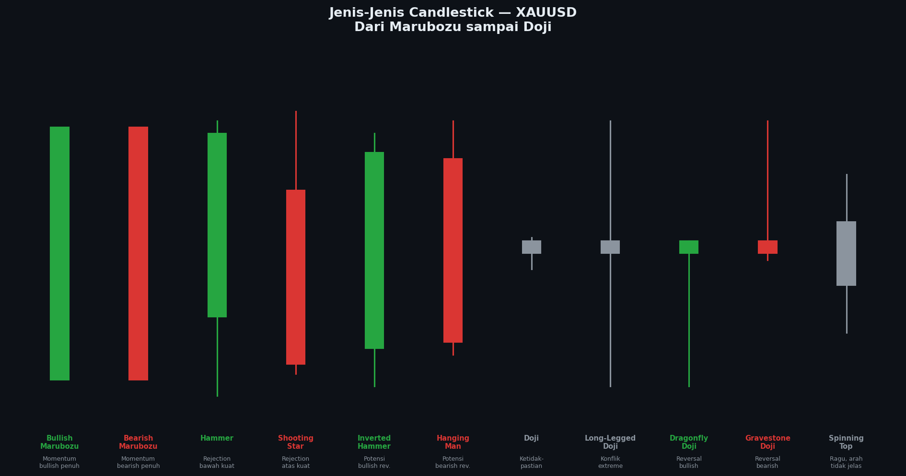

# Modul 02 — Jenis-Jenis Candlestick

> **Level**: 🟢 LOW | **Estimasi belajar**: 2 hari | **Latihan pair**: XAUUSD

---

## 2.1 Mengapa Perlu Tahu Jenis Candle?

Setiap jenis candle punya **kepribadian** berbeda — menceritakan kondisi pasar yang berbeda. Marubozu bercerita tentang dominasi penuh, Doji tentang keseimbangan, Hammer tentang penolakan keras dari bawah. Mengenali jenis candle adalah skill dasar yang wajib dikuasai sebelum analisis apapun.

---

## 📊 Chart: Jenis-Jenis Candlestick



*Gambar: 11 jenis candle utama dari Marubozu sampai Spinning Top. Perhatikan perbedaan ukuran body dan wick masing-masing.*

---

## 2.2 Marubozu — Candle Tanpa Kompromi

Marubozu adalah candle dengan **body sangat besar dan hampir tidak ada wick**. Menunjukkan satu pihak mendominasi penuh dari open sampai close.

```
Bullish Marubozu:        Bearish Marubozu:
    ┌───┐                    ┌───┐
    │███│ ← Close            │░░░│ ← Open
    │███│                    │░░░│
    │███│                    │░░░│
    └───┘ ← Open             └───┘ ← Close
(Tidak ada wick)         (Tidak ada wick)
```

| | Bullish Marubozu | Bearish Marubozu |
|--|-----------------|-----------------|
| **Artinya** | Buyer dominan penuh | Seller dominan penuh |
| **Di mana kuat** | Setelah sweep SSL, di OB bullish | Setelah sweep BSL, di OB bearish |
| **Sinyal** | Momentum naik sangat kuat | Momentum turun sangat kuat |

**Studi Kasus XAUUSD**: Saat NFP rilis dan data bagus, sering muncul Bearish Marubozu besar pada XAUUSD karena USD menguat drastis dalam satu candle M5.

---

## 2.3 Hammer & Hanging Man

Candle dengan **body kecil di atas** dan **wick bawah panjang** (minimal 2x body).

```
Hammer (di Support):     Hanging Man (di Resistance):
      ┌─┐                       ┌─┐
      │█│ ← Close/Body          │█│
      └─┘                       └─┘
       │                         │
       │ ← Wick panjang          │ ← Wick panjang
       │   (min 2x body)         │
```

| | Hammer | Hanging Man |
|--|--------|------------|
| **Lokasi** | Di zona Support / OB Bullish | Di zona Resistance / OB Bearish |
| **Sinyal** | Bullish reversal | Bearish reversal |
| **Konfirmasi** | Candle berikutnya bullish | Candle berikutnya bearish |
| **Pada XAUUSD** | Sering muncul di support 2000, 2050 | Sering muncul di resistance 2080, 2100 |

---

## 2.4 Shooting Star & Inverted Hammer

Kebalikan Hammer — body kecil di **bawah**, wick atas panjang.

```
Shooting Star (di Resistance):   Inverted Hammer (di Support):
        │                                │
        │ ← Wick atas panjang            │
       ┌─┐                             ┌─┐
       │█│ ← Body kecil                │█│
       └─┘                             └─┘
```

| | Shooting Star | Inverted Hammer |
|--|--------------|-----------------|
| **Lokasi** | Resistance / OB Bearish | Support / OB Bullish |
| **Sinyal** | Bearish reversal | Potensi bullish (lebih lemah dari Hammer) |
| **Wick** | Atas panjang = seller menolak harga tinggi | Atas panjang = ada upaya beli |

---

## 2.5 Doji — Keseimbangan Sempurna

Doji terbentuk ketika **Open ≈ Close** — buyer dan seller berakhir seimbang.

```
Standard Doji:    Long-legged Doji:   Dragonfly Doji:   Gravestone Doji:
      │                  │                              ─┬─
    ──┼──              ──┼──                  ┌─┐        │
      │                  │                   (kecil)     │
                         │              ─────┘           │
```

| Jenis Doji | Wick | Artinya |
|-----------|------|---------|
| **Standard** | Pendek dua sisi | Ketidakpastian ringan |
| **Long-legged** | Panjang dua sisi | Konflik ekstrem, mau kemana? |
| **Dragonfly** | Hanya bawah panjang | Seller gagal, potensi bullish |
| **Gravestone** | Hanya atas panjang | Buyer gagal, potensi bearish |

> **Catatan**: Doji **bukan sinyal mandiri**. Kuat hanya jika muncul di zona penting (OB, FVG, key level).

---

## 2.6 Spinning Top — Ketidakpastian Moderat

Body kecil dengan wick di kedua sisi yang lebih besar dari body.

```
    │
   ┌─┐
   │ │ ← Body kecil
   └─┘
    │
```

Artinya: Pasar tidak punya arah jelas. Sering muncul sebelum breakout atau di tengah konsolidasi.

---

## 2.7 Pin Bar — Penolakan Kuat

Pin Bar adalah nama lain untuk Hammer/Shooting Star dengan wick yang sangat panjang (min 3x body). Sangat signifikan dalam SnR dan SMC.

```
Bullish Pin Bar:          Bearish Pin Bar:
      ┌─┐                       │
      └─┘ ← Body sangat kecil   │ ← Wick sangat panjang
       │                       ┌─┐
       │                       └─┘
       │ ← Wick sangat panjang
```

**Kriteria Pin Bar yang valid di XAUUSD:**
- Wick minimal 3x panjang body
- Body berada di 1/3 atas atau bawah dari keseluruhan candle
- Muncul di zona kunci (OB, FVG, Support/Resistance)
- Candle sebelumnya menunjukkan momentum berlawanan

---

## 2.8 Displacement Candle (Khusus SMC/ICT)

Candle besar dengan momentum kuat — sering menciptakan FVG dan menandai awal pergerakan institusi.

```
Bullish Displacement:
    ┌──┐
    │██│ ← Body sangat besar
    │██│    (tidak ada / sedikit wick)
    │██│    Sering gap dari candle sebelumnya
    └──┘

Ciri:
- Body > 3x candle rata-rata
- Close mendekati High
- Terjadi dalam satu candle (burst momentum)
```

Dalam SMC: Displacement candle menciptakan **FVG** yang menjadi zona entry.

---

## 2.9 Cara Cepat Identifikasi di XAUUSD

| Situasi | Candle yang muncul | Interpretasi |
|---------|-------------------|--------------|
| Harga turun ke support 2000 | Hammer dengan wick panjang | Buyer menolak harga 2000, potensi naik |
| Harga naik ke resistance 2080 | Shooting Star | Seller menolak harga 2080, potensi turun |
| Setelah news NFP positif | Bearish Marubozu | USD kuat, Gold turun tajam |
| Konsolidasi sebelum breakout | Doji / Spinning Top | Pasar tidak punya arah, tunggu kejelasan |
| Setelah liquidity sweep | Bullish Pin Bar | Institusi beli setelah sweep SSL |

---

## 2.10 Latihan

> **Pair**: XAUUSD | **Timeframe**: H4

**Tugas:**
1. Buka TradingView → XAUUSD → H4
2. Scroll ke belakang 1 bulan
3. Identifikasi dan tandai:
   - Semua **Hammer / Pin Bar Bullish** yang muncul
   - Semua **Shooting Star / Pin Bar Bearish** yang muncul
   - Minimal 3 **Doji** yang muncul
4. Untuk setiap candle yang ditemukan, catat:
   - Di zona apa candle itu muncul? (Support? Resistance? OB?)
   - Apa yang terjadi setelah candle tersebut?
5. Hitung: berapa % Hammer yang diikuti kenaikan?

**Target**: Temukan minimal 5 contoh untuk setiap jenis.

---

**[← 01 Anatomi](./01-anatomi-candlestick.md)** | **[→ 03 Pola Dua Candle](./03-pola-dua-candle.md)**
