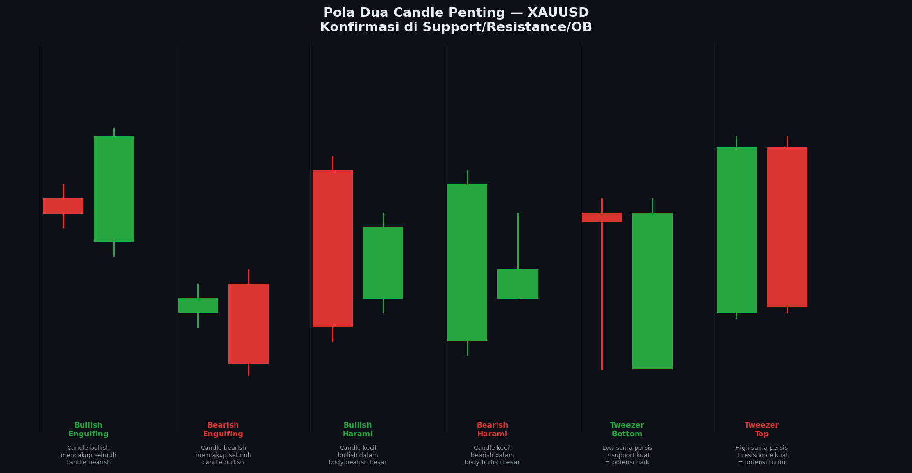

# Modul 03 — Pola Dua Candle

> **Level**: 🟡 MEDIUM | **Estimasi belajar**: 2 hari | **Latihan pair**: XAUUSD

---

## 3.1 Mengapa Pola Dua Candle Lebih Kuat?

Satu candle bisa berdiri sendiri, tapi dua candle berurutan mencerminkan **perubahan momentum yang lebih terukur**. Pola dua candle lebih banyak digunakan karena memberikan konfirmasi tambahan sebelum entry.

---

## 📊 Chart: Pola Dua Candle



*Gambar: 6 pola dua candle paling penting. Perhatikan bagaimana candle kedua mengkonfirmasi atau membalik momentum candle pertama.*

---

## 3.2 Bullish Engulfing

Candle bullish (kedua) yang **body-nya mencakup seluruh body** candle bearish sebelumnya.

```
Sebelum:          Sesudah:
  ┌─┐              ┌───┐
  │░│ (bearish)    │███│ ← body lebih besar
  └─┘              │███│   dari candle pertama
                   └───┘
Syarat valid:
✓ Candle 1: bearish (merah)
✓ Candle 2: bullish, body mencakup seluruh body candle 1
✓ Lokasi: di zona support / OB bullish / FVG
✓ HTF bias: bullish
```

**Studi Kasus — XAUUSD H1:**
```
Situasi: Harga pullback ke OB bullish di 2028-2035 (H4 uptrend)

Candle 14:15 WIB: Bearish, O=2034, H=2036, L=2028, C=2030
Candle 14:30 WIB: BULLISH ENGULFING — O=2029, H=2042, L=2027, C=2041

→ Body C2 (2029-2041) mencakup body C1 (2030-2034) ✓
→ Candle engulfing terjadi tepat di dalam OB ✓
→ Entry BUY: 2041 | SL: 2025 | TP: 2058 | RR 1:1.06 → minimal
→ Lebih baik: Entry di 2038 (saat candle C3 open) → RR 1:1.5
```

---

## 3.3 Bearish Engulfing

Kebalikan — candle bearish mencakup seluruh body candle bullish.

```
Sebelum:          Sesudah:
  ┌─┐              ┌───┐
  │█│ (bullish)    │░░░│ ← body lebih besar
  └─┘              │░░░│
                   └───┘
Lokasi terbaik: OB bearish, resistance, FVG bearish
```

---

## 3.4 Bullish Harami

Candle bullish **kecil** yang body-nya berada **di dalam** body candle bearish besar sebelumnya.

```
  ┌────┐   ← Candle 1: Bearish besar
  │░░░░│
  │░░░░│
  │ ┌─┐│   ← Candle 2: Bullish kecil (body dalam C1)
  │ │█││
  │ └─┘│
  └────┘

Artinya: Momentum bearish melemah, ada potensi reversal
Lebih lemah dari Engulfing — butuh konfirmasi candle ke-3
```

---

## 3.5 Bearish Harami

Candle bearish kecil dalam body candle bullish besar.

```
  ┌────┐
  │████│ ← Candle 1: Bullish besar
  │ ┌─┐│
  │ │░││ ← Candle 2: Bearish kecil
  │ └─┘│
  └────┘
```

---

## 3.6 Tweezer Bottom (Bullish)

Dua candle dengan **Low yang hampir sama persis** — menunjukkan level support yang sangat kuat.

```
       │              │
    ┌─┐│           ┌─┐│
    │░││           │█││ ← C2 bullish
    └─┘│           └─┘│
───────┼───────────────┼──── ← Level Low yang sama (Support kuat)
    Low C1          Low C2
```

**Mengapa kuat?**
- Low yang sama = harga dua kali ditolak di level yang persis sama
- Ini berarti ada banyak order beli di level tersebut
- Dalam SMC: ini adalah **Equal Lows (EQL)** yang menjadi SSL — biasanya di-sweep dulu sebelum naik

---

## 3.7 Tweezer Top (Bearish)

Dua candle dengan **High yang hampir sama** — resistance sangat kuat.

```
────┼───────────────────┼──── ← Level High yang sama (Resistance)
    │              │
    │┌─┐           │┌─┐
    ││█│           ││░│ ← C2 bearish
    │└─┘           │└─┘
```

**Dalam SMC**: Tweezer Top = Equal Highs (EQH) = BSL yang akan di-sweep institusi.

---

## 3.8 Dark Cloud Cover & Piercing Line

### Dark Cloud Cover (Bearish)
```
      ┌───┐
      │███│ ← C1: Bullish besar
      └─┬─┘
        │
     ┌──┴──┐ ← C2 open di atas C1 high
     │░░░░░│   tapi close menembus 50% C1
     └─────┘
```
Sinyal: Rally gagal, seller mengambil alih

### Piercing Line (Bullish — kebalikan)
```
  ┌─────┐ ← C1: Bearish besar
  │░░░░░│
  └──┬──┘
     │
  ┌──┴──┐ ← C2 open di bawah C1 low
  │█████│   tapi close menembus 50% C1
  └─────┘
```
Sinyal: Penurunan gagal, buyer masuk kuat

---

## 3.9 Pola Dua Candle + Konfluensi SMC

Pola dua candle paling valid ketika dikombinasikan dengan:

| Kondisi | Pola yang Dicari |
|---------|-----------------|
| HTF bullish + OB bullish | Bullish Engulfing di dalam OB |
| HTF bearish + OB bearish | Bearish Engulfing di dalam OB |
| Setelah SSL sweep | Bullish Engulfing / Tweezer Bottom |
| Setelah BSL sweep | Bearish Engulfing / Tweezer Top |
| Di FVG bullish | Bullish Harami atau Engulfing |

---

## 3.10 Latihan

> **Pair**: XAUUSD | **Timeframe**: D1

**Tugas:**
1. Buka XAUUSD D1, scroll 3 bulan ke belakang
2. Cari dan tandai semua **Bullish Engulfing** yang valid (di zona support)
3. Cari dan tandai semua **Bearish Engulfing** yang valid (di zona resistance)
4. Untuk setiap pola, catat:
   - Lokasi (di zona apa?)
   - Apa yang terjadi dalam 3-5 candle setelahnya?
   - Apakah ada konfirmasi dari HTF bias?
5. Hitung win rate: berapa % yang dilanjutkan ke arah yang benar?

**Target**: Minimal 5 Bullish Engulfing dan 5 Bearish Engulfing.

---

**[← 02 Jenis Candle](./02-jenis-candle.md)** | **[→ 04 Pola Tiga Candle](./04-pola-tiga-candle.md)**
