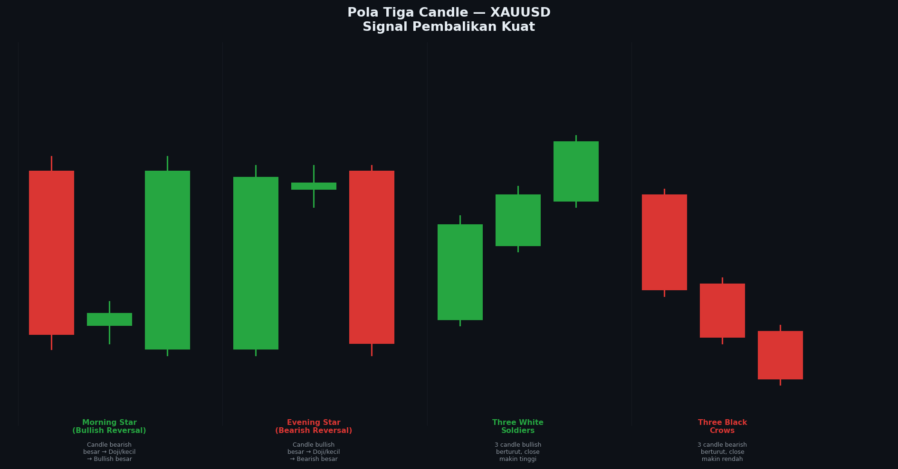

# Modul 04 — Pola Tiga Candle

> **Level**: 🟡 MEDIUM | **Estimasi belajar**: 2 hari | **Latihan pair**: XAUUSD

---

## 4.1 Kekuatan Pola Tiga Candle

Pola tiga candle memberikan konfirmasi yang lebih kuat karena **tiga periode harga berturut-turut** mengkonfirmasi perubahan sentiment. Ini mengurangi false signal dibanding pola satu atau dua candle.

---

## 📊 Chart: Pola Tiga Candle



*Gambar: Morning Star, Evening Star, Three White Soldiers, Three Black Crows — empat pola tiga candle paling penting dalam trading.*

---

## 4.2 Morning Star (Bullish Reversal)

Pola tiga candle yang menandai pembalikan dari bearish ke bullish.

```
Struktur:
Candle 1: ┌─────┐ Bearish besar (momentum turun kuat)
           │░░░░░│
           └─────┘
Candle 2:    ┌─┐   Kecil / Doji (momentum melemah, ragu)
             │ │
             └─┘
Candle 3:  ┌─────┐ Bullish besar (buyer mengambil alih)
           │█████│ Close minimal di atas 50% body C1
           └─────┘

Studi Kasus XAUUSD H4:
───────────────────────────────────────────────
D1:  2050  ─────────────────────── ← Support D1 kuat
           
H4:
C1:  O=2065, H=2068, L=2048, C=2050  ← Bearish besar
C2:  O=2050, H=2054, L=2046, C=2051  ← Doji / spinning top
C3:  O=2051, H=2075, L=2049, C=2073  ← Bullish besar ✓

Close C3 (2073) > 50% body C1 (2057) ✓
Lokasi: Support D1 ✓
Entry: 2073 (close C3)
SL:   2044 (di bawah Low C2)
TP:   2102 (resistance berikutnya)
RR:   1:1.0 (minimal) → cari TP lebih jauh
```

**Syarat valid Morning Star:**
- C1 harus bearish yang cukup besar
- C2 harus kecil (body kecil / doji) dan ada gap dengan C1
- C3 harus bullish dan close minimal 50% ke dalam body C1
- Lokasi harus di zona support / HTF key level

---

## 4.3 Evening Star (Bearish Reversal)

Kebalikan Morning Star — pembalikan dari bullish ke bearish.

```
Candle 1: ┌─────┐ Bullish besar
           │█████│
           └─────┘
Candle 2:    ┌─┐   Kecil / Doji
             │ │
             └─┘
Candle 3:  ┌─────┐ Bearish besar
           │░░░░░│ Close minimal 50% ke dalam body C1
           └─────┘

Lokasi terbaik: Resistance / OB bearish HTF
```

---

## 4.4 Three White Soldiers (Bullish Continuation)

Tiga candle bullish berturut-turut, masing-masing close lebih tinggi.

```
                ┌──┐
           ┌──┐ │██│
      ┌──┐ │██│ │██│
      │██│ │██│ │██│
      └──┘ └──┘ └──┘
C1         C2    C3

Syarat valid:
✓ Setiap candle: bullish, body relatif besar
✓ Setiap open: di dalam body candle sebelumnya (tidak gap besar)
✓ Setiap close: lebih tinggi dari close sebelumnya
✓ Minimal wick (tidak ada rejection)
```

**Artinya**: Buyer sangat kuat dan konsisten selama tiga periode.
**Pada XAUUSD**: Sering muncul setelah major support bounce atau setelah data ekonomi positif untuk Gold.

---

## 4.5 Three Black Crows (Bearish Continuation)

Tiga candle bearish berturut-turut, masing-masing close lebih rendah.

```
      ┌──┐ ┌──┐
      │░░│ │░░│ ┌──┐
      │░░│ │░░│ │░░│
      └──┘ │░░│ │░░│
           └──┘ │░░│
                └──┘
C1    C2         C3
```

**Peringatan**: Three Black Crows setelah long uptrend = tanda exhaustion yang sangat kuat.

---

## 4.6 Three Inside Up (Bullish)

Variasi Harami yang dikonfirmasi candle ketiga:

```
C1: ┌─────┐ Bearish besar
    │░░░░░│
    └──┬──┘
C2:   ┌┴┐   Bullish kecil dalam C1 (Harami)
      │█│
      └─┘
C3: ┌─────┐ Bullish yang close di atas High C1
    │█████│ ← Konfirmasi! Ini yang membedakan
    └─────┘ dari sekadar Harami
```

---

## 4.7 Three Inside Down (Bearish)

Kebalikan — Bearish Harami dikonfirmasi candle ketiga yang close di bawah Low C1.

---

## 4.8 Pola Tiga Candle dalam Konteks XAUUSD

### Waktu Terbaik Menemukan Pola Ini:
- **Morning Star di XAUUSD**: Sering setelah penurunan tajam ke support, terutama saat London open (14:00 WIB)
- **Evening Star**: Sering di resistance setelah rally NY session
- **Three White Soldiers**: Setelah data ekonomi US buruk (USD lemah = Gold naik 3 candle berturut)
- **Three Black Crows**: Setelah Fed hawkish statement atau CPI tinggi

### Timeframe Terbaik:
- H4 dan H1 paling reliable untuk pola ini
- D1 memberikan sinyal terkuat tapi entry terlambat
- M15 terlalu banyak noise

---

## 4.9 Latihan

> **Pair**: XAUUSD | **Timeframe**: H4

**Tugas:**
1. Buka XAUUSD H4, scroll 2 bulan ke belakang
2. Identifikasi semua **Morning Star** yang terbentuk:
   - Apakah di zona support / key level?
   - Berapa candle setelahnya terus naik?
3. Identifikasi semua **Evening Star**:
   - Di zona resistance mana?
4. Cari minimal 1 contoh **Three White Soldiers** dan **Three Black Crows**
5. Screenshot setiap pola yang ditemukan

**Bonus**: Cek apakah setiap pola yang valid didahului oleh liquidity sweep (wick panjang sebelum C1).

---

**[← 03 Pola Dua Candle](./03-pola-dua-candle.md)** | **[→ 05 Candle dalam Konteks](./05-candle-dalam-konteks.md)**
