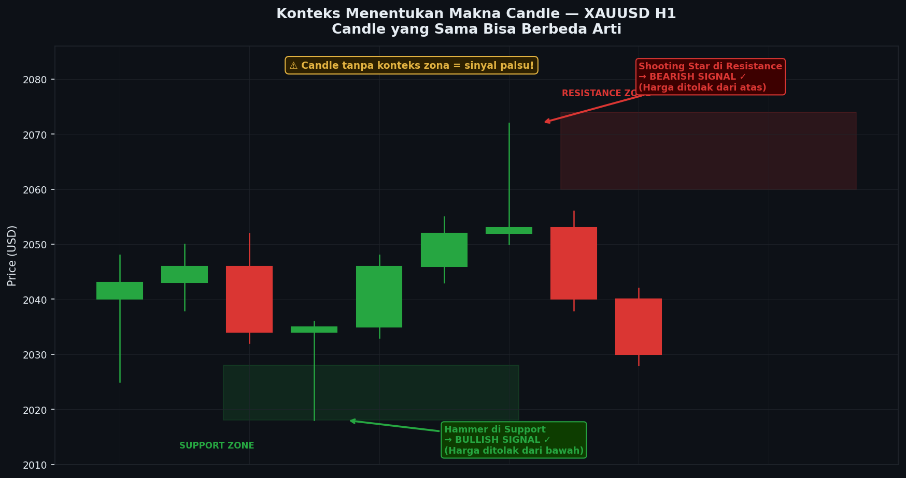

# Modul 05 — Candle dalam Konteks

> **Level**: 🔴 HIGH | **Estimasi belajar**: 3 hari | **Latihan pair**: XAUUSD

---

## 5.1 Konteks adalah Segalanya

Candle yang sama bisa berarti **beli** di satu situasi dan **jual** di situasi lain. Tanpa konteks, analisis candle hanya tebak-tebakan.

> "Bukan candle apa yang muncul — tapi **di mana** candle itu muncul."

---

## 📊 Chart: Konteks Menentukan Makna



*Gambar: Hammer yang sama muncul di dua tempat berbeda — di support (bullish signal valid) dan di resistance (signal lemah/invalid). Lokasi menentukan segalanya.*

---

## 5.2 Lima Konteks Utama

### Konteks 1: Candle di Support / Resistance
```
DI SUPPORT:                    DI RESISTANCE:
─────────── Support ───────   ──────── Resistance ────
      │                               ┌─┐
     ┌─┐   ← Hammer                  │░│ ← Shooting Star
     └─┘     = BULLISH ✓             └─┘   = BEARISH ✓
      │

DI TENGAH RANGE (tidak ada zona):
  ┌─┐  ← Hammer tapi di tengah range
  └─┘    = SINYAL LEMAH, abaikan
   │
```

### Konteks 2: Candle di Order Block (OB)
```
XAUUSD H1 — Candle di Bullish OB:

OB High: 2038 ─────────────────────────────
OB Low:  2030 ─ [OB Zone] ─────────────────
                    │
              ┌─┐   │ ← Hammer muncul DI DALAM OB
              │█│───┘   = Konfirmasi kuat untuk BUY
              └─┘        (OB + Candle = Konfluensi)
               │ (wick ke bawah OB, tapi close di atas)
```

### Konteks 3: Candle di FVG
```
FVG Top: 2045 ─────────────────────────────
            [FVG Zone]
FVG Bot: 2035 ─────────────────────────────
                    │
              ┌─┐   │ ← Bullish Engulfing di dalam FVG
              │█│───┘   = Market mengisi FVG lalu bounce
              └─┘        = Entry BUY valid
```

### Konteks 4: Candle setelah Liquidity Sweep
```
      ──── SSL ────
            │   ← Harga turun, sweep SSL
           ┌─┐
           │ │  ← Wick panjang ke bawah SSL
           └─┘  ← Body close kembali di atas SSL
Candle ini = Pin Bar setelah sweep = ENTRY TERKUAT
```

### Konteks 5: Candle dalam Trend
```
UPTREND → Bullish candle lebih bermakna dari bearish:
HH
   \   → Koreksi (bearish candle)
    HL
      \
       → Candle bullish di HL = BELI

DOWNTREND → Bearish candle lebih bermakna dari bullish:
LH
  \
   → Koreksi (bullish candle) = abaikan
LH
  \
   LL → Candle bearish di LH = JUAL
```

---

## 5.3 Displacement Candle — Candle Paling Penting SMC

Displacement candle adalah candle besar yang menciptakan **ketidakseimbangan (imbalance)** — sering menjadi awal dari pergerakan institusi.

```
Ciri Displacement Candle:

Normal candles:  Displacement:
   ┌─┐               ┌──┐
   │ │               │██│ ← Body minimal 3x rata-rata
   └─┘               │██│   Close mendekati extreme
   ┌─┐               │██│   Sedikit atau tidak ada wick
   │ │               └──┘
   └─┘
   ┌─┐
   │ │
   └─┘
```

**Yang terjadi setelah Displacement Candle:**
1. FVG terbentuk (celah antara wick C-1 dan wick C+1)
2. Harga kemungkinan besar akan kembali mengisi FVG tersebut
3. Entry terbaik: saat harga balik ke FVG

---

## 5.4 Rejection Candle — Penolakan Institusi

Rejection candle menunjukkan bahwa institusi **menolak harga** di level tertentu.

```
Wick ke Supply Zone:          Wick ke Demand Zone:
        │                           
    ┌─┐ │ ← Wick ke atas          ┌─┐
    │█│─┘   (Seller menolak)      │░│
    └─┘                           └─┘
                                   │
                                   │ ← Wick ke bawah
                                   │   (Buyer menolak)
```

**Wick Analysis di XAUUSD:**

| Wick ke | Level yang Dicapai | Artinya |
|---------|-------------------|---------|
| Atas | Round number 2100 | Seller kuat di 2100 |
| Bawah | Support 2000 | Buyer kuat di 2000 |
| Atas | OB bearish H4 | Konfirmasi OB valid |
| Bawah | SSL (EQL) | Sweep likuiditas terjadi |

---

## 5.5 Candle Size Context

Ukuran candle **relatif terhadap candle sekitarnya** juga penting:

```
Candle Kecil dalam Ranging:
┌─┐┌─┐┌─┐┌─┐┌─┐  ← Semua kecil = tidak ada momentum = hindari
└─┘└─┘└─┘└─┘└─┘

Candle Kecil diikuti Candle Besar:
┌─┐┌─┐     ┌───┐ ← Besar tiba-tiba = breakout / momentum dimulai
└─┘└─┘     │███│
           └───┘

Candle Makin Kecil (dalam trend):
┌──┐  ┌─┐  ┌┐    ← Trend melemah = hati-hati reversal
│██│  │█│  ││
└──┘  └─┘  └┘
```

---

## 5.6 Studi Kasus: 5 Candle XAUUSD H1

```
Situasi: XAUUSD H1, Rabu 14:00-19:00 WIB (London + NY)
HTF Bias (H4): Bullish — harga dalam pullback ke OB H4

═══════════════════════════════════════════════════════
14:00 │ Bearish medium: O=2038, H=2040, L=2032, C=2033
      │ Interpretasi: Pullback berlanjut ke bawah. Belum entry.
      │
15:00 │ Bearish kecil: O=2033, H=2034, L=2028, C=2030
      │ Interpretasi: Momentum turun melemah (candle lebih kecil).
      │ Harga mendekati OB H4 zone (2026-2032).
      │
16:00 │ Hammer: O=2030, H=2032, L=2020, C=2031
      │ Interpretasi: KUAT! Wick ke 2020 (sweep SSL), 
      │ body close kembali di atas 2028 (dalam OB).
      │ = Liquidity sweep + Candle konfirmasi di OB!
      │ → ENTRY BUY di Close: 2031
      │
17:00 │ Bullish engulfing: O=2030, H=2044, L=2029, C=2043
      │ Interpretasi: Konfirmasi kuat — CISD terjadi!
      │ Body mencakup seluruh body candle sebelumnya.
      │ → Move SL ke 2025 (bawah sweep)
      │
18:00 │ Bullish marubozu: O=2043, H=2056, L=2042, C=2055
      │ Interpretasi: Momentum kuat, tidak ada wick besar.
      │ Institusi mendorong harga. Biarkan profit jalan.
═══════════════════════════════════════════════════════

Entry: 2031 | SL: 2018 | TP: 2062 | RR: 1:2.4 ✓
```

---

## 5.7 Latihan

> **Pair**: XAUUSD | **Timeframe**: H1

**Tugas:**
1. Pilih 3 hari trading minggu lalu di XAUUSD H1
2. Untuk setiap hari, identifikasi:
   - Semua **displacement candle** yang terjadi
   - Semua **rejection candle** (wick panjang di zona kunci)
   - Candle yang muncul **dalam OB atau FVG**
3. Tulis "cerita" dari candle-candle tersebut — apa yang terjadi, siapa yang menang, kenapa
4. Apakah ada setup entry yang valid dari candle-candle ini?

---

**[← 04 Pola Tiga Candle](./04-pola-tiga-candle.md)** | **[→ 06 Psikologi Candle](./06-psikologi-candle.md)**
