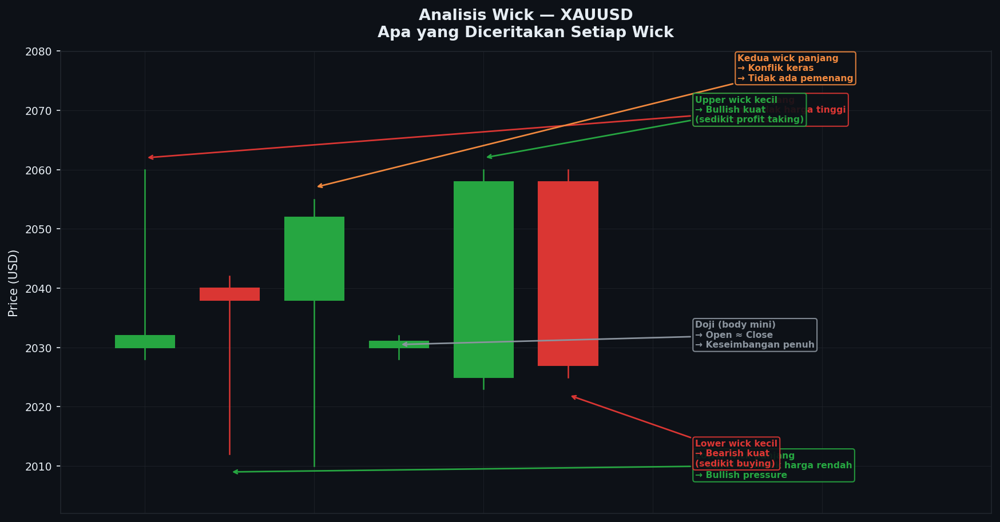

# Modul 06 — Psikologi Candlestick

> **Level**: 🔴 HIGH | **Estimasi belajar**: 3 hari | **Latihan pair**: XAUUSD

---

## 6.1 Setiap Candle adalah Sebuah Cerita

Bayangkan setiap candle sebagai **episode pertarungan** antara buyer (bull) dan seller (bear). Open adalah bel tanda pertarungan dimulai, dan Close adalah bel tanda pertarungan berakhir.

```
Timeline satu candle H1 (1 jam):

00:00 → Open (pertarungan dimulai)
  ↓
Fluktuasi (buyer dan seller saling dorong)
  ↓
59:59 → Close (pertarungan berakhir)
         Siapa yang menang?
```

---

## 📊 Chart: Analisis Wick



*Gambar: Enam jenis candle dengan wick berbeda — setiap wick menceritakan apa yang terjadi selama periode tersebut. Upper wick = seller menolak, Lower wick = buyer menolak.*

---

## 6.2 Membaca Psikologi dari Wick

### Upper Wick Panjang
```
      │ ← Harga naik ke sini (buyer push ke atas)
     ┌─┐
     │ │ ← Tapi close jauh di bawah high
     └─┘

Cerita: "Buyer mencoba naik ke atas, tapi seller datang dengan
kuat dan mendorong harga kembali ke bawah sebelum candle close.
Seller MENANG di bagian atas."

Pada XAUUSD: Jika upper wick menyentuh resistance (misal 2080),
ini berarti ada banyak order sell di area tersebut.
```

### Lower Wick Panjang
```
     ┌─┐
     │ │ ← Close jauh di atas low
     └─┘
      │ ← Harga turun ke sini (seller push ke bawah)

Cerita: "Seller mencoba turun lebih dalam, tapi buyer datang
kuat dari bawah dan mendorong kembali ke atas. Buyer MENANG
di bagian bawah."

Pada XAUUSD: Lower wick panjang di support 2000 = buyer institusi
masuk besar-besaran di level tersebut.
```

### Kedua Wick Panjang (Long-Legged Doji)
```
      │
     ┌─┐
     │ │ ← Body kecil di tengah
     └─┘
      │

Cerita: "Buyer push ke atas → seller dorong balik. Seller push ke
bawah → buyer dorong balik. Dua kali pertarungan ekstrem, tidak ada
yang menang. Kebingungan total."

Biasanya terjadi: Sebelum major news, atau saat market menunggu
keputusan besar (misal sebelum FOMC).
```

---

## 6.3 Membaca "Cerita" dari 5 Candle Berturut

Ini adalah skill paling berharga dalam membaca candlestick.

### Contoh 1: Trend Melemah Lalu Reversal
```
XAUUSD H1 — Downtrend melemah:

Candle 1: ┌──┐ Bearish besar, tidak ada wick
           │░░│ "Seller sangat dominan, tidak ada perlawanan"
           └──┘

Candle 2: ┌─┐  Bearish sedang, ada lower wick kecil
           │░│  "Seller masih dominan, tapi buyer mulai muncul"
           └─┘
            │

Candle 3: ┌─┐  Bearish kecil, lower wick lebih panjang
           │░│  "Seller melemah, buyer semakin kuat dari bawah"
           └─┘
            │
            │ (wick lebih panjang)

Candle 4:   │   Doji / Spinning Top
           ┌─┐  "Pertarungan seimbang — momentum bearish habis"
           └─┘
            │

Candle 5: ┌──┐  Bullish besar!
           │██│  "Buyer mengambil alih sepenuhnya — REVERSAL!"
           └──┘

→ Entry BUY di close candle 5
```

### Contoh 2: Uptrend Melanjut (Pullback Normal)
```
XAUUSD H4 — Pullback dalam uptrend:

Candle 1-3: Bullish progression (HH/HL)
             "Trend naik kuat"

Candle 4: ┌─┐  Bearish sedang (koreksi)
           │░│  "Profit taking — NORMAL dalam uptrend"
           └─┘

Candle 5: ┌─┐  Bearish kecil dengan lower wick panjang
           │ │  "Koreksi melemah, buyer mulai masuk di bawah"
           └─┘
            │

→ Ini adalah pullback ke HL — cari OB/FVG di area ini untuk BUY
```

---

## 6.4 Volume Implication dari Candle

Meski kita tidak selalu punya data volume, ukuran candle memberikan **proxy volume**:

| Ukuran Candle | Implied Volume | Artinya |
|--------------|----------------|---------|
| Sangat besar | Volume tinggi | Institusi aktif |
| Sedang | Volume normal | Retail aktif |
| Sangat kecil | Volume rendah | Pasar tidak ada yang mau gerak |
| Makin mengecil | Volume menurun | Momentum habis |

---

## 6.5 Psikologi Retail vs Institusi dari Candle

```
Retail trader melihat candle bearish besar → TAKUT, JUAL
Institusi melihat candle bearish besar turun ke support → BELI

Retail trader melihat candle bullish naik → EUPHORIA, BELI
Institusi melihat candle bullish mencapai resistance → JUAL

Itulah mengapa:
- Harga sering sweep low (retail stop loss bawah) lalu naik
- Harga sering sweep high (retail stop loss atas) lalu turun
```

---

## 6.6 Studi Kasus: Membaca Cerita XAUUSD London Open

```
XAUUSD M15 — Selasa, London Kill Zone (14:00-16:30 WIB)
HTF: H4 uptrend, pullback ke OB H4 di 2025-2032

14:00 ┌─┐  Bearish kecil (2038→2035)
       │░│  "Market masih dalam bearish delivery, belum ada signal"
       └─┘

14:15 ┌─┐  Bearish kecil (2035→2032)
       │░│  "Turun perlahan ke zona OB"
       └─┘

14:30  │    Candle turun ke 2025, wick panjang ke bawah
      ┌─┐   Close di 2031
      │█│   "BUYER MUNCUL KUAT! Wick panjang ke bawah OB,
      └─┘    close kembali di dalam OB — REJECTION dari bawah"
       │
       └── SSL di 2028 di-sweep! ← Ini adalah SIGNAL

14:45 ┌──┐  Bullish besar (2031→2044)
      │██│  "CISD terjadi! Close melewati swing high sebelumnya.
      └──┘   Delivery berubah dari bearish ke bullish."

15:00 ┌─┐   Bullish kecil (2044→2048)
      │█│   "Konfirmasi — harga tidak kembali turun"
      └─┘

15:15 ┌──┐  Bullish besar (2048→2058)
      │██│  "Momentum kuat berlanjut — institusi sedang push"
      └──┘

═══════════════════════════════════════════════════
Entry: 2044 (close candle CISD 14:45)
SL:   2023 (di bawah wick candle 14:30)
TP:   2064 (BSL terdekat)
RR:   1:0.95 → terlalu kecil
Better TP: 2070 → RR 1:1.2 (masih kecil)
Best TP:   2082 (next BSL) → RR 1:1.8 ✓
```

---

## 6.7 Latihan

> **Pair**: XAUUSD | **Timeframe**: H1

**Tugas:**
1. Setiap hari selama 1 minggu, pilih **5 candle berurutan** di H1
2. Tulis "cerita" dari masing-masing candle dalam 1-2 kalimat
3. Tentukan: buyer atau seller yang menang di setiap candle?
4. Prediksi: berdasarkan 5 candle tersebut, candle ke-6 kemungkinan besar seperti apa?
5. Cek apakah prediksimu benar

**Contoh format:**
```
Tanggal: [isi]
Candle 1 (14:00): Bearish sedang, wick bawah kecil
  → Cerita: Seller dominan, buyer mencoba tapi lemah
Candle 2 (15:00): ...
...
Prediksi candle 6: Bullish, karena...
Hasil aktual: [isi setelah cek]
```

---

## 6.8 Kesimpulan Modul Candlestick

Setelah menyelesaikan semua 6 modul Candlestick, kamu seharusnya bisa:

- ✅ Membaca O/H/L/C dari setiap candle
- ✅ Mengidentifikasi 10+ jenis candle dan artinya
- ✅ Mengenali pola dua dan tiga candle
- ✅ Membaca candle **dalam konteks zona** (bukan isolasi)
- ✅ Menceritakan "psikologi" dari serangkaian candle
- ✅ Mengidentifikasi displacement dan rejection candle

**Langkah selanjutnya**: [Market Structure →](../Market-Structure/README.md)

---

**[← 05 Candle dalam Konteks](./05-candle-dalam-konteks.md)** | **[→ Market Structure](../Market-Structure/README.md)**
