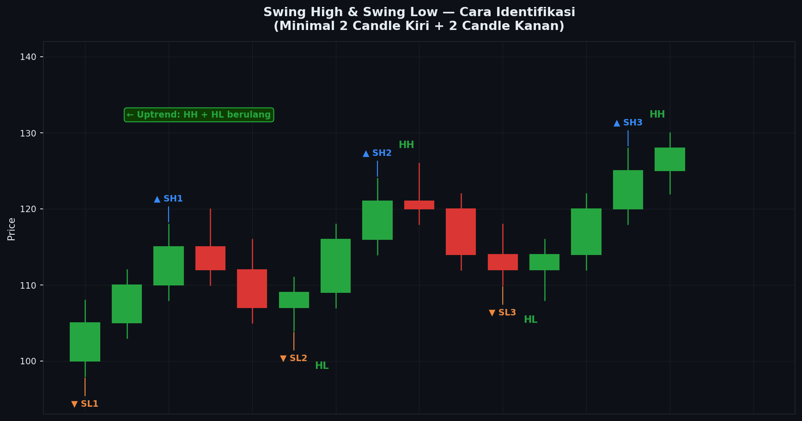

# Modul 01 — Swing High & Swing Low

> **Level**: 🟢 LOW | **Estimasi belajar**: 1 hari | **Latihan pair**: XAUUSD

---

## 1.1 Definisi Swing High dan Swing Low

Swing High dan Swing Low adalah titik-titik ekstrem harga yang membentuk "pola gunung dan lembah" pada chart. Ini adalah komponen paling dasar dari Market Structure.

### Swing High (SH)

Swing High adalah titik di mana harga mencapai level tertinggi lokal — lalu berbalik turun. Secara visual, terlihat seperti "puncak gunung" di chart.

**Definisi teknis:** Sebuah candle memiliki High yang lebih tinggi dari High candle-candle di sekitarnya (kanan dan kiri).

```
         *          ← Swing High (High paling tinggi dalam area ini)
        / \
       /   \
──────/     \──────
```

### Swing Low (SL)

Swing Low adalah titik di mana harga mencapai level terendah lokal — lalu berbalik naik. Secara visual, terlihat seperti "lembah" di chart.

**Definisi teknis:** Sebuah candle memiliki Low yang lebih rendah dari Low candle-candle di sekitarnya.

```
──────\     /──────
       \   /
        \ /
         *          ← Swing Low (Low paling rendah dalam area ini)
```

---

## 1.2 Aturan Identifikasi — Berapa Candle Konfirmasi?

Ini adalah pertanyaan yang paling sering membingungkan trader pemula. Berapa candle yang dibutuhkan untuk mengkonfirmasi sebuah swing point?

### Metode 2-Candle (Dasar)

Paling sederhana: candle tengah adalah Swing High jika High-nya lebih tinggi dari High candle kiri DAN candle kanan.

```
Swing High dengan 2 candle konfirmasi:

     H
    /|\
   / | \
  /  |  \
 /   |   \
C1   SH   C2

SH valid jika: High(SH) > High(C1) DAN High(SH) > High(C2)
```

### Metode 3-Candle (Standar)

Lebih reliable: candle tengah adalah Swing High jika High-nya lebih tinggi dari **2 candle di kiri DAN 2 candle di kanan**.

```
Swing High dengan 3 candle konfirmasi:

       H
      /|\
     / | \
    /  |  \
   /   |   \
  /    |    \
C1  C2  SH  C2  C3

SH valid jika: High(SH) > High(semua 2 candle kiri) 
           DAN High(SH) > High(semua 2 candle kanan)
```

### Metode 5-Candle (Konservatif)

Untuk swing point yang lebih "besar" dan lebih signifikan. Candle tengah harus memiliki High tertinggi dari 5 candle total (2 kiri + tengah + 2 kanan).

**Catatan penting:** Semakin banyak candle konfirmasi, semakin jarang swing point terbentuk tapi semakin signifikan. Untuk XAUUSD H4, metode 3-candle sudah cukup baik.

---

## 1.3 Body vs Wick untuk Swing Point

Ini adalah debat yang cukup umum di komunitas trading: apakah kita menggunakan High/Low dari wick (bayangan) atau dari body untuk menentukan swing point?

### Jawaban Singkat: Gunakan Wick (High dan Low)

Karena High dan Low sebuah candle ADALAH wick (atau body jika wick = body). High = harga tertinggi yang dicapai = ujung wick atas (atau Close jika tidak ada upper wick).

### Kapan Body Lebih Relevan?

Dalam konteks SMC, **body candle** terkadang lebih penting untuk:
- Menentukan di mana Order Block dimulai/berakhir
- Mengukur Fair Value Gap
- Menentukan level yang "kuat" untuk dipertahankan

Tapi untuk identifikasi swing point: **selalu gunakan High dan Low (wick).**

### Contoh Praktis XAUUSD H4

```
Candle A: O=2.068, H=2.078, L=2.065, C=2.071
Candle B: O=2.071, H=2.085, L=2.069, C=2.074
Candle C: O=2.074, H=2.081, L=2.070, C=2.073

Swing High?
High(A) = 2.078
High(B) = 2.085  ← Tertinggi
High(C) = 2.081

High(B) > High(A): YA (2.085 > 2.078)
High(B) > High(C): YA (2.085 > 2.081)

→ B adalah Swing High di level 2.085
```

---

## 1.4 Swing Major vs Minor

Tidak semua swing point diciptakan sama. Ada swing yang lebih besar dan lebih signifikan (major) dan ada yang lebih kecil (minor).

### Swing Minor

Swing High/Low yang terbentuk pada timeframe kecil atau dalam konteks pergerakan yang lebih besar.

```
Contoh dalam uptrend:

                    *  ← Swing High minor
                   / \
          *       /   \
         / \     /     \
        /   \   /       *  ← Swing Low minor
       /     \ /
      *        
     / \
    /   
```

Swing minor penting untuk:
- Entry di LTF (M15, H1)
- Identifikasi koreksi dalam trend
- Menetapkan SL yang presisi

### Swing Major

Swing High/Low yang lebih signifikan — biasanya menjadi titik referensi utama dalam analisis.

```
Contoh dalam uptrend:

                              * ← Swing Major High
                             /
                *            
               / \           
     * ← SL  /   \          
    / \      /     \         
   /   \    /       \        
  /     \  /         \       
 /       \/           *  ← Swing Major Low (setelah koreksi)
/
```

Swing major penting untuk:
- Analisis bias dari HTF (D1, H4)
- Menetapkan TP utama
- Menentukan apakah trend masih valid

### Cara Membedakan Major vs Minor

| Kriteria | Major | Minor |
|----------|-------|-------|
| Timeframe | Terlihat signifikan di H4 atau D1 | Hanya terlihat di H1 atau lebih kecil |
| Range | Swing yang besar (banyak poin) | Swing yang relatif kecil |
| Reaksi harga | Harga berbalik signifikan dari sini | Harga hanya koreksi sedikit |
| Level penting | Sering berkorelasi dengan OB/FVG/round number | Tidak selalu |

---

## 1.5 Common Mistakes dalam Identifikasi Swing

### Mistake 1: Terlalu Ketat (Under-identification)

Menggunakan terlalu banyak candle konfirmasi sehingga hanya sedikit swing yang teridentifikasi.

**Akibat:** Kehilangan banyak sinyal trading. Chart terlihat "bersih" tapi tidak informatif.

**Solusi:** Untuk H4, gunakan 2-3 candle konfirmasi. Untuk D1, 2 candle sudah cukup.

### Mistake 2: Terlalu Longgar (Over-identification)

Menandai setiap "tonjolan kecil" sebagai swing point.

```
Over-identification (salah):
* * *   *  *   *   ← Semua ini ditandai sebagai swing
```

**Akibat:** Chart penuh dengan swing point yang tidak bermakna. Analisis jadi noise.

**Solusi:** Filter dengan bertanya: "Apakah harga berbalik signifikan dari sini?" Jika harga cuma gerak 5 poin lalu balik, itu bukan swing yang valid.

### Mistake 3: Konfirmasi Dini

Menandai swing point sebelum dikonfirmasi — saat candle konfirmasi belum terbentuk.

**Akibat:** Swing point "palsu" yang kemudian harus dihapus saat harga terus bergerak melampaui level tersebut.

**Solusi:** Tunggu candle konfirmasi tutup sebelum menandai swing point.

### Mistake 4: Tidak Konsisten dengan Timeframe

Mencampur swing dari timeframe berbeda dalam satu analisis tanpa label yang jelas.

**Solusi:** Pisahkan analisis per timeframe. Gunakan warna berbeda: misalnya, swing D1 = merah, swing H4 = biru, swing H1 = abu-abu.

---

## 1.6 ASCII Chart — Identifikasi Swing dengan 15 Candle

```
Harga XAUUSD H4 (15 candle berturut-turut):

2100 |          *                              ← SH3 (2.098)
2095 |         / \         *                  ← SH2 (sementara, belum konfirmasi)
2090 |        /   \       / \
2085 |       /     \     /   \
2080 |  *   /       \   /     \
2075 | / \ /         \ /       \
2070 |/   *            *        \             ← SL2 (2.068)
2065 |     ↑           ↑
2060 |   SL1          SH1
2055 |
2050 |

Candle 1 : H=2.072 → masih naik
Candle 2 : H=2.080 *SH1 kandidat
Candle 3 : H=2.075 → konfirmasi SH1 (Low(3) < High(2))
Candle 4 : L=2.063 *SL1 kandidat
Candle 5 : L=2.068 → konfirmasi SL1
Candle 6 : H=2.088
Candle 7 : H=2.095
Candle 8 : H=2.098 *SH2 kandidat = SH3 kandidat major
Candle 9 : H=2.093 → konfirmasi SH2 (= SH Major)
Candle 10: L=2.070
Candle 11: L=2.068 *SL2 kandidat
Candle 12: L=2.072 → konfirmasi SL2
Candle 13: H=2.085
Candle 14: H=2.092 *SH3 kandidat
Candle 15: H=2.088 → konfirmasi SH3
```

**Swing Points yang teridentifikasi:**
- SH1: 2.080 (Candle 2)
- SL1: 2.063 (Candle 4)
- SH Major: 2.098 (Candle 8)
- SL2: 2.068 (Candle 11)
- SH3: 2.092 (Candle 14)

**Struktur:** SH1(2.080) → SH Major(2.098) = Higher High. SL1(2.063) → SL2(2.068) = Higher Low. **Uptrend teridentifikasi.**

---

## 📊 Chart: Swing High & Swing Low


*Gambar: Chart XAUUSD H4 dengan semua Swing High dan Swing Low yang ditandai — menunjukkan swing major (label besar merah/hijau) dan swing minor (label kecil) dengan contoh identifikasi 15 candle dan konfirmasi 2-3 candle*

---

## 1.7 Latihan

> **Pair**: XAUUSD | **Timeframe**: H4

### Instruksi:

1. Buka XAUUSD H4 di TradingView
2. Gunakan **Drawing Tool** untuk menandai swing points
3. Scroll ke **1 bulan terakhir**
4. Tandai semua Swing High dan Swing Low menggunakan metode 2-3 candle konfirmasi
5. Gunakan warna berbeda:
   - Swing Major: warna merah (SH) dan hijau (SL)
   - Swing Minor: warna oranye (SH) dan biru muda (SL)

### Catat dalam tabel:

| # | Jenis | Level Harga | Tanggal | Minor/Major | Candle konfirmasi |
|---|-------|-------------|---------|-------------|-------------------|
| 1 | SH | | | | |
| 2 | SL | | | | |
| ... | | | | | |

### Pertanyaan:

1. Ada berapa Swing High dan Swing Low dalam 1 bulan terakhir di H4?
2. Berapa rata-rata jarak (dalam poin) antara satu swing ke swing berikutnya?
3. Apakah ada pola berulang dalam interval antar swing?

### Bonus:

- Bandingkan swing points di H4 dengan swing points di D1. Berapa swing H4 yang "jatuh" dalam satu swing D1?

---

**[← Kembali ke Index Market Structure](./README.md)** | **[→ Modul 02: Jenis Trend](./02-jenis-trend.md)**
