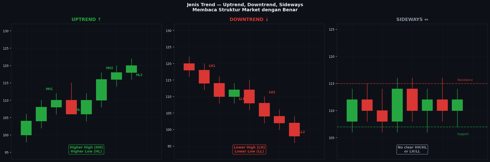

# Modul 02 — Jenis Trend

> **Level**: 🟢 LOW | **Estimasi belajar**: 1 hari | **Latihan pair**: XAUUSD

---

## 2.1 Konsep Dasar Trend

Trend adalah kecenderungan harga untuk bergerak dalam satu arah selama periode tertentu. Memahami trend adalah langkah pertama dalam menentukan bias trading — apakah kamu akan mencari peluang buy atau sell.

**Prinsip dasar:** Trade dengan trend, bukan melawan trend.

Ada tiga jenis trend utama:
1. **Uptrend** (Tren Naik)
2. **Downtrend** (Tren Turun)
3. **Sideways** (Ranging / Tidak Ada Trend)

---

## 2.2 Uptrend — Higher High dan Higher Low

### Definisi Ketat

Uptrend terkonfirmasi ketika:
- Setiap Swing High baru **lebih tinggi** dari Swing High sebelumnya (**Higher High / HH**)
- Setiap Swing Low baru **lebih tinggi** dari Swing Low sebelumnya (**Higher Low / HL**)

```
Uptrend Klasik:

                        HH2 (2.098)
               HH1     /
              (2.085)  /
              /     \ /
             /      HL2 (2.075)
            /
      HL1 (2.062)
     /
────/
```

**Pola:** HH1 → HL1 → HH2 → HL2 → HH3 → HL3 ...

### Syarat Minimum Uptrend

Untuk menyebut sesuatu sebagai uptrend, dibutuhkan minimal:
- 2 Swing High dengan HH yang terkonfirmasi
- 2 Swing Low dengan HL yang terkonfirmasi

Satu candle naik bukanlah uptrend. Uptrend adalah pola berulang dari HH dan HL.

### Uptrend di XAUUSD — Karakteristik

XAUUSD sering menunjukkan uptrend yang kuat ketika:
- USD melemah (DXY turun)
- Ketidakpastian geopolitik tinggi (safe haven demand)
- Inflasi naik
- Federal Reserve dovish

**Contoh range XAUUSD D1 dalam uptrend:**
```
SL1: 1.985 → HL1: 2.020 → SH2: 2.068 → HL2: 2.042 → SH3: 2.098
```

---

## 2.3 Downtrend — Lower High dan Lower Low

### Definisi Ketat

Downtrend terkonfirmasi ketika:
- Setiap Swing High baru **lebih rendah** dari Swing High sebelumnya (**Lower High / LH**)
- Setiap Swing Low baru **lebih rendah** dari Swing Low sebelumnya (**Lower Low / LL**)

```
Downtrend Klasik:

────\
     \
      LH1 (2.082)
     /     \
    /       LH2 (2.068)
LL1 (2.055)     \
                 \    LH3 (2.058) (sementara)
                  LL2 (2.040)
                      \
                       LL3 (2.025) (sementara)
```

**Pola:** LH1 → LL1 → LH2 → LL2 → LH3 → LL3 ...

### Sinyal Downtrend di XAUUSD

XAUUSD dalam downtrend ketika:
- USD menguat tajam (DXY naik)
- Federal Reserve hawkish (naikkan suku bunga)
- Risk-on environment (pasar saham rally, investor keluar dari safe haven)
- Data ekonomi AS sangat kuat

---

## 2.4 Sideways — Tidak Ada HH/HL atau LH/LL Konsisten

### Definisi

Sideways (ranging, consolidating) terjadi ketika pasar tidak membentuk pola HH/HL atau LH/LL yang konsisten. Harga bergerak antara dua level (support dan resistance) tanpa arah yang jelas.

```
Sideways (Range):

Resistance ─────*──────────*────────
                 \         /\
                  \       /  \
                   \     /    \
Support    ─────────*───/──────*─────
```

### Ciri-Ciri Sideways

1. Swing High-nya kira-kira sama tingginya (Equal Highs)
2. Swing Low-nya kira-kira sama rendahnya (Equal Lows)
3. Tidak ada pola HH/HL atau LH/LL yang jelas
4. Harga "terjebak" antara dua level

### Kapan Sideways Terjadi di XAUUSD?

- Sebelum rilis data penting (pasar menunggu)
- Setelah pergerakan besar, harga "istirahat"
- Di hari libur atau sesi Asia (low volatility)
- Saat tidak ada katalis yang jelas

### Strategi di Sideways

Dalam kondisi sideways:
- **Jangan trading di tengah range** — peluang terbaik adalah di ujung range (support dan resistance)
- **Trading dari support ke resistance** (atau sebaliknya)
- **Siapkan diri untuk breakout** — sideways selalu berakhir dengan breakout ke salah satu arah

---

## 2.5 Cara Mengukur Kekuatan Trend

Tidak semua trend diciptakan sama. Ada trend yang kuat dan ada yang lemah.

### Indikator Kekuatan Trend (Tanpa Indikator Teknikal)

**1. Sudut Pergerakan (Angle)**

```
Trend kuat (sudut curam):      Trend lemah (sudut landai):
    /                              /
   /                            /
  /                          /
 /                        /
```

Trend dengan sudut lebih curam = momentum lebih kuat.

**2. Ukuran Impulse vs Ukuran Koreksi**

```
Trend kuat:                    Trend lemah:
     ↑ Impulse besar                ↑ Impulse kecil
    /\                          /\
   /  \                        /  \
  /    \                      /    \
 /      \ Koreksi kecil      /      \ Koreksi besar
/        \                  /        \
```

Dalam trend yang kuat: impulse (pergerakan searah trend) jauh lebih besar dari koreksi (pergerakan berlawanan).

**3. Konsistensi HH/HL atau LH/LL**

Trend yang kuat memiliki HH dan HL yang jelas dan konsisten. Jika mulai ada yang tidak meyakinkan (misalnya HL yang hampir sama dengan HL sebelumnya), trend mulai melemah.

**4. Kecepatan Pembentukan Swing**

Trend kuat: swing terbentuk dengan cepat (sedikit candle)
Trend lemah: perlu banyak candle untuk mencapai swing berikutnya

---

## 2.6 Trend dalam Konteks Timeframe Berbeda

Ini adalah konsep kritis yang sering diabaikan trader pemula.

**Prinsip:** Trend di timeframe yang berbeda bisa berlawanan arah — dan keduanya bisa benar secara bersamaan.

```
Ilustrasi:

D1: Uptrend (HH/HL dari 1.980 ke 2.100)
├── H4: Downtrend (koreksi dari 2.098 ke 2.048)
│   ├── H1: Sideways (range 2.048 - 2.058)
│   └── M15: Uptrend (recovery kecil dalam sideways)
```

**Cara membaca:** Koreksi di H4 adalah bagian dari uptrend D1. Ketika H4 selesai koreksi dan kembali bullish, itulah momen terbaik untuk entry buy (aligned dengan D1).

### Contoh XAUUSD

```
Scenario nyata:
- D1: HH di 2.085, HL di 2.028 → Uptrend D1
- H4: Harga sedang turun dari 2.085 ke 2.045 → Downtrend H4 (koreksi)
- H1: Di 2.045, terbentuk OB bullish dan ada Morning Star

Analisis:
→ D1 bullish → kita mencari BUY
→ H4 sedang koreksi ke area OB → kita tunggu koreksi selesai
→ H1 menunjukkan sinyal reversal di OB → ini adalah entry point
→ Setup: BUY di 2.048, SL di 2.038, TP di 2.085 (SH D1)
```

---

## 2.7 ASCII Chart — Setiap Jenis Trend

### Uptrend dengan Label HH/HL

```
Harga XAUUSD (skalasi sederhana)

2.100  |                              HH3 *
2.090  |                    HH2 *       / 
2.080  |          HH1 *       /\       /  
2.070  |            /\       /  HL3   /   
2.060  |           /  HL2   /         
2.050  |          /         
2.040  |    HL1  /          
2.030  |      \ /           
2.020  |       *            
       ┴────────────────────────────── Waktu
       
Struktur: HL1(2.038) → HH1(2.082) → HL2(2.058) → HH2(2.092) → HL3(2.072) → HH3(2.098)
UPTREND TERKONFIRMASI
```

### Downtrend dengan Label LH/LL

```
Harga XAUUSD (skalasi sederhana)

2.090  |   *  LH1                     
2.080  |    \        LH2 *            
2.070  |     \          \       LH3 * 
2.060  |      LL1 *      \         \  
2.050  |           \      \         LL3 *
2.040  |            \      LL2 *    
2.030  |             \              
       ┴────────────────────────────── Waktu
       
Struktur: LH1(2.088) → LL1(2.058) → LH2(2.078) → LL2(2.042) → LH3(2.068) → LL3(2.048)
DOWNTREND TERKONFIRMASI
```

### Sideways (Range)

```
Harga XAUUSD (skalasi sederhana)

2.080  |  *──────────*──────────*      ← Equal Highs (resistance)
2.075  | / \        / \        / \     
2.070  |/   \      /   \      /   \    
2.065  |     \    /     \    /     \   
2.060  |      \  /       \  /       \  
2.055  |       \/         \/         *─── (apakah akan breakout?)
2.050  |  *────*──────────*               ← Equal Lows (support)
       ┴──────────────────────────── Waktu
       
Tidak ada HH/HL atau LH/LL → SIDEWAYS
```

---

## 📊 Chart: Jenis-Jenis Trend di Market Structure


*Gambar: Chart XAUUSD D1 menunjukkan tiga fase berbeda — Uptrend dengan label HH/HL (hijau), transisi ke Sideways (abu-abu), dan Downtrend dengan label LH/LL (merah) — semua dalam satu tampilan panorama*

---

## 2.8 Studi Kasus — XAUUSD D1 (6 Bulan)

### Identifikasi Trend 6 Bulan Terakhir

Misalkan kita menganalisis XAUUSD D1 dari Januari hingga Juni (periode hipotetis dengan harga realistis):

```
Januari:
- 1 Jan: Low 1.982
- 15 Jan: High 2.035 → SH1
- 25 Jan: Low 2.008 → HL1 (lebih tinggi dari Low 1 Jan)
KESIMPULAN: Awal uptrend

Februari:
- 5 Feb: High 2.058 → HH1 (lebih tinggi dari SH1 2.035)
- 15 Feb: Low 2.028 → HL2 (lebih tinggi dari HL1 2.008)
KESIMPULAN: Uptrend D1 terkonfirmasi (HH + HL)

Maret:
- 8 Mar: High 2.082 → HH2
- 20 Mar: Low 2.048 → HL3
KESIMPULAN: Uptrend berlanjut, semakin kuat

April:
- 3 Apr: High 2.098 → HH3
- 15 Apr: Low 2.068 → HL4
- 25 Apr: Harga mulai turun tapi belum break HL4
KESIMPULAN: Uptrend masih valid, monitor

Mei:
- 5 Mei: Harga break di bawah HL4 (2.068) → PERINGATAN
- 10 Mei: High 2.085 → LH1 (lebih rendah dari HH3 2.098)
- 20 Mei: Low 2.055 → LL1 (lebih rendah dari HL4 2.068)
KESIMPULAN: Transisi ke Downtrend, uptrend sudah berakhir

Juni:
- 5 Jun: High 2.072 → LH2 (lebih rendah dari LH1 2.085)
- 15 Jun: Low 2.038 → LL2 (lebih rendah dari LL1 2.055)
KESIMPULAN: Downtrend D1 terkonfirmasi
```

**Pelajaran:** Uptrend tidak berakhir dengan satu candle bearish besar. Ia berakhir ketika pola HH/HL terganggu — pertama dengan kegagalan membentuk HH baru, kemudian dengan break di bawah HL terakhir.

---

## 2.9 Latihan

> **Pair**: XAUUSD | **Timeframe**: H1

### Tugas

1. Buka XAUUSD H1 di TradingView — lihat hari ini
2. Tandai semua Swing High dan Swing Low dari 3 hari terakhir
3. Tentukan: harga saat ini sedang dalam trend apa di H1?

### Checklist analisis:

```
□ Saya sudah tandai semua SH dan SL dengan benar
□ Saya sudah label setiap SH sebagai HH atau LH
□ Saya sudah label setiap SL sebagai HL atau LL
□ Pola yang terlihat adalah: [HH/HL] atau [LH/LL] atau [tidak konsisten]
□ Kesimpulan trend H1 saat ini: [Uptrend / Downtrend / Sideways]
```

### Dokumen hasil:

| Waktu | Jenis Swing | Level Harga | HH/HL/LH/LL |
|-------|-------------|-------------|-------------|
| | SH | | |
| | SL | | |
| | ... | | |

**Pertanyaan:** Apakah trend H1 hari ini selaras dengan trend H4? Bagaimana dengan D1?

---

**[← Modul 01: Swing High & Swing Low](./01-swing-high-swing-low.md)** | **[→ Modul 03: Key Levels](./03-key-levels.md)**
