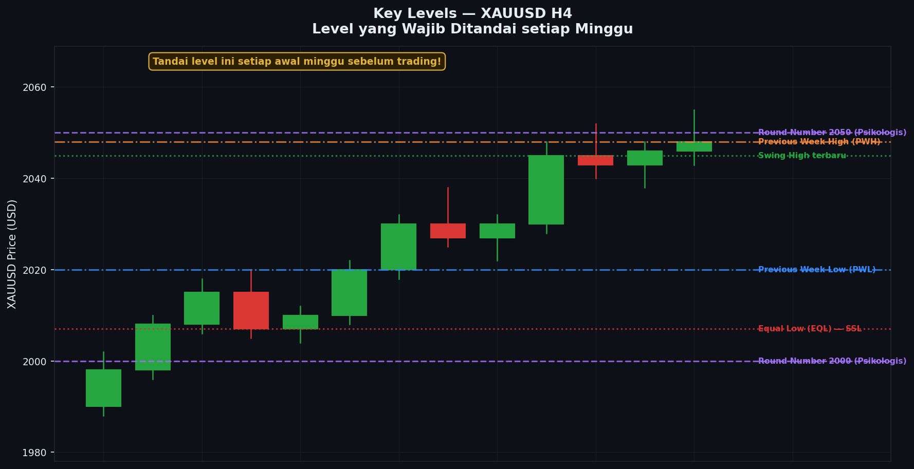

# Modul 03 — Key Levels

> **Level**: 🟡 MEDIUM | **Estimasi belajar**: 2 hari | **Latihan pair**: XAUUSD

---

## 3.1 Apa Itu Key Level?

Key Level adalah level harga yang secara historis terbukti penting — di mana harga sering berhenti, berbalik, atau meledak. Key level bukan sembarang level; ini adalah area di mana institusi (bank, hedge fund, bank sentral) kemungkinan besar telah menempatkan order besar.

Memahami key level seperti mengetahui "peta ranjau" pasar — tahu di mana "ledakan" kemungkinan terjadi.

---

## 3.2 Previous High & Previous Low

### Konsep

Previous High (PDH/PWH/PMH) dan Previous Low (PDL/PWL/PML) adalah level harga tertinggi dan terendah dari periode sebelumnya.

- **PDH/PDL** = Previous Day High/Low (High dan Low kemarin)
- **PWH/PWL** = Previous Week High/Low (High dan Low minggu lalu)
- **PMH/PML** = Previous Month High/Low (High dan Low bulan lalu)

### Mengapa Ini Penting?

Institusi dan trader besar menggunakan level ini sebagai referensi. Banyak order (terutama stop loss dan take profit) ditempatkan di sekitar level ini. Inilah yang menjadikannya "magnet" bagi harga.

### Contoh XAUUSD

```
Misalkan saat ini hari Selasa:

Previous Day (Senin):
- PDH = 2.082,50
- PDL = 2.051,30

Analisis:
→ Jika harga naik mendekati 2.082,50 (PDH): 
  - Ada banyak stop loss sell dari trader yang sell kemarin
  - Ada take profit buy dari trader yang buy kemarin
  - Harga bisa "di-sweep" dulu ke atas 2.082,50 sebelum turun
  - Atau bisa menjadi resistance kuat dan bounced dari sana

→ Jika harga turun mendekati 2.051,30 (PDL):
  - Ada stop loss buy yang tertarget
  - Institusi mungkin "sweep" PDL untuk ambil likuiditas sebelum naik
```

### Cara Menandai di Chart

1. Identifikasi PDH dan PDL dari Daily candle kemarin
2. Buat garis horizontal di kedua level
3. Gunakan warna berbeda: PDH = merah, PDL = hijau
4. Lakukan hal sama untuk PWH/PWL dan PMH/PML

### Hierarki Kekuatan

```
PMH/PML > PWH/PWL > PDH/PDL
(Monthly > Weekly > Daily)
```

Level monthly lebih kuat dari weekly, weekly lebih kuat dari daily.

---

## 3.3 Round Numbers / Psychological Levels

### Konsep

Round numbers adalah level harga yang "bulat" — angka yang secara psikologis menarik perhatian semua orang.

**Untuk XAUUSD:**

| Level | Tipe | Signifikansi |
|-------|------|--------------|
| 2.000 | Ultra-major | Level psikologis historis paling penting |
| 2.050 | Major | Round number dengan 50 |
| 2.100 | Major | Level 100 baru |
| 2.150 | Sedang | Round number 50 |
| 2.200 | Major | Level 100 baru |
| 1.950 | Major | Di bawah 2000, sangat penting |

**Sub-level:**
- Setiap level yang berakhir dengan 0 atau 5: 2.010, 2.020, 2.025, 2.030, 2.040, 2.045, dll
- Semakin banyak nol di ujung = semakin kuat

### Mengapa Institusi Peduli dengan Round Numbers?

1. **Sizing order** — banyak order institusi menggunakan round numbers sebagai target
2. **Options market** — opsi dengan strike price round number sangat populer
3. **Psikologi massal** — retail trader menempatkan SL dan TP di round numbers
4. **Media** — berita selalu menyebut round numbers ("Gold breaks 2000!")

### Contoh Reaksi XAUUSD di Round Number

```
Level 2.000 — Analisis historis:

Pertama kali gold tembus 2000 (historis): ada aksi jual besar
Gold kembali ke 2000 dari bawah: ada penolakan kuat
Gold break permanent di atas 2000: level 2000 menjadi support

Ini adalah pola klasik: resistance → break → support
```

---

## 3.4 Equal High (EQH) & Equal Low (EQL)

### Konsep — Sangat Penting untuk SMC

Equal High (EQH) adalah kondisi di mana dua atau lebih Swing High berada di level yang hampir sama persis. Equal Low (EQL) adalah hal yang sama untuk Swing Low.

```
Equal Highs (EQH):

*─────────*─────── ← Dua swing high di level yang sama
 \       / \
  \     /   \
   \   /     \
    \ /
     *
```

### Mengapa EQH dan EQL Sangat Penting?

Dalam SMC, EQH dan EQL adalah **reservoir likuiditas**. Di atas EQH:
- Banyak stop loss dari trader yang sell di area tersebut
- Banyak order buy stop dari breakout trader
- Ini adalah kumpulan likuiditas yang "diincar" institusi

Institusi akan mendorong harga menembus EQH untuk mengambil likuiditas ini, lalu kemudian berbalik ke bawah.

### Contoh XAUUSD H4

```
Skenario EQH di XAUUSD:

2.082 ────*──────────*──── ← EQH di 2.082 (dua swing high sama)
          │          │
          │          │
2.068 ────┘          │
                      │
2.055 ────────────────┘

Analisis:
1. EQH di 2.082 menandai bahwa ada likuiditas (stop loss) di atas 2.082
2. Institusi kemungkinan akan "sweep" ke atas 2.082 untuk ambil likuiditas
3. Setelah sweep (harga menyentuh 2.085-2.088), institusi mulai sell
4. Harga kemudian turun tajam dari 2.088 ke bawah
```

### EQL (Equal Low)

```
Skenario EQL di XAUUSD:

2.065 ─────────────────────
          │          │
          │          │
2.048 ────*──────────*──── ← EQL di 2.048 (dua swing low sama)

Analisis:
1. EQL di 2.048 menandai ada stop loss (dari yang long) di bawah 2.048
2. Institusi akan sweep ke bawah 2.048 untuk ambil likuiditas
3. Setelah sweep ke 2.043-2.045, institusi mulai buy
4. Harga kemudian naik tajam dari 2.043 ke atas
```

---

## 3.5 Cara Menentukan Level Mana yang "Kuat"

Tidak semua level sama kuatnya. Berikut cara memilah level yang paling relevan:

### Faktor Penentu Kekuatan Level

**1. Banyaknya Candle yang "Menyentuh" Level**

Semakin banyak candle yang bounce dari suatu level, semakin kuat level tersebut. Level yang sudah diuji 3+ kali dan masih bertahan = sangat kuat.

**2. Reaksi Harga di Level**

Seberapa besar reversal yang terjadi saat harga menyentuh level? Reversal besar = level kuat.

**3. Timeframe yang Membentuk Level**

Level yang terlihat di D1 atau W1 lebih kuat dari level yang hanya terlihat di H1.

**4. Kombinasi dengan Faktor Lain**

Level yang bersamaan dengan:
- Round number → lebih kuat
- Previous week/month high-low → lebih kuat
- OB (Order Block) → jauh lebih kuat
- FVG (Fair Value Gap) → lebih kuat

### Skoring Level (1–10)

| Kondisi | Skor |
|---------|------|
| Round number major (2000, 2100) | +3 |
| Tested 3+ kali | +2 |
| Previous Week High/Low | +2 |
| Timeframe D1 atau lebih besar | +2 |
| Bersamaan dengan OB/FVG | +3 |

Level dengan skor 7+ = level paling kuat, prioritas utama.

---

## 3.6 HTF Key Level vs LTF Key Level

### Perbedaan

**HTF Key Level (Higher Timeframe):**
- Teridentifikasi dari D1, W1, atau MN
- Lebih kuat, lebih jarang tersentuh
- Digunakan untuk bias utama dan target besar
- Contoh: Previous Month High di 2.098

**LTF Key Level (Lower Timeframe):**
- Teridentifikasi dari H1, H4
- Lebih sering tersentuh
- Digunakan untuk entry dan SL presisi
- Contoh: Previous Daily High di 2.072

### Cara Menggunakannya Bersama

```
Step 1: Identifikasi HTF Key Level → tentukan ZONA (area besar)
Step 2: Masuk ke LTF → cari entry presisi di dalam zona tersebut

Contoh:
HTF zona sell: 2.085 – 2.098 (antara PWH dan PMH)
LTF entry: Bearish pin bar di H1 tepat di 2.091
SL: 2.101 (di atas PMH)
TP: 2.055 (PDL atau support berikutnya)
```

---

## 3.7 ASCII Chart — XAUUSD dengan Key Levels

```
Harga XAUUSD (Representasi H4)

2200 ─────────────────────────────── ← Round number major
2180
2160
2150 ─────────────────────────────── ← Round number (50)
2140
2130
2120
2110
2100 ─────────────────────────────── ← Round number major
2098 ─── PMH ──────────────────────  ← Previous Month High
2092 ─── PWH ──────────────────────  ← Previous Week High
2088
2085 ─── EQH ───────*───────*─────── ← Equal High (likuiditas)
2082
2078
2075
2072 ─── PDH ──────────────────────  ← Previous Day High
2068
2062
2058
2055
2052 ─── PDL ──────────────────────  ← Previous Day Low
2050 ─────────────────────────────── ← Round number (50)
2048 ─── EQL ───────*───────*─────── ← Equal Low (likuiditas)
2042
2038 ─── PWL ──────────────────────  ← Previous Week Low
2030
2025
2020
2015
2010
2005
2000 ─────────────────────────────── ← Round number ULTRA MAJOR
```

Semua level ini aktif secara bersamaan dan saling mempengaruhi kekuatan masing-masing.

---

## 3.8 Studi Kasus — 5 Key Level Paling Penting di XAUUSD

### Analisis Key Level Aktif (Contoh Hipotetis)

Misalkan XAUUSD saat ini di 2.065:

**Level 1: 2.100 (Round Number Major + Resistance)**
- Skor: 8/10
- Alasan: Round number major + multiple rejections + PWH dua minggu lalu
- Gunakan untuk: Target TP sell dari atas, atau area sell setup jika harga mencapai sana

**Level 2: 2.082 (EQH + Previous Week High)**
- Skor: 7/10
- Alasan: Dua swing high sama di level ini + PWH dari seminggu lalu
- Gunakan untuk: Area likuiditas, ekspektasi sweep ke atas EQH lalu sell

**Level 3: 2.050 (Round Number 50 + Previous Day Low)**
- Skor: 7/10
- Alasan: Round number 50 + sering jadi support minggu ini + PDL dua hari lalu
- Gunakan untuk: Area support, cari buy setup jika harga turun ke sini

**Level 4: 2.038 (Previous Week Low + Swing Low Major)**
- Skor: 8/10
- Alasan: PWL + area major swing dari H4 + area OB potensial
- Gunakan untuk: Area buy utama jika harga menembus 2.050

**Level 5: 2.000 (Ultra-Major Psychological)**
- Skor: 10/10
- Alasan: Round number terpenting untuk gold, level historis, major support
- Gunakan untuk: Jika ada move besar ke bawah, ini adalah target ekstrem dan area buy besar

---

## 📊 Chart: Key Levels di XAUUSD


*Gambar: Chart XAUUSD H4 dengan semua key level yang ditandai — PDH/PDL (garis solid), PWH/PWL (garis tebal), PMH/PML (garis sangat tebal), Round Numbers (garis putus-putus), dan EQH/EQL (label khusus) — menunjukkan bagaimana semua level ini berinteraksi*

---

## 3.9 Latihan

> **Pair**: XAUUSD | **Timeframe**: H4

### Tugas 1 — Tandai Previous Week High/Low

1. Buka XAUUSD H4 di TradingView
2. Identifikasi High dan Low dari **minggu lalu** (candle W1 atau tandai manual di H4)
3. Buat garis horizontal di PWH dan PWL
4. Catat:
   - PWH = ?
   - PWL = ?
   - Berapa jarak (range) antara PWH dan PWL?

### Tugas 2 — Tandai Round Numbers

1. Dari harga saat ini, tandai semua round numbers yang relevan:
   - Level dengan 50 (X.050, X.100, X.150, X.200)
   - Level dengan 00 (X.000)
   - Jangkauan: 100 poin di atas dan di bawah harga saat ini

### Tugas 3 — Cari EQH dan EQL

1. Di XAUUSD H4, scroll ke 2 minggu terakhir
2. Cari area di mana ada **2 atau lebih Swing High di level yang hampir sama**
3. Cari area di mana ada **2 atau lebih Swing Low di level yang hampir sama**
4. Catat level harganya

### Tugas 4 — Scoring

Ambil 5 level yang sudah kamu tandai dan beri skor 1-10 berdasarkan:
- Apakah round number? (+3)
- Tested berapa kali? (+2 jika 3+)
- Previous week atau daily? (+2 jika weekly)
- Ada OB/FVG di sana? (+3 jika ada)

Urutkan dari yang paling kuat ke yang paling lemah.

---

**[← Modul 02: Jenis Trend](./02-jenis-trend.md)** | **[→ Modul 04: Struktur dalam Trend](./04-struktur-dalam-trend.md)**
