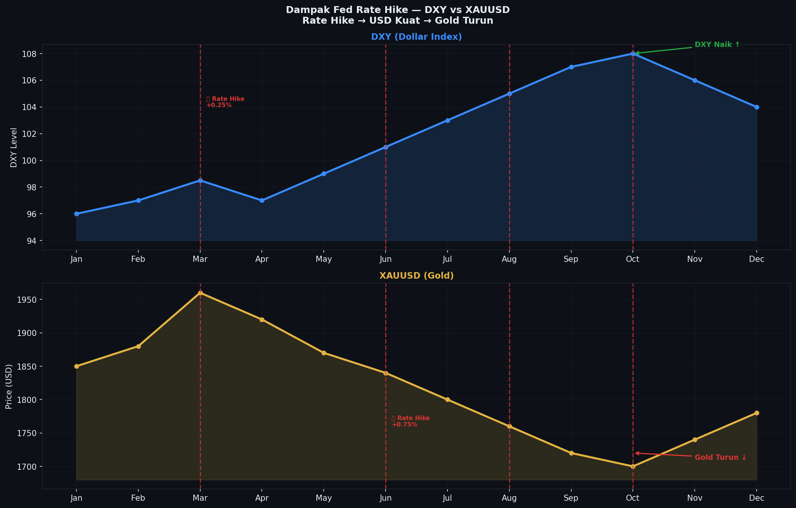
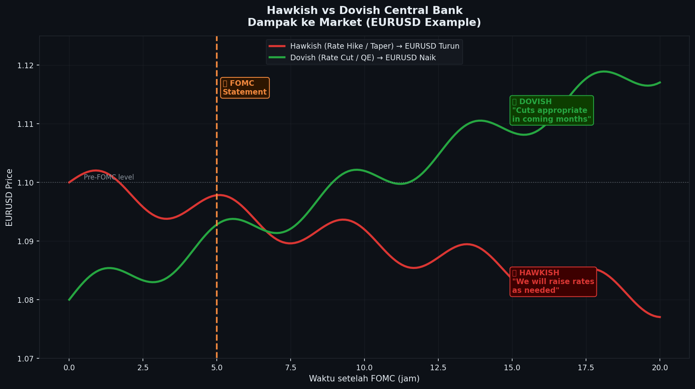

# Modul 01 — Apa Itu Analisis Fundamental?

**Level:** LOW (Pemula)
**Estimasi Waktu:** 30 menit
**Prasyarat:** Mengenal konsep dasar trading

---

## Pendahuluan

Bayangkan Anda ingin membeli sebuah rumah. Sebelum memutuskan, Anda tidak hanya melihat cat dindingnya — Anda juga melihat lokasi, kondisi ekonomi daerah tersebut, harga pasar sekitar, dan prospek ke depan. Itulah esensi analisis fundamental: memahami **nilai intrinsik** dari sebuah aset berdasarkan kondisi ekonomi, politik, dan keuangan yang mendasarinya.

Dalam trading forex dan komoditas, analisis fundamental menjawab pertanyaan: **"Mengapa harga bergerak ke arah ini?"**

---

## 1. Definisi Analisis Fundamental

**Analisis Fundamental** adalah metode evaluasi aset keuangan berdasarkan faktor ekonomi, keuangan, dan kualitatif yang mempengaruhi nilai intrinsik aset tersebut.

Dalam konteks forex:
- Analisis kondisi ekonomi dua negara yang mata uangnya dipasangkan
- Membandingkan kekuatan relatif kedua ekonomi
- Mengidentifikasi arah kebijakan moneter masing-masing bank sentral

Dalam konteks Gold (XAUUSD):
- Menganalisis kekuatan USD (karena gold dihargai dalam USD)
- Melihat tingkat suku bunga riil (real yield)
- Memantau kondisi geopolitik dan risk sentiment global

---

## 2. Fundamental vs Teknikal: Perbedaan Fundamental

```
PERBANDINGAN ANALISIS FUNDAMENTAL VS TEKNIKAL
═════════════════════════════════════════════════════════════════

ANALISIS FUNDAMENTAL                ANALISIS TEKNIKAL
──────────────────                  ─────────────────
Menjawab: MENGAPA?                  Menjawab: KAPAN & DIMANA?
Fokus: Nilai intrinsik              Fokus: Price action & pattern
Timeframe: Mingguan-Bulanan         Timeframe: Menit-Harian
Alat: Data ekonomi, berita          Alat: Chart, indikator
Prediksi: Arah besar (bias)         Prediksi: Entry & exit point

Kelebihan:                          Kelebihan:
+ Memahami big picture              + Presisi entry
+ Menghindari trade kontra trend    + Stop loss terukur
+ Valid untuk posisi jangka panjang + Bisa diterapkan semua pair

Kekurangan:                         Kekurangan:
- Sulit untuk timing entry          - Tidak tahu "mengapa" bergerak
- Data bisa disalahartikan          - Bisa false signal
- Perlu banyak pengetahuan          - Rentan noise jangka pendek
```

**Kesimpulan penting:** Keduanya BUKAN saingan — keduanya SALING MELENGKAPI.

---

## 3. Bagaimana Fundamental Menggerakkan Market?

### Mekanisme Transmisi Fundamental ke Harga

```
MEKANISME TRANSMISI FUNDAMENTAL → HARGA
══════════════════════════════════════════════════════════════

CONTOH: CPI AS naik melebihi ekspektasi (Inflasi tinggi)
                     │
                     ▼
        [Market menginterpretasikan]
                     │
           ┌─────────┴─────────┐
           │                   │
           ▼                   ▼
   "Fed perlu naikkan    "Inflasi tinggi =
    suku bunga lebih      ekonomi panas"
    agresif"
           │                   │
           └─────────┬─────────┘
                     │
                     ▼
        [Institusi/Smart Money bereaksi]
        - Bank besar menutup posisi EUR/USD
        - Hedge fund membeli USD futures
        - COT positioning bergeser ke long USD
                     │
                     ▼
        [Retail mengikuti]
        - Tekanan jual EUR/USD meningkat
        - Harga bergerak turun
                     │
                     ▼
        [Price Action yang terlihat di chart]
        EUR/USD drop 80-120 pip dalam beberapa jam
```

### Dampak ke Chart — Contoh Nyata

```
Studi Kasus: XAUUSD — Dampak CPI AS Oktober 2023
═══════════════════════════════════════════════════════════════

Konteks: CPI Oktober 2023 keluar LEBIH RENDAH dari ekspektasi
         Actual: 3.2%  |  Forecast: 3.3%  |  Previous: 3.7%

Interpretasi: Inflasi melambat → Fed mungkin sudah selesai naikkan rate
              → USD melemah → Gold naik (karena priced in USD)

XAUUSD H1 Chart:

1990 ─────────────────────────────────────────────── TP $1998
      ▲
      │                                      ┌──────┐
1980 ─│────────────────────────────────────┌─┘      └──
      │                            ┌──────┐│  +$28 dalam
1970 ─│──────────────────────────┌─┘      ││  2 jam
      │                    Rilis │         │
1960 ─│──────── ranging ─────────┤         │
      │  sebelum CPI             │spike up │
      │                    ┌─┐  ┌┘         │
1955 ─│────────────────────┘ └──┘          │
      │                                    │
      │  ← Initial drop 5 menit (noise)    │
      │     kemudian reversal kuat          │
      │
      13:00           13:30            14:30
              WIB        CPI Rilis        2 jam setelah

Analisis:
- Sebelum CPI: ranging di 1960-1965 (market menunggu)
- Saat CPI: spike turun dulu 5-8 menit (confusion)
- Kemudian: reversal kuat ke atas +28 pip dalam 2 jam
- Alasan: CPI miss → USD lemah → Gold menguat
```

---

## 4. Hierarki Faktor Fundamental

Tidak semua berita diciptakan sama. Ada hierarki yang perlu dipahami:

### Tier 1 — Central Bank Decisions (DAMPAK TERBESAR)

```
DAMPAK TIER 1: FOMC Rate Decision
══════════════════════════════════════════════════════════

Contoh: Fed naikkan rate 25bps (sesuai ekspektasi) + hawkish statement

DXY (Dollar Index):
105.5 ────────────────────────────────── resistance
      │                          ┌──────┐
105.0 ─────────────────────────┌─┘      └─── DXY naik
      │              ┌──┐  ┌──┘              +0.8%
104.5 ──── ranging ──┘  └──┘
      │
      FOMC Meeting
      20:00 WIB

EURUSD (reaksi berlawanan dengan DXY):
1.0650 ──── ranging ──┐
           sebelum    │
1.0600 ───────────────┤ ← Saat FOMC: drop
                      │
1.0540 ───────────────┘──────────────────── EURUSD turun -110 pip
      │                                      dalam 1 hari
      │
      Tier 1 events bisa menggerakkan market 100-300+ pip
```

### Tier 2 — Data Makro Utama (DAMPAK BESAR)

| Data | Dampak Rata-rata | Contoh Pair |
|------|-----------------|-------------|
| NFP | 50-150 pip | XAUUSD, EURUSD, DXY |
| CPI | 40-120 pip | Semua major pair |
| GDP | 30-80 pip | Pair negara terkait |
| FOMC Minutes | 30-70 pip | Semua major |

### Tier 3 — Data Sekunder (DAMPAK SEDANG)

| Data | Dampak Rata-rata | Contoh Pair |
|------|-----------------|-------------|
| PMI | 20-50 pip | EUR, GBP, AUD |
| Retail Sales | 20-40 pip | USD, GBP |
| Trade Balance | 15-35 pip | AUD, CAD, JPY |

### Tier 4 — Data Minor (DAMPAK KECIL)

Biasanya hanya mempengaruhi jika sangat jauh dari ekspektasi atau dalam kondisi market yang sensitif.

---

## 5. Tipe Fundamental Trader

### Tipe A — Pure Fundamental Trader

```
Profil:
- Trading timeframe: Daily, Weekly
- Hold posisi: Berhari-hari hingga berbulan-bulan
- Fokus: Monetary policy divergence antar negara
- Contoh trade: Long EUR/USD selama 3 bulan karena ECB hawkish

Cocok untuk: Trader profesional, fund manager
Tidak cocok untuk: Yang suka scalping, yang tidak sabar
```

### Tipe B — Pure Technical Trader

```
Profil:
- Trading timeframe: M5 hingga H4
- Hold posisi: Menit hingga hari
- Fokus: Chart pattern, support/resistance
- Kelemahan: Sering terkena "fundamental surprise"

Risiko: Tidak tahu bahwa ada NFP hari ini → posisi terbuka → spike terkena SL
```

### Tipe C — Combined Trader (REKOMENDASI)

```
Profil:
- Gunakan fundamental untuk BIAS (arah besar)
- Gunakan teknikal untuk ENTRY (kapan dan dimana masuk)
- Trading timeframe: H1 hingga H4 untuk entry
- Selalu cek kalender ekonomi sebelum trading

Contoh pendekatan:
SENIN PAGI (Analisis Mingguan):
1. Cek fundamental: Minggu ini ada NFP → ekspektasi bullish USD
2. Tentukan bias: BEARISH EURUSD minggu ini
3. Cari setup teknikal: Tunggu EURUSD pullback ke OB/resistance
4. Entry: Saat ada konfirmasi bearish candle di zona tersebut
```

---

## 6. Mental Model: Fundamental Sebagai "Gravitasi"

Cara terbaik memahami fundamental adalah seperti gravitasi terhadap harga:

```
FUNDAMENTAL SEBAGAI GRAVITASI HARGA
══════════════════════════════════════════════════════════════

Fundamental Bullish = Gravitasi menarik ke ATAS
                ▲ ▲ ▲ ▲ ▲
                │ │ │ │ │
Harga: ─────────┘ ┘ ┘ ┘ ┘──────────────── (trend naik)

Fundamental Bearish = Gravitasi menarik ke BAWAH
Harga: ─────────┐ ┐ ┐ ┐ ┐──────────────── (trend turun)
                │ │ │ │ │
                ▼ ▼ ▼ ▼ ▼

Teknikal hanya menentukan KAPAN:
- Kapan harga "jatuh" mengikuti gravitasi
- Kapan harga "terbang" mengikuti dorongan ke atas
- Correction/pullback adalah sementara — fundamental yang menang akhirnya

Contoh nyata:
XAUUSD 2022-2024:
- Fundamental: Ketidakpastian global + ekspektasi rate cut Fed
- Gold "gravitasi" ke atas sepanjang periode
- Setiap dip teknikal adalah kesempatan BELI
- Trader yang "melawan fundamental" terus rugi short
```

---

## 7. Kesalahan Umum Pemula

### Kesalahan 1: "Buy the rumor, sell the fact"

```
SKENARIO UMUM YANG MEMBINGUNGKAN PEMULA
════════════════════════════════════════════════════════════

Situasi: NFP keluar BAGUS (200K vs forecast 180K)
Ekspektasi pemula: "Data bagus → USD naik → XAUUSD turun"
Kenyataan:

1990 ─────────────────────────────── sebelum NFP (ranging)
      │
1985 ─│──── TURUN dulu ← "sell the fact" setelah
      │                   NFP bagus sudah diantisipasi
1980 ─│────────────┐
      │             │ 20-30 menit
1975 ─│─────────────┘──────────────── reversal naik!
      │
      │ Mengapa? Karena market sudah "price in" data bagus
      │ sebelumnya. Saat data keluar, "beli rumor" sudah
      │ selesai, saatnya "jual fakta"
      │
      NFP Rilis

Pelajaran: Lihat apakah harga sudah bergerak sebelum news.
           Jika sudah naik 50+ pip menuju news, kemungkinan
           besar ada aksi "sell the fact" setelah rilis.
```

### Kesalahan 2: Bereaksi terhadap Headline, Bukan Konteks

"Inflasi naik" bisa BULLISH atau BEARISH USD tergantung konteksnya:
- Jika Fed sudah aggressive rate hike: CPI naik lagi = mungkin sudah dipriced in
- Jika CPI naik pertama kali setelah deflasi: = hawkish surprise = USD mungkin naik

### Kesalahan 3: Mengabaikan Kalender Ekonomi

Membuka posisi tanpa mengecek apakah ada rilis data besar dalam beberapa jam ke depan adalah resep bencana.

---

## Checklist Memahami Fundamental

Sebelum membuka posisi trading, tanyakan:

- [ ] Apa kondisi fundamental pair ini minggu ini?
- [ ] Apakah ada data penting yang akan rilis hari ini?
- [ ] Apakah bias fundamental saya SEARAH dengan setup teknikal?
- [ ] Apakah ada event besar (FOMC, NFP) dalam 24 jam ke depan?
- [ ] Apakah posisi saya searah dengan "gravitasi fundamental"?

---

## Latihan Modul 01

### Latihan 1 — Identifikasi Tipe Berita
Klasifikasikan berita berikut ke Tier 1, 2, 3, atau 4:
1. Federal Reserve menaikkan suku bunga 50bps
2. PMI Manufaktur Jerman turun ke 42.5
3. Retail Sales AS naik 0.4% vs forecast 0.2%
4. GDP AS Q3 tumbuh 2.1%
5. Pernyataan Fed Chair di konferensi tahunan Jackson Hole

### Latihan 2 — Analisis Dampak
Untuk setiap skenario, tentukan dampak ke XAUUSD (naik/turun) dan alasannya:
1. NFP keluar jauh di bawah ekspektasi (100K vs 200K)
2. CPI AS mencapai level tertinggi 40 tahun (9.1%)
3. Fed mengumumkan akan mulai memotong suku bunga
4. Ketegangan geopolitik meningkat di Timur Tengah

### Latihan 3 — Refleksi Trading
Lihat 5 trade terakhir Anda:
- Apakah Anda tahu kondisi fundamental saat itu?
- Apakah ada news yang mempengaruhi trade tersebut?
- Apakah trade Anda searah dengan fundamental?

---

**Jawaban Latihan 1:** 1=Tier 1, 2=Tier 3, 3=Tier 2, 4=Tier 2, 5=Tier 1

**Jawaban Latihan 2:**
1. XAUUSD naik — NFP miss = USD lemah = Gold naik
2. XAUUSD bisa naik dulu (safe haven) tapi kemudian turun jika Fed aggressive rate hike
3. XAUUSD naik — rate cut = USD melemah = Gold menguat
4. XAUUSD naik — ketidakpastian geopolitik = safe haven demand naik

---

## Rangkuman

| Konsep | Poin Kunci |
|--------|-----------|
| Definisi | Analisis nilai intrinsik berdasarkan kondisi ekonomi |
| vs Teknikal | Fundamental = arah, Teknikal = entry/exit |
| Hierarki | Tier 1 (Central Bank) > Tier 2 (Data Makro) > Tier 3 (Sekunder) |
| Mental Model | Fundamental = gravitasi yang menentukan arah akhir harga |
| Pendekatan Terbaik | Combined: Fundamental untuk bias, Teknikal untuk entry |

---

**Modul Berikutnya:** [02 — Data Ekonomi Penting & Dampaknya](./02-data-ekonomi-penting.md)


---

## 📊 Chart: Dampak Rate Hike — DXY vs Gold



---

## 📊 Chart: Hawkish vs Dovish Impact



---
