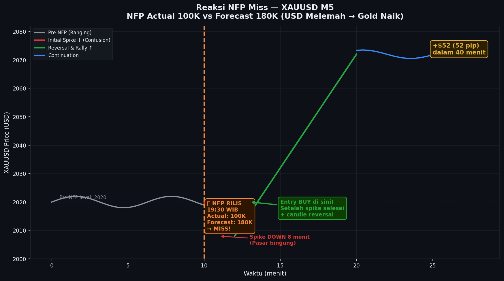

# Modul 02 — Data Ekonomi Penting & Dampaknya

**Level:** LOW (Pemula)
**Estimasi Waktu:** 45 menit
**Prasyarat:** Modul 01 — Apa Itu Analisis Fundamental

---

## Pendahuluan

Market forex dan komoditas digerakkan oleh data ekonomi. Seperti dokter yang membaca hasil lab pasien, trader fundamental membaca data ekonomi untuk mendiagnosa kesehatan sebuah ekonomi. Modul ini membahas semua data ekonomi penting yang perlu Anda ketahui, dampaknya terhadap market, dan cara membacanya dengan benar.

---

## Peta Data Ekonomi

```
PETA DATA EKONOMI BERDASARKAN KATEGORI
═══════════════════════════════════════════════════════════════

KETENAGAKERJAAN          INFLASI              PERTUMBUHAN
────────────────         ───────              ──────────
NFP (Non-Farm Payroll)   CPI (Consumer)       GDP (Quarterly)
Unemployment Rate        PPI (Producer)       PMI Manufacturing
ADP Employment           PCE Deflator         PMI Services
Initial Jobless Claims   Inflation Exp.       ISM Manufacturing

KONSUMSI                 PERUMAHAN            PERDAGANGAN
──────────               ─────────            ──────────
Retail Sales             Housing Starts       Trade Balance
Consumer Confidence      Building Permits     Current Account
Consumer Spending        Existing Home Sales  Import/Export Price
Personal Income          New Home Sales
```

---

## 1. NFP — Non-Farm Payroll

### Apa Itu?
NFP mengukur jumlah pekerjaan baru yang ditambahkan di sektor non-pertanian AS dalam sebulan. Ini adalah indikator terpenting dalam kalender ekonomi global.

**Jadwal rilis:** Jumat pertama setiap bulan, pukul 20:30 WIB (musim panas: 19:30 WIB)

### Cara Membaca NFP

| Skenario | Sinyal | Dampak USD | Dampak XAUUSD |
|----------|--------|-----------|---------------|
| Actual > Forecast | Bullish USD | Naik | Turun |
| Actual < Forecast | Bearish USD | Turun | Naik |
| Actual = Forecast | Netral | Sedikit bergerak | Sedikit bergerak |
| Revisi ke bawah (bulan lalu) | Bearish USD | Turun | Naik |

### Data Tambahan yang Menyertai NFP

| Komponen | Mengapa Penting |
|----------|----------------|
| Unemployment Rate | Konfirmasi kekuatan tenaga kerja |
| Average Hourly Earnings | Tekanan inflasi dari upah |
| Participation Rate | Kualitas angka employment |
| Previous Month Revision | Revisi selalu mengejutkan market |

### Studi Kasus: NFP Agustus 2024 — XAUUSD Rally Besar

```
Studi Kasus: NFP Agustus 2024
═══════════════════════════════════════════════════════════════

Data:
  Previous (Juli):  114,000 (sudah revisi dari 179,000 — revisi besar!)
  Forecast:         175,000
  Actual:           142,000  ← MISS dari forecast
  Unemployment:     4.3%     ← NAIK dari 4.1% (terburuk sejak 2021)

Interpretasi:
  NFP miss + revisi besar ke bawah + unemployment naik
  = Pasar tenaga kerja melemah drastis
  = Ekspektasi Fed cut lebih agresif meningkat
  = USD melemah tajam
  = XAUUSD naik kuat

XAUUSD H1 Chart (2 Agustus 2024):

2470 ──────────────────────────────────────────── TP Area
      │                            ┌────────────
      │                     ┌─────┘  +$42 dalam
2460 ─│───────────────────┌─┘        3 jam
      │             ┌────┘
2450 ─│────────────┤  ← breakout dari ranging
      │   ranging  │
2440 ─│───────────┐└─────────────────────── ini sebelum NFP
      │  (1 jam  ) │  Spike TURUN 5 menit
2435 ─│────────────┘──── pertama (confusion)
      │            ↑
      │      NFP Rilis 19:30 WIB
      │
      │  Kemudian reversal naik KUAT karena:
      │  1. NFP miss besar (142K vs 175K)
      │  2. Unemployment naik ke 4.3%
      │  3. Revisi Juli besar ke bawah
      │
      Timeline:
      19:30 NFP rilis → spike down ke 2435 (5-8 menit confusion)
      19:38 Reversal → market mulai baca data secara keseluruhan
      19:45 Strong bullish move → 2450 ditembus
      20:30 Harga mencapai 2470 (+$42 dari low)

Entry terbaik: 2445 (setelah spike selesai + bullish confirmation candle)
SL: 2432 (di bawah spike low)
TP: 2468 (BSL terdekat)
R:R = 1:1.8 (23 pip risk, 41 pip reward)

Pelajaran:
- Jangan panik dengan spike awal saat NFP rilis
- Tunggu 5-10 menit untuk konfirmasi arah sebenarnya
- Baca semua komponen: NFP + unemployment + revision
```

---

## 2. CPI — Consumer Price Index

### Apa Itu?
CPI mengukur perubahan harga rata-rata barang dan jasa yang dikonsumsi rumah tangga. Ini adalah ukuran inflasi utama yang dipantau bank sentral.

**Jadwal rilis:** Sekitar tanggal 10-15 setiap bulan, pukul 20:30 WIB

### Komponen CPI

```
BREAKDOWN CPI AS (BOBOT RATA-RATA)
═══════════════════════════════════════════════════════════

Perumahan (Shelter)        ████████████████ 34%
Transportasi               ██████████ 15%
Makanan & Minuman          ████████ 14%
Medis & Kesehatan          ██████ 9%
Rekreasi                   ████ 6%
Pakaian                    ███ 4%
Lainnya                    ███████ 18%
```

### CPI Core vs CPI Headline

| Jenis | Isi | Yang Lebih Diperhatikan |
|-------|-----|------------------------|
| CPI Headline | Semua komponen termasuk food & energy | Publik umum |
| CPI Core | Exclude food & energy (lebih volatile) | Fed & trader pro |
| CPI MoM | Perubahan bulan ke bulan | Short-term trend |
| CPI YoY | Perubahan tahun ke tahun | Long-term trend |

### Dampak CPI ke Market

```
Studi Kasus: CPI AS Juni 2022 — "CPI 9.1%" Shock
═══════════════════════════════════════════════════════════════

Data (13 Juli 2022):
  Forecast: 8.8% YoY
  Actual:   9.1% YoY  ← Tertinggi dalam 40 tahun!

Dampak:
EURUSD Daily:

1.0200 ──────────────────────────────────────────────────
        ▼
        │  CPI 9.1% rilis
1.0100 ─└──────────────────────────────────────────────
        │
1.0000 ──────────────────────────────────────────────────
   (parity!)
        │
0.9900 ─┐
        │  ← -220 pip dalam 3 hari setelah CPI!
        │  Mengapa? CPI 9.1% = Fed HARUS naikkan rate agresif
        │          = USD menguat drastis
        │          = EURUSD jatuh ke level parity pertama
        │            sejak 2002

XAUUSD:
1750 ──────────────┐
                   │
1700 ──────────────┴──────────────────────────────────────
                   │
1650 ─────────────────────────────────────────────────────
                   ← -$130 dalam 1 minggu setelah CPI

Mengapa Gold TURUN saat inflasi tinggi?
Jawabannya kontra-intuitif:
- Inflasi tinggi = Fed hawkish = rate naik agresif
- Rate naik = real yield naik = oportuniti cost hold Gold naik
- Trader lebih pilih hold bond berbunga daripada Gold
- Posisi long gold dilikuidasi massal
```

### Cara Baca CPI dengan Benar

```
FRAMEWORK BACA CPI
═══════════════════════════════════════════════════════════

Langkah 1: Lihat actual vs forecast
  CPI Actual > Forecast = Inflasi lebih tinggi dari dugaan
  CPI Actual < Forecast = Inflasi lebih rendah dari dugaan

Langkah 2: Lihat konteks kebijakan Fed
  Jika Fed sedang rate hike cycle:
    CPI tinggi → USD naik (Fed perlu lebih agresif)
    CPI rendah → USD turun (Fed bisa pause/cut)

  Jika Fed sudah pause/mulai cut:
    CPI tinggi → USD naik (menunda cut)
    CPI rendah → USD turun (mempercepat cut)

Langkah 3: Lihat tren CPI beberapa bulan terakhir
  CPI turun terus (disinflasi) → dovish signal → USD melemah
  CPI stuck tinggi (sticky inflation) → hawkish signal → USD kuat

Langkah 4: Perhatikan komponen
  Shelter CPI terus turun? → Inflasi kemungkinan akan turun
  Services CPI masih tinggi? → Inflasi mungkin sticky
```

---

## 3. GDP — Gross Domestic Product

### Apa Itu?
GDP mengukur total nilai barang dan jasa yang diproduksi suatu negara dalam periode tertentu. Ini adalah ukuran paling komprehensif kesehatan ekonomi.

**Jadwal rilis:** Kuartalan (3 kali per kuartal: Advance, Preliminary, Final)

| Rilis GDP | Timing | Dampak |
|-----------|--------|--------|
| Advance | Akhir bulan setelah kuartal berakhir | TERBESAR |
| Preliminary | 1 bulan setelah Advance | Sedang |
| Final | 1 bulan setelah Preliminary | Terkecil |

### GDP vs Market

```
HUBUNGAN GDP DENGAN MARKET
═══════════════════════════════════════════════════════════

GDP Kuat (> ekspektasi):
  → Ekonomi sehat → kemungkinan suku bunga lebih tinggi
  → Mata uang menguat
  → Equities umumnya naik (tapi tidak selalu)
  → Gold: kompleks — bisa naik atau turun

GDP Lemah (< ekspektasi):
  → Ekonomi melambat → kemungkinan suku bunga turun/tetap
  → Mata uang melemah
  → Safe haven (Gold, JPY, CHF) bisa naik
  → Equities umumnya turun

GDP Negatif 2 kuartal berturut (RESESI):
  → Panik market → Risk-off besar
  → Gold naik kuat (safe haven)
  → JPY, CHF menguat
  → AUD, NZD, equities jatuh
```

---

## 4. PMI — Purchasing Managers Index

### Apa Itu?
PMI mengukur kondisi bisnis dari sudut pandang manajer pembelian. Angka di atas 50 = ekspansi, di bawah 50 = kontraksi.

**Jadwal rilis:** Awal setiap bulan (Flash PMI lebih awal)

```
SKALA PMI
═══════════════════════════════════════════════════════════

EKSPANSI                          KONTRAKSI
──────────────────────────────────────────────────────────
                        |
  > 60 = Ekspansi kuat  |  < 40 = Kontraksi parah
  50-60 = Ekspansi      |  40-50 = Kontraksi
  45-50 = Perlambatan   |  < 35 = Resesi teknikal
                        50
                        |
Komponen: Orders, Output, Employment, Delivery, Inventories

PMI Flash (preliminary) ← lebih market-moving dari Final
PMI Final (confirmed)   ← jarang bergerak banyak
```

### PMI Manufacturing vs Services

| PMI | Sektor | Untuk Pair | Dampak |
|-----|--------|-----------|--------|
| Manufacturing PMI | Industri, ekspor | AUD, EUR, JPY | Sedang |
| Services PMI | Jasa, konsumsi | USD, GBP | Lebih besar (70%+ ekonomi AS) |
| Composite PMI | Gabungan | Semua major | Sebagai konfirmasi |

---

## 5. Retail Sales

### Apa Itu?
Mengukur total penjualan di tingkat ritel — proxy dari pengeluaran konsumen yang mencakup ~70% GDP AS.

**Jadwal rilis:** Pertengahan setiap bulan

```
DAMPAK RETAIL SALES KE MARKET
═══════════════════════════════════════════════════════════

Retail Sales kuat (di atas ekspektasi):
  + Konsumen berbelanja → ekonomi sehat
  + USD menguat
  + Tekanan inflasi bisa meningkat (demand tinggi)

Retail Sales lemah:
  - Konsumen pelit → resesi risk meningkat
  - USD melemah
  - Gold bisa naik (safe haven)

Penting: Lihat "Core Retail Sales" (ex-auto) karena lebih stabil
         Revisi bulan sebelumnya seringkali mengejutkan
```

---

## 6. Unemployment Rate

### Cara Membaca

```
KOMPONEN UNEMPLOYMENT YANG PERLU DIPERHATIKAN
═══════════════════════════════════════════════════════════

1. Unemployment Rate (headline)
   Target Fed: ~4% (full employment)
   < 4% = pasar kerja sangat ketat = tekanan inflasi
   > 5% = pasar kerja melonggar = Fed bisa lebih dovish

2. U-6 Rate (Underemployment) — lebih komprehensif
   Termasuk: unemployed + part-time that want full-time
             + marginally attached
   Biasanya 1.5-2x lebih tinggi dari U-3 headline

3. Initial Jobless Claims (MINGGUAN!)
   < 200K = sangat ketat
   200-250K = normal
   > 300K = melemah
   > 400K = sinyal resesi

4. Continuing Claims
   Berapa lama orang tetap menganggur
   Meningkat = orang susah cari kerja baru
```

---

## 7. Trade Balance

### Apa Itu?
Selisih antara nilai ekspor dan impor suatu negara.

| Kondisi | Definisi | Dampak Mata Uang |
|---------|----------|-----------------|
| Trade Surplus | Ekspor > Impor | Mata uang menguat (demand tinggi) |
| Trade Deficit | Impor > Ekspor | Mata uang melemah (suplai tinggi) |

### Relevansi untuk Pair Tertentu

```
TRADE BALANCE DAN PAIR YANG TERPENGARUH
═══════════════════════════════════════════════════════════

AUD/USD:
  Australia pengekspor utama besi & batu bara ke China
  China PMI naik → demand commodity naik → AUD naik
  China PMI turun → AUD ikut turun

USD/CAD:
  Canada pengekspor minyak terbesar ke AS
  Oil naik → CAD menguat → USD/CAD turun
  Oil turun → CAD melemah → USD/CAD naik

USD/JPY:
  Japan pengekspor besar (Toyota, Sony, dll)
  JPY surplus besar → normalnya JPY kuat
  Tapi BoJ intervensi bisa mengubah dinamika

NZD/USD:
  New Zealand: dairy & agricultural products
  Milk price index (GDT) → sinyal awal NZD direction
```

---

## 8. PPI — Producer Price Index

### Apa Itu?
PPI mengukur perubahan harga di level produsen — "leading indicator" untuk CPI karena kenaikan biaya produksi seringkali diteruskan ke konsumen.

```
HUBUNGAN PPI DAN CPI
═══════════════════════════════════════════════════════════

PPI naik → biaya produksi naik → produsen naikkan harga
         → CPI naik (dengan lag 1-3 bulan)
         → Tekanan inflasi lebih persisten

PPI turun → biaya produksi turun → harga konsumen turun
          → CPI menurun
          → Sinyal disinflasi

Timeline:
  PPI: Rilis sekitar tanggal 12-13 setiap bulan
  CPI: Rilis sekitar tanggal 10-15 setiap bulan
  (biasanya PPI rilis sehari setelah CPI)
```

---

## 9. Housing Data

### Jenis-jenis Housing Data

| Data | Rilis | Mengukur | Dampak |
|------|-------|---------|--------|
| Housing Starts | Bulanan | Konstruksi baru dimulai | Sedang |
| Building Permits | Bulanan | Izin konstruksi baru | Sedang (leading) |
| Existing Home Sales | Bulanan | Penjualan rumah bekas | Sedang |
| New Home Sales | Bulanan | Penjualan rumah baru | Sedang |
| Case-Shiller HPI | Bulanan | Indeks harga rumah | Sedang |
| NAHB Housing Index | Bulanan | Sentimen pembangun | Sedang (leading) |

```
KONTEKS HOUSING DATA
═══════════════════════════════════════════════════════════

Housing merupakan ~15-18% dari GDP AS dan sangat sensitif
terhadap suku bunga:

Rate naik 1% → Mortgage rate naik → Housing affordability turun
             → Housing starts turun → GDP tertekan
             → Sinyal ekonomi melambat

Rate turun 1% → Mortgage rate turun → Demand rumah naik
             → Housing starts naik → GDP terbantu

Fed sangat memantau housing data karena:
1. Shelter adalah komponen terbesar CPI (34%)
2. Housing wealth effect: rumah naik → konsumen belanja lebih
3. Konstruksi = lapangan kerja langsung
```

---

## Tabel Master: Data Ekonomi & Dampak Lengkap

| Data | Frekuensi | Waktu Rilis (WIB) | Impact | Dampak USD | Dampak XAUUSD | Pair Utama |
|------|-----------|-------------------|--------|-----------|---------------|-----------|
| NFP | Bulanan | Jum, 19:30/20:30 | HIGH | +/- | Berlawanan | Semua major |
| CPI | Bulanan | 19:30/20:30 | HIGH | +/- | Kompleks | Semua major |
| FOMC Rate | 8x/tahun | 01:00/02:00 | VERY HIGH | +/- | Berlawanan | Semua major |
| GDP Advance | Kuartalan | 20:30 | HIGH | +/- | Berlawanan | Semua major |
| PMI Flash | Bulanan | 15:45-16:00 | MEDIUM-HIGH | +/- | Berlawanan | EUR, GBP, USD |
| Retail Sales | Bulanan | 20:30 | MEDIUM-HIGH | +/- | Berlawanan | USD pairs |
| Unemployment | Bulanan | Bersama NFP | HIGH | -/+ | +/- | Semua major |
| Trade Balance | Bulanan | 20:30 | MEDIUM | +/- | - | USD, CAD, AUD |
| PPI | Bulanan | 20:30 | MEDIUM | +/- | Berlawanan | USD pairs |
| PCE | Bulanan | 20:30 | HIGH | +/- | Berlawanan | Semua major |
| ISM Manufacturing | Bulanan | 22:00 | MEDIUM | +/- | Berlawanan | USD pairs |
| Housing Starts | Bulanan | 20:30 | LOW-MEDIUM | +/- | - | USD pairs |
| Jobless Claims | Mingguan | Kam, 20:30 | MEDIUM | -/+ | +/- | USD pairs |
| JOLTS | Bulanan | 22:00 | MEDIUM | +/- | Berlawanan | USD pairs |
| ADP | Bulanan | 20:15 | MEDIUM | +/- | Berlawanan | USD pairs |

---

## Studi Kasus Singkat: Rangkaian Data Bearish USD

```
Studi Kasus: Mei 2023 — Serangkaian Data Melemahkan USD
═══════════════════════════════════════════════════════════════

Minggu 1 Mei 2023:
  PMI Manufacturing: 47.1 vs est 49.0 (MISS - kontraksi)
  ↓ USD sedikit melemah, XAUUSD naik $8

Minggu 2 Mei 2023:
  CPI: 4.9% vs est 5.0% (sedikit lebih rendah)
  ↓ USD melemah, XAUUSD naik $18

Minggu 3 Mei 2023:
  Retail Sales: -0.4% vs est -0.4% (sesuai, tapi negatif)
  ↓ USD sideways

Minggu 4 Mei 2023:
  NFP: 253K vs est 185K (BEAT - tapi revisi bulan lalu turun)
  Unemployment: 3.4% (sangat ketat)
  ↓ Mixed: USD naik sesaat, kemudian turun karena revisi besar

XAUUSD Mei 2023:
2000 ──────────────────────────────────────────── (awal Mei)
      │     ▲ PMI  ▲ CPI    ← setiap data secara kumulatif
2020 ─│─────┘─────┘────────────────────────────── mendorong
      │                      ↑ NFP confusion
2050 ─│───────────────────────┤──────────────────
      │                       │
2040 ─│─────────────────────────────────────────── (akhir Mei)

Kumulatif: +$40-50 selama sebulan
Pelajaran: Data tidak dibaca satu per satu tetapi SECARA KUMULATIF
           Tren data sebulan lebih penting dari satu data saja
```

---

## Checklist Membaca Data Ekonomi

Sebelum dan sesudah rilis data:

**Sebelum Rilis:**
- [ ] Berapa forecast konsensus?
- [ ] Berapa data bulan sebelumnya?
- [ ] Apakah pasar sudah "price in" ekspektasi?
- [ ] Apakah ada revision bulan lalu yang mungkin mengejutkan?

**Saat Rilis:**
- [ ] Actual vs Forecast: Lebih tinggi atau lebih rendah?
- [ ] Revisi bulan lalu: Naik atau turun?
- [ ] Komponen tambahan (misal: Average Hourly Earnings dalam NFP)
- [ ] Reaksi awal market (jangan langsung ikut spike pertama!)

**Setelah Rilis:**
- [ ] Apakah arah spike pertama konsisten dengan data?
- [ ] Apakah ada reversal? (kemungkinan "sell the fact")
- [ ] Apakah data ini mengubah ekspektasi kebijakan Fed?

---

## Latihan Modul 02

### Latihan 1 — Interpretasi Data
Untuk setiap skenario, tentukan: Bullish/Bearish USD? Naik/Turun XAUUSD?

| Skenario | Jawaban Anda | Alasan |
|----------|-------------|--------|
| NFP 250K, forecast 180K | | |
| CPI 2.8%, forecast 3.0%, previous 3.2% | | |
| GDP -1.5%, forecast +1.0% | | |
| PMI Manufacturing 48.5, forecast 50.2 | | |
| Unemployment 3.5%, forecast 3.8% | | |

### Latihan 2 — Analisis Kumulatif
Minggu ini keluar 3 data berikut:
- Senin: ISM Manufacturing 47.2 (vs 49.0 est) — MISS
- Rabu: ADP Employment 120K (vs 180K est) — MISS besar
- Jumat: NFP belum keluar, tapi Initial Claims naik ke 250K

Berdasarkan 3 data ini, apakah bias Anda untuk NFP Jumat? Kenapa?

### Latihan 3 — Jurnal Data
Minggu depan, ikuti 1 rilis data penting:
1. Catat forecast sebelum rilis
2. Catat actual saat rilis
3. Catat reaksi harga 5 menit, 30 menit, dan 2 jam setelah rilis
4. Tulis analisis singkat: apakah reaksi sesuai ekspektasi?

---

**Jawaban Latihan 1:**
1. Bullish USD, Turun XAUUSD (NFP sangat beat = tenaga kerja kuat)
2. Bearish USD, Naik XAUUSD (CPI miss + tren turun = Fed lebih dovish)
3. Bearish USD, Naik XAUUSD (GDP negatif = resesi risk = safe haven)
4. Bearish USD, Naik XAUUSD (PMI <50 = kontraksi manufaktur)
5. Bullish USD, Turun XAUUSD (unemployment rendah = tenaga kerja kuat)

---

## Rangkuman

| Data | Frekuensi | Dampak | Pair Utama |
|------|-----------|--------|-----------|
| NFP | Bulanan | Sangat Tinggi | Semua |
| CPI | Bulanan | Sangat Tinggi | Semua |
| GDP | Kuartalan | Tinggi | Semua |
| PMI | Bulanan | Sedang-Tinggi | EUR, GBP |
| Retail Sales | Bulanan | Sedang-Tinggi | USD pairs |
| Unemployment | Bulanan | Tinggi | Semua |
| Trade Balance | Bulanan | Sedang | CAD, AUD, JPY |
| PPI | Bulanan | Sedang | USD pairs |
| Housing | Bulanan | Sedang | USD pairs |

---

**Modul Berikutnya:** [03 — Cara Baca Kalender Ekonomi](./03-kalender-ekonomi.md)


---

## 📊 Chart: Reaksi NFP Miss — XAUUSD M5



---
