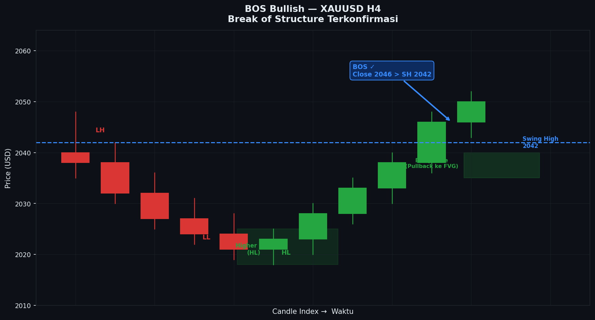
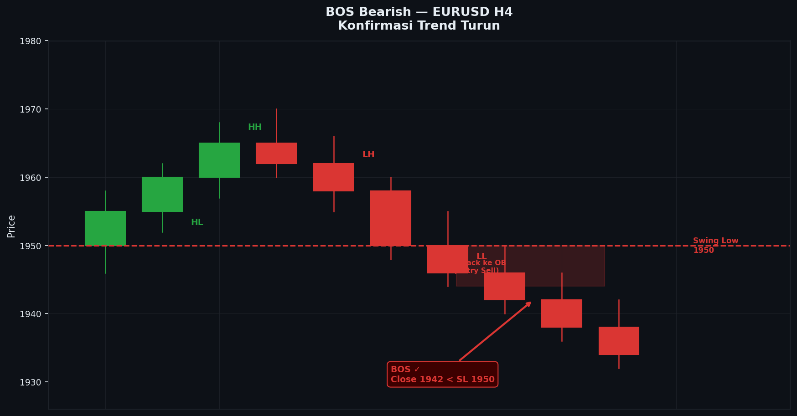
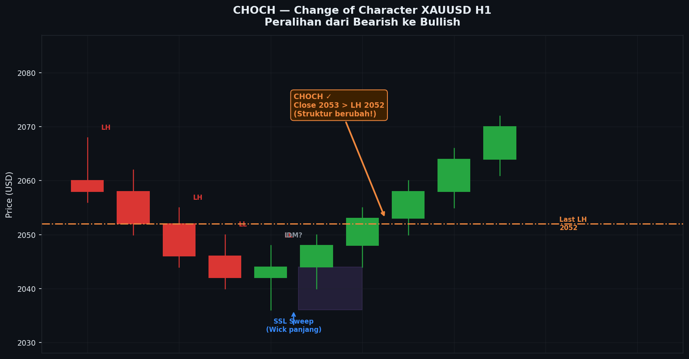

# Modul 05 — BOS & CHOCH

> **Level**: 🟡 MEDIUM | **Estimasi belajar**: 4-5 hari

---

## 5.1 Mengapa BOS & CHOCH Penting?

BOS dan CHOCH adalah **inti dari struktur SMC**. Tanpa memahami ini, kamu tidak bisa:
- Menentukan bias (bullish/bearish)
- Tahu kapan trend berubah
- Menemukan zona entry yang tepat

---

## 5.2 BOS — Break of Structure

### Definisi
**BOS** terjadi ketika harga melanjutkan arah trend dengan **menembus Swing High atau Swing Low yang signifikan**.

### BOS Bullish
```
              BOS ↑
         ─────────── ← Swing High ditembus
        /
  ──── /
      /
SH1──     ← Swing High sebelumnya belum ditembus
    \
     HL1
```

Artinya: Trend bullish **terkonfirmasi berlanjut**.

### BOS Bearish
```
LH1──     ← Swing Low sebelumnya belum ditembus
    \
     LL1
      \
  ──── \
        \
         ─────────── ← Swing Low ditembus
              BOS ↓
```

Artinya: Trend bearish **terkonfirmasi berlanjut**.

---

## 5.3 CHOCH — Change of Character

### Definisi
**CHOCH** terjadi ketika harga **melanggar struktur yang berlawanan dengan trend saat ini** — pertanda pembalikan awal.

### CHOCH dari Bearish ke Bullish
```
Kondisi: Sedang downtrend (LH → LL → LH → LL)

LH1
   \
    LL1
       \
       LH2 ← Ini masih LH (lower high)
       /
      /
     /──────── ← CHOCH! Harga tembus LH sebelumnya
    /
  LL2
```

Artinya: Struktur berubah — potensi reversal ke bullish.

### CHOCH dari Bullish ke Bearish
```
Kondisi: Sedang uptrend (HH → HL → HH → HL)

          HH2
         /
       HH1
       /
     HL1
         \
          HL2
              \──────── ← CHOCH! Harga tembus HL sebelumnya
```

Artinya: Struktur berubah — potensi reversal ke bearish.

---

## 5.4 Perbedaan BOS vs CHOCH

| | BOS | CHOCH |
|--|-----|-------|
| **Artinya** | Lanjutan trend | Perubahan trend |
| **Konteks** | Dalam trend yang sudah ada | Setelah series LH/LL atau HH/HL |
| **Tindakan** | Cari entry searah trend | Bersiap reversal |
| **Risiko** | Lebih rendah | Lebih tinggi (perlu konfirmasi) |

---

## 5.5 Cara Membaca BOS & CHOCH Step by Step

### Langkah 1: Identifikasi Swing Points
Tandai semua Swing High dan Swing Low yang signifikan.

### Langkah 2: Tentukan Trend Awal
Apakah membuat HH/HL atau LH/LL?

### Langkah 3: Monitor Penembusan
- Jika ditembus searah trend → **BOS**
- Jika ditembus berlawanan trend → **CHOCH**

### Langkah 4: Konfirmasi dengan Candle Close
**Penting**: BOS/CHOCH hanya valid jika candle **CLOSE** di luar level, bukan hanya wick.

```
TIDAK VALID:          VALID:
   ─────               ─────
  ╱ wick menembus     ┌─┐  Close menembus
─╱                    └─┘
                         ─────
```

---

## 5.6 BOS & CHOCH pada Multi-Timeframe

### Prinsip
- **HTF (H4/D1)**: BOS/CHOCH menentukan bias besar
- **ITF (H1)**: BOS/CHOCH menentukan arah trading hari ini
- **LTF (M15/M5)**: BOS/CHOCH menentukan entry precision

### Contoh:
```
D1: Uptrend (HH/HL) → Bias Bullish
H4: Sedang koreksi ke bawah → Tunggu CHOCH bullish di H4
H1: CHOCH bullish terjadi di OB → Setup entry!
M15: BOS bullish kecil → Konfirmasi entry
```

---

## 5.7 Inducement (IDM)

Konsep penting sebelum CHOCH: **Inducement**.

```
Kondisi downtrend:
LH1
   \
    LL1
       \
       LH2 (ini adalah IDM — "umpan" untuk seller)
       /↑
      /   ← harga naik dulu, TAPI belum CHOCH
     /
   LL2 (masih buat LL baru → trend masih bearish)
       \
        LH3
        /
       /──── CHOCH! (baru sekarang reversal)
```

**IDM** adalah gerakan harga yang terlihat seperti reversal tapi sebenarnya hanya "umpan" sebelum harga melanjutkan trend aslinya.

Cara membedakan IDM vs CHOCH:
- IDM: Tidak menembus swing point tertinggi sebelumnya
- CHOCH: Menembus swing point tertinggi sebelumnya (dalam downtrend)

---

## 5.8 Contoh Real Skenario

### Skenario 1: Entry setelah BOS Bullish
```
Situasi: XAUUSD H4 uptrend
1. HH terbentuk di 2050
2. Harga koreksi ke HL di 2030
3. Harga naik lagi dan BOS di atas 2050 ✓
4. Setelah BOS: cari pullback ke OB atau FVG untuk entry BUY
5. Target: Swing High berikutnya / likuiditas di atas
```

### Skenario 2: Entry setelah CHOCH Bullish
```
Situasi: XAUUSD H1 downtrend
1. LH → LL → LH → LL → LH (sudah jelas downtrend)
2. Harga tembus LH terakhir → CHOCH!
3. Konfirmasi: cari OB bullish atau FVG yang terbentuk
4. Entry BUY di zona tersebut
5. SL: di bawah LL terakhir
6. TP: Area resistensi / swing high HTF
```

---

## 5.9 Kesalahan Umum

| Kesalahan | Solusi |
|-----------|--------|
| BOS dari wick, bukan close | Tunggu candle close |
| Label CHOCH tanpa konteks trend | Pastikan ada series HH/HL atau LH/LL dulu |
| Terlalu banyak BOS di chart | Fokus pada swing yang signifikan saja |
| Entry langsung saat CHOCH tanpa konfirmasi | Tunggu pullback ke OB/FVG |

---

---

## Studi Kasus: Contoh Nyata di Chart

### Kasus 1: XAUUSD H4 — BOS Bullish Terkonfirmasi (London Session)

**Konteks:** XAUUSD sedang dalam uptrend jangka panjang di D1. Di H4, harga sedang melakukan koreksi setelah membuat Swing High di 2048. Setelah koreksi membentuk HL baru, harga rally dan kita perlu mengkonfirmasi apakah ini BOS yang valid.

**Chart:**
```
XAUUSD H4 — BOS Bullish
Periode: Senin–Kamis, London–NY Session

Harga
 2060 ─────────────────────────────────────────────── ← Target BSL berikutnya
      │
 2055 │                                         ┌─┐
      │                                         │█│ ← Candle displacement (BOS!)
 2050 │                        ┌─┐             │█│
      │                        │░│             │█│
 2048 ───────── SWING HIGH ────┤ ├─────────────┤ ├──── ← Level BOS
      │          (Previous SH) └─┘             └─┘
 2045 │        ┌─┐                    ┌─┐
      │        │░│                    │░│
 2042 │        └─┘       ┌─┐         └─┘
      │    ┌─┐           │░│
 2038 │    │░│           └─┘
      │    └─┘  ← HL1    │
 2035 │         (Higher   │
      │          Low 1)  ┌─┐
 2032 │                  │░│ ← HL2 terbentuk
      │         ┌─┐      └─┘ (tidak buat LL baru)
 2028 ─── HL0 ──┤ ├───────────────────────────────────
      │   (awal)└─┘
 2024 │    ┌─┐
      │    │░│
 2020 │    └─┘
      │
 2015 ─ LL lama (tidak ditembus) ─────────────────────
      ├──┬──┬──┬──┬──┬──┬──┬──┬──┬──┬──┬──┬──┬──┬──┤
      C1 C2 C3 C4 C5 C6 C7 C8 C9 C10 C11 C12 C13 C14 C15
      ← Downtrend →  HL0  ← Rally → HL1 ← Koreksi → HL2  ← BOS! →

Keterangan:
  C1–C4  : Downtrend awal (LH/LL)
  C5     : HL0 terbentuk di 2028 → harga tidak buat LL baru
  C6–C8  : Rally pertama, tidak menembus SH lama (2048)
  C9     : HL1 terbentuk di 2038 (Higher Low baru)
  C10–C11: Koreksi ringan
  C12    : HL2 terbentuk di 2032 (masih Higher Low)
  C13    : Candle bullish besar
  C14    : CLOSE DI ATAS 2048 → BOS TERKONFIRMASI! ✓
  C15    : Continuation candle
  
  ★ BOS valid karena CLOSE (bukan wick) di atas 2048
  ★ Ada 3 HL berurutan sebelum BOS → struktur kuat
```

**Analisis Step-by-Step:**
1. Identifikasi downtrend awal: LH → LL → LH → LL (candle C1-C4)
2. Catat Swing High terakhir di 2048 sebagai level BOS yang perlu ditembus
3. C5: Harga tidak membuat LL baru → terbentuk HL0 di 2028 (potensi reversal dimulai)
4. C6-C8: Rally tapi belum menembus 2048 → belum BOS
5. C9: Koreksi membuat HL1 di 2038 → struktur HH/HL mulai terlihat
6. C12: HL2 terbentuk di 2032 → konfirmasi Higher Low berlanjut
7. C13-C14: Momentum bullish kuat, candle C14 CLOSE di 2051 → BOS terkonfirmasi!
8. Setelah BOS: cari pullback ke area FVG/OB yang terbentuk antara C12-C14

**Hasil Trade (Entry setelah BOS):**
- Tunggu pullback ke zona 2035-2042 (FVG yang terbentuk)
- Entry BUY: 2038
- SL: 2025 (di bawah HL0, buffer 3 pip) → 13 pip risk
- TP1: 2058 (swing high berikutnya) → 20 pip
- TP2: 2072 (BSL H4 berikutnya) → 34 pip
- RR: 1:2.6 ke TP2
- Hasil: **Win** (harga mencapai TP2 dalam 2 sesi berikutnya)

---

### Kasus 2: EURUSD H1 — CHOCH Bearish → Reversal ke Downtrend

**Konteks:** EURUSD sudah uptrend selama 3 minggu di H4 (membuat HH/HL berulang). Di level H1, harga tiba-tiba membuat HL yang lebih rendah dari HL sebelumnya, dan kita curiga ada CHOCH bearish. Perlu dikonfirmasi dengan candle close.

**Chart:**
```
EURUSD H1 — CHOCH Bearish Terkonfirmasi
Periode: Selasa–Rabu, NY Session ke London Session berikutnya

Harga
 1.0940 ─────────── HH2 ──────────────────────────────
        │         (1.0938)   ← BSL di atas ini sudah di-sweep
 1.0935 │        ┌─┐
        │        │█│ ← Rally final sebelum CHOCH
 1.0930 │        │█│
        │  ┌─┐   └─┘
 1.0925 │  │█│       \
        │  └─┘  HH1   \  LH1 (Lower High terbentuk!)
 1.0920 ─── ──────────── ← HL2 = level CHOCH yang krusial
        │  HL2    ↑       \
 1.0915 │  ┌─┐   │   ┌─┐  \
        │  │█│   │   │░│   \
 1.0912 │  └─┘   │   └─┘    \
        │         │           \  ← Candle bearish besar
 1.0908 ─── HL1 ─┘            \
        │   (1.0908)           ┌─┐
 1.0905 │  ┌─┐                 │░│ ← Close di 1.0903
        │  │█│                 │░│    DI BAWAH HL2 (1.0908)
 1.0903 ─────────────────────── └─┘ ─ CHOCH! ─────────────
        │                       ↑
        │               CANDLE CHOCH BEARISH
        │               Body besar, close di bawah HL1
 1.0895 │
        │                            ┌─┐
 1.0890 ─── Target SSL ──────────────┤ ├──────────────────
        │   (Swing Low H4)           │░│
        │                            └─┘ ← Harga berlanjut turun
 1.0880 ─────────────────────────────────────────────────
        ├──┬──┬──┬──┬──┬──┬──┬──┬──┬──┬──┬──┬──┬──┬──┤
        C1 C2 C3 C4 C5 C6 C7 C8 C9 C10 C11 C12 C13 C14 C15

Keterangan candle:
  C1–C4  : HH/HL uptrend (HL1 di 1.0908, HH1 di 1.0925)
  C5–C7  : Rally ke HH2 (1.0938) — sweep BSL di atas
  C8     : Rejection dari HH2, candle bearish pertama
  C9–C10 : Koreksi, tapi hanya sampai LH1 → gagal buat HH baru
  C11    : LH1 terbentuk di 1.0921 (lebih rendah dari HH2!)
  C12    : Candle bearish besar mulai turun
  C13    : CLOSE di 1.0903 — DI BAWAH HL2 (1.0908) → CHOCH! ✓
  C14–C15: Continuation bearish, tidak ada pullback ke atas C13

  ★ CHOCH valid: setelah seri HH/HL, sekarang LH terbentuk
  ★ Candle CLOSE di bawah HL sebelumnya = konfirmasi pembalikan
  ★ IDM sempat terjadi di C9-C10 (terlihat mau naik tapi gagal)
```

**Analisis Step-by-Step:**
1. Kenali uptrend H1: HH1 (1.0925) → HL1 (1.0908) → HH2 (1.0938)
2. HH2 sweep BSL di atas 1.0935 — perhatikan apakah ada rejection!
3. C8: Rejection candle di HH2 → kemungkinan distribusi institusi
4. C9-C10: Harga mencoba naik tapi hanya sampai 1.0921 (LH1) → tidak buat HH baru
5. LH1 di 1.0921 = sinyal pertama — tapi belum CHOCH sampai HL ditembus
6. C13: Close di 1.0903, menembus HL2 (1.0908) → CHOCH BEARISH terkonfirmasi
7. Setelah CHOCH: cari setup SELL di pullback ke zona OB bearish

**Hasil Trade (Entry setelah CHOCH):**
- Tunggu pullback ke zona 1.0910-1.0915 (area OB bearish yang terbentuk)
- Entry SELL: 1.0912
- SL: 1.0925 (di atas LH1) → 13 pip risk
- TP1: 1.0890 (SSL H1 terdekat) → 22 pip
- TP2: 1.0865 (Swing Low H4) → 47 pip
- RR: 1:3.6 ke TP2
- Hasil: **Win** (harga mencapai TP1 dalam 4 jam, TP2 dalam 2 hari)

---


---

## 📊 Chart: BOS Bullish



*Gambar: BOS Bullish terkonfirmasi saat harga close di atas Swing High. Perhatikan Higher Low terbentuk sebelum BOS.*

---

## 📊 Chart: BOS Bearish



*Gambar: BOS Bearish — harga menembus Swing Low, konfirmasi trend turun berlanjut.*

---

## 📊 Chart: CHOCH Bullish



*Gambar: CHOCH — perubahan dari bearish ke bullish delivery. SSL sweep terjadi sebelum CHOCH terkonfirmasi.*

---
## 5.10 Kesimpulan Modul 05

- BOS = konfirmasi trend berlanjut
- CHOCH = sinyal awal pembalikan
- Wajib candle CLOSE untuk validasi
- IDM bisa menipu — tunggu konfirmasi CHOCH sejati
- Kombinasikan dengan OB dan FVG untuk entry (modul berikutnya)

---

> **Latihan**: Buka XAUUSD D1. Mulai dari 3 bulan yang lalu. Tandai semua BOS dan CHOCH. Hitung: berapa BOS yang valid dan berapa CHOCH yang valid? Apakah arah setelah CHOCH benar-benar berbalik?

---

**[← Modul 04](../01-LOW/04-session-waktu.md)** | **[→ Modul 06: Order Block](./06-order-block.md)**
