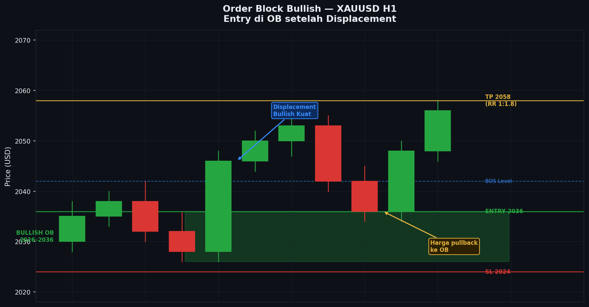
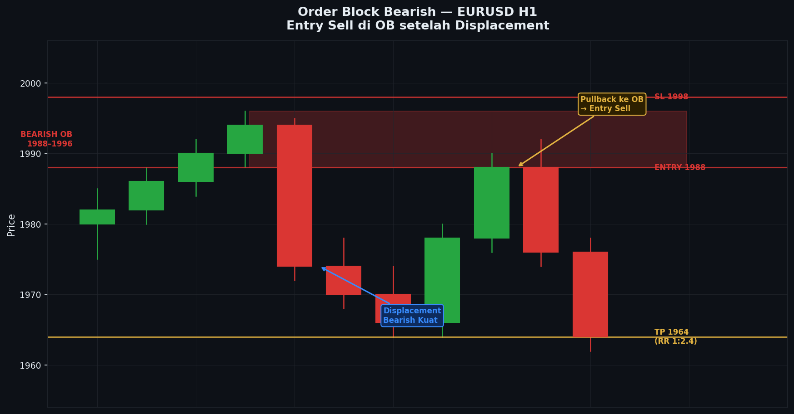

# Modul 06 — Order Block (OB)

> **Level**: 🟡 MEDIUM | **Estimasi belajar**: 5-7 hari

---

## 6.1 Apa itu Order Block?

**Order Block** adalah zona harga terakhir di mana institusi menempatkan order besar **sebelum** pergerakan impulsif terjadi. OB menjadi area di mana harga cenderung **kembali** untuk mengisi order yang belum tereksekusi.

```
Analogi:
Bayangkan kamu punya order beli 10.000 lot di harga 1.1000.
Harga lalu naik ke 1.1200 (order tidak semua terisi).
Harga kemudian turun kembali ke 1.1000 → kamu tambah beli lagi.
Ini yang dilakukan institusi di Order Block.
```

---

## 6.2 Bullish Order Block

### Definisi
Candle **bearish (merah) terakhir** sebelum pergerakan bullish impulsif yang membuat BOS ke atas.

```
Contoh:
     ┌─┐
     │░│ ← Candle bearish = BULLISH ORDER BLOCK
     └─┘
      │
     ┌─┐
     │█│ ← Displacement bullish (impulsif, buat BOS)
     │█│
     │█│
     └─┘
      ...harga terus naik (BOS terkonfirmasi)
      
      Kemudian harga pullback ke zona OB:
      ┌─┐
      └─┘  ← Area OB bullish (zona beli)
```

### Cara Menggambar Bullish OB
1. Temukan BOS bullish yang valid
2. Lihat ke belakang — cari candle bearish **terakhir** sebelum displacement
3. Kotak dari **High ke Low** candle bearish tersebut = zona OB bullish

---

## 6.3 Bearish Order Block

### Definisi
Candle **bullish (hijau) terakhir** sebelum pergerakan bearish impulsif yang membuat BOS ke bawah.

```
Contoh:
     ┌─┐
     │█│ ← Candle bullish = BEARISH ORDER BLOCK
     └─┘
      │
     ┌─┐
     │░│ ← Displacement bearish (impulsif, buat BOS)
     │░│
     │░│
     └─┘
      ...harga terus turun (BOS terkonfirmasi)
      
      Kemudian harga pullback ke zona OB:
      ┌─┐
      └─┘  ← Area OB bearish (zona jual)
```

---

## 6.4 Syarat OB yang Valid

Bukan semua candle sebelum gerakan besar adalah OB yang valid. Syarat:

| Syarat | Penjelasan |
|--------|-----------|
| **Ada BOS setelahnya** | Displacement harus membuat break structure |
| **Displacement impulsif** | Candle displacement harus besar/kuat |
| **Belum di-mitigasi** | OB yang sudah "dikunjungi" dan ditembus ke bawah/atas tidak valid lagi |
| **Konteks HTF mendukung** | Arah OB harus sejalan dengan trend HTF |

---

## 6.5 Mitigasi OB

**Mitigasi** = OB sudah "digunakan" atau dikunjungi oleh harga.

```
Bullish OB Belum Dimitigasi (masih valid):
   [OB zone] ─────────────────────────────
                                          ← Harga belum kembali ke OB
              Harga naik terus

Bullish OB Sudah Dimitigasi (tidak valid):
   [OB zone] ────────────
              ↑
              Harga kembali ke OB → lanjut naik (mitigasi normal)

Bullish OB Gugur (invalid):
   [OB zone] ────────────
              ↑
              Harga kembali ke OB → TURUN MENEMBUS OB ke bawah
              → OB ini sudah tidak valid
```

---

## 6.6 Jenis OB Lanjutan

### 1. Breaker Block
OB yang sudah gagal (dimitigasi dan ditembus) — kini berubah fungsi jadi resistance/supply.

```
Bullish OB → Harga kembali, ditembus ke bawah → 
Sekarang zona ini menjadi Bearish Breaker Block
```

### 2. Rejection Block
Candle dengan wick panjang di area yang kemudian menjadi OB. Wick menunjukkan penolakan kuat dari zona tersebut.

### 3. Propulsion Block
OB yang terbentuk dalam serangkaian gerakan naik/turun — setiap pullback ke OB menjadi opportunity entry.

### 4. Vacuum Block
Zona harga di mana terjadi "kekosongan" order — harga biasanya bergerak cepat melewati area ini.

---

## 6.7 OB + FVG Kombinasi

Sangat sering OB dan FVG (Fair Value Gap) terbentuk berdekatan atau overlap — ini disebut **Optimal Trade Entry (OTE)**.

```
Bullish Displacement:
     ┌─┐ Candle 1 (bearish = OB)
     └─┘
          [FVG di sini — celah antara candle 1 dan 3]
     ┌─┐ Candle 3 (bullish besar = displacement)
     │█│
     └─┘

Zona terbaik untuk entry:
→ High OB sampai Low FVG = Zona Confluent Entry
```

---

## 6.8 Volume Imbalance pada OB

OB yang lebih kuat biasanya memiliki **volume imbalance** — terlihat dari:
- Badan candle sangat besar
- Hampir tidak ada wick
- Pergerakan terjadi cepat (satu atau dua candle)

---

## 6.9 Entry di Order Block

### Setup Entry Bullish OB:
```
1. HTF: Trend bullish (D1/H4 BOS ke atas)
2. ITF: CHOCH bullish atau BOS bullish di H1
3. OB bullish terbentuk di H1/M15
4. Harga pullback ke zona OB
5. Konfirmasi entry: CISD candle atau engulfing bullish di dalam OB
6. Entry: Open candle konfirmasi
7. SL: Di bawah Low OB (+ beberapa pip buffer)
8. TP: Swing High berikutnya / BSL yang terlihat
```

---

## 6.10 Contoh Real Scenario

### XAUUSD — Bullish OB Setup
```
Analisis:
D1: Uptrend, harga baru saja buat HH
H4: Pullback, CHOCH bullish terjadi
H1: Displacement bullish → OB terbentuk di H1

Eksekusi:
- Harga pullback ke OB H1
- Di dalam OB: muncul hammer + wick panjang ke bawah
- Entry BUY di close hammer
- SL: 5 pip di bawah Low OB
- TP: Swing High H4 (2x-3x risk)
- RR ratio: 1:3
```

---

## 6.11 Kesalahan Umum OB

| Kesalahan | Solusi |
|-----------|--------|
| Label setiap candle sebagai OB | Hanya candle sebelum displacement + BOS |
| Tidak cek apakah OB sudah dimitigasi | Selalu cek history — sudah dikunjungi belum? |
| Entry tanpa konfirmasi candle | Tunggu rejection / CISD di dalam OB |
| OB berlawanan dengan HTF | Pastikan OB sejalan dengan bias HTF |

---

---

## Studi Kasus: Contoh Nyata di Chart

### Kasus 1: XAUUSD H1 — Bullish Order Block Entry (Asian → London)

**Konteks:** XAUUSD D1 dalam uptrend kuat, baru saja membuat Higher High baru di 2072. Di H4, harga sedang pullback. Di H1, displacement bullish terjadi dan membentuk OB yang jelas. Kita menunggu pullback ke OB tersebut untuk entry BUY.

**Chart:**
```
XAUUSD H1 — Bullish Order Block Setup
Periode: Senin malam (Asian) hingga Selasa London Open

Harga
 2078 ──────────────────────────────── ← Target TP2 (BSL H4)
      │
 2072 ─── BSL terdekat ───────────────────────────────────
      │                                         ┌─┐
 2068 │                                         │█│
      │                                         │█│ ← Displacement bullish
 2064 │                                         │█│   (BOS terjadi di sini)
      │                                 ┌─┐     │█│
 2060 ─── Swing High (level BOS) ───────┤ ├─────┤ ├─── BOS → 2060 ditembus
      │                                 └─┘     └─┘
 2058 │                         ┌─┐      ↑
      │                         │░│  candle 1
 2055 │              ┌─┐        │░│  (bullish kecil
      │   ┌─┐        │░│        └─┘   bukan OB)
 2052 │   │░│        └─┘
      │   └─┘
 2050 │         ┌─┐
      │    ┌─┐  │░│ ← BULLISH OB ← Candle bearish TERAKHIR
      │    │░│  └─┘   sebelum displacement
 2048 ─────┤ ├──────────────────────────────────────────
      │    └─┘  ↑
 2046 │    OB Zone: 2048–2056
      │    (High OB = 2056, Low OB = 2048)
 2044 │                     ┌─┐ ← Harga pullback ke OB
      │                     │░│
 2042 ─── HL sebelumnya ────┤ ├──────────────────────────
      │                     └─┘
 2040 │            ┌─┐       │
      │            │░│       │ ← Harga masuk zona OB
 2038 │            └─┘       ↓
      │
 2036 ─────────────────────── SL area ──────────────────
      ├──┬──┬──┬──┬──┬──┬──┬──┬──┬──┬──┬──┬──┬──┬──┬──┤
      C1 C2 C3 C4 C5 C6 C7 C8 C9 C10 C11 C12 C13 C14 C15 C16

Detail candle OB:
  ╔══════════════════════════════════════╗
  ║  BULLISH ORDER BLOCK                 ║
  ║  Candle bearish terakhir sebelum     ║
  ║  displacement                        ║
  ║                                      ║
  ║  High OB : 2056.50                   ║
  ║  Open OB : 2055.00  ┌──────┐         ║
  ║  Close OB: 2049.80  │ ░░░░ │ ← body  ║
  ║  Low OB  : 2048.20  └──────┘         ║
  ║                                      ║
  ║  Lebar zona: 8.3 pip                 ║
  ║  Entry ideal: 2050-2055              ║
  ╚══════════════════════════════════════╝

Keterangan:
  C1–C5  : Sideways Asian session
  C6     : BULLISH OB terbentuk (candle bearish, close 2049.80)
  C7     : Displacement bullish dimulai (candle besar)
  C8     : BOS — close di atas 2060 → OB terkonfirmasi valid
  C9–C12 : Harga terus naik
  C13    : Pullback dimulai
  C14    : Harga masuk zona OB (2056 ke bawah)
  C15    : Di dalam OB: muncul candle hammer (wick bawah panjang)
  C16    : Konfirmasi bullish engulfing → ENTRY!

  ★ OB valid: ada BOS setelah displacement
  ★ OB belum dimitigasi (fresh)
  ★ Konfirmasi: hammer + engulfing di dalam OB
  ★ Konteks HTF mendukung (D1 uptrend)
```

**Analisis Step-by-Step:**
1. Tentukan bias HTF: D1 uptrend, H4 sedang koreksi → cari BUY di H1
2. Identifikasi displacement bullish di H1 (candle C7): impulsif, besar, membuat BOS
3. Tarik candle bearish terakhir sebelum displacement (C6) → ini Bullish OB
4. Gambar kotak dari High C6 (2056.50) ke Low C6 (2048.20) = zona OB
5. Tunggu harga pullback ke zona OB (2048-2056)
6. Di dalam OB, amati candle konfirmasi: C15 hammer → potensi entry
7. C16 bullish engulfing menutup di atas high C15 → konfirmasi entry
8. Pasang order dengan SL di bawah Low OB

**Hasil Trade:**
- Entry BUY: 2053.50 (close candle konfirmasi C16)
- SL: 2045.00 (5 pip di bawah Low OB 2048.20) → 8.5 pip risk
- TP1: 2068.00 (Swing High sebelum BOS) → 14.5 pip
- TP2: 2078.00 (BSL H4) → 24.5 pip
- RR: 1:2.9 ke TP2
- Hasil: **Win** — TP1 tercapai dalam 3 candle H1, TP2 dalam sesi NY

---

### Kasus 2: EURUSD H4 — Bearish Order Block Entry (Bearish Continuation)

**Konteks:** EURUSD D1 sedang downtrend. Di H4, harga membuat rally koreksi ke atas setelah buat Lower Low. Rally ini mendekati zona Bearish OB yang terbentuk sebelumnya. Kita siap untuk SELL dari OB.

**Chart:**
```
EURUSD H4 — Bearish Order Block (SELL Setup)
Periode: Rabu–Kamis, multi-sesi

Harga
 1.0960 ─────────── BSL di atas ini ─────────────────────
        │
 1.0950 ─────────── BEARISH OB ──────────────────────────
        │           High OB: 1.0948    ╔══════════════╗
 1.0948 ─────────── ─────────────────  ║ BEARISH OB   ║
        │           ┌─┐ ← Candle       ║              ║
 1.0944 │           │█│   bullish      ║ High: 1.0948 ║
        │           │█│   terakhir     ║ Open: 1.0940 ║
 1.0940 │           │█│   sebelum      ║ Close:1.0933 ║
        │           └─┘   displacement ║ Low: 1.0930  ║
 1.0933 ─── Close OB ─────────────────  ╚══════════════╝
        │
 1.0928 │    ┌─┐                               Lebar: 18 pip
        │    │░│ ← Displacement bearish
 1.0920 │    │░│   (BOS ke bawah)
        │    │░│
 1.0912 ─────┤ ├────── BOS ──────────────────────────────
        │    └─┘  ← Swing Low ditembus
 1.0905 │
        │         ┌─┐
 1.0900 │         │░│
        │         │░│ ← Harga turun terus
 1.0890 │         └─┘
        │               ┌─┐   ← Rally koreksi
 1.0882 ─── LL ─────────┤ ├──────────────────────────────
        │   (Lower Low)  │░│
 1.0875 │                └─┘ ← Rally berhenti di LL area
        │                         ┌─┐ ← Pullback ke atas
 1.0888 │                         │█│
        │                         │█│
 1.0895 │                         └─┘
        │                              ┌─┐ ← Masuk OB zone
 1.0905 │                              │█│
        │                              │█│ ← Close di 1.0933
 1.0915 │                              │█│   (di dalam OB)
        │                              └─┘
 1.0930 ─── LOW OB ───────────────────── ← Harga masuk zona OB
        │                                ┌─┐ ← Rejection candle!
 1.0936 │                                │░│   Wick panjang ke atas
 1.0940 ─── ENTRY SELL ──────────────────┤ ├── ← Entry di sini
        │                                └─┘
 1.0948 ─── HIGH OB / SL ────────────────────────────────
        │
        ↓ Harga turun setelah rejection dari OB
        │
 1.0880 ─── TP1 ─────────────────────────────────────────
 1.0855 ─── TP2 ─────────────────────────────────────────

        ├──┬──┬──┬──┬──┬──┬──┬──┬──┬──┬──┬──┬──┬──┬──┤
        C1 C2 C3 C4 C5 C6 C7 C8 C9 C10 C11 C12 C13 C14 C15

  ★ OB = candle bullish TERAKHIR sebelum displacement bearish (C2)
  ★ Displacement (C3) membuat BOS ke bawah → OB tervalidasi
  ★ Harga rally kembali ke OB di C13–C14
  ★ Rejection candle di High OB → SELL setup
  ★ SL di atas High OB (1.0950), bukan di tengah OB
```

**Analisis Step-by-Step:**
1. Bias D1 bearish → cari SELL di H4
2. Identifikasi displacement bearish C3 yang membuat BOS ke bawah 1.0912
3. Candle C2 (bullish terakhir sebelum displacement) = Bearish OB
4. Zone OB: High 1.0948 → Low 1.0930
5. Harga membuat LL di 1.0882, lalu rally koreksi
6. Rally mencapai zona OB (1.0930-1.0948) di C13
7. Candle C14: rejection candle (wick panjang ke atas, body kecil bearish) → konfirmasi
8. SELL di close C14 atau open C15

**Hasil Trade:**
- Entry SELL: 1.0938
- SL: 1.0952 (4 pip di atas High OB) → 14 pip risk
- TP1: 1.0880 (Previous Low / LL terdekat) → 58 pip
- TP2: 1.0855 (SSL H4 berikutnya) → 83 pip
- RR: 1:5.9 ke TP2
- Hasil: **Win** — TP1 tercapai dalam 2 candle H4, TP2 dalam 3 hari

---


---

## 📊 Chart: Order Block Bullish



*Gambar: Bullish OB — zona hijau adalah candle bearish terakhir sebelum displacement. Harga pullback ke OB lalu lanjut naik.*

---

## 📊 Chart: Order Block Bearish



*Gambar: Bearish OB — candle bullish terakhir sebelum displacement bearish. Harga pullback ke OB lalu lanjut turun.*

---
## 6.12 Kesimpulan Modul 06

- OB = candle terakhir sebelum displacement impulsif
- Bullish OB = candle bearish sebelum naik
- Bearish OB = candle bullish sebelum turun
- OB yang sudah dimitigasi dan ditembus → tidak valid (jadi Breaker)
- Entry di OB butuh konfirmasi candle

---

> **Latihan**: Di XAUUSD H1, cari 5 Bullish OB dan 5 Bearish OB. Tandai dengan kotak. Cek: berapa yang sudah dimitigasi? Berapa yang masih fresh? Apakah harga bereaksi saat kembali ke OB?

---

**[← Modul 05](./05-bos-choch.md)** | **[→ Modul 07: FVG & Imbalance](./07-fvg-imbalance.md)**
