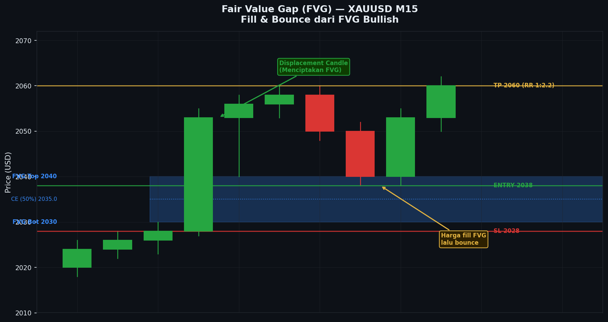

# Modul 07 — FVG & Imbalance

> **Level**: 🟡 MEDIUM | **Estimasi belajar**: 3-4 hari

---

## 7.1 Apa itu Fair Value Gap (FVG)?

**Fair Value Gap** adalah celah harga yang terbentuk ketika pasar bergerak terlalu cepat sehingga **tidak semua order terisi** di zona tersebut. FVG menunjukkan **ketidakseimbangan** antara supply dan demand.

### Konsep Dasar
Market selalu berusaha mencari "fair value" — harga yang menyeimbangkan buyer dan seller. Ketika ada gap besar, market cenderung **kembali mengisi** gap tersebut.

---

## 7.2 Cara Mengidentifikasi FVG

FVG terbentuk dari **3 candle berurutan**:

### Bullish FVG
```
Candle 1: ┌─┐  High = A
           └─┘  Low  = B

Candle 2: ┌──┐  (candle besar bullish = displacement)
           │██│
           └──┘

Candle 3: ┌─┐  High = C
           └─┘  Low  = D

FVG = celah antara HIGH Candle 1 (A) dan LOW Candle 3 (D)
Kondisi: A < D (ada gap, tidak overlap)

        D ─── Low candle 3
        ↑
   [FVG zona] ← Area yang tidak pernah diperdagangkan
        ↓
        A ─── High candle 1
```

### Bearish FVG
```
Candle 1: ┌─┐  Low = A (yang relevan adalah LOW)
           └─┘

Candle 2: ┌──┐  (candle besar bearish = displacement)
           │░░│
           └──┘

Candle 3: ┌─┐  High = B
           └─┘

FVG = celah antara LOW Candle 1 (A) dan HIGH Candle 3 (B)
Kondisi: A > B (ada gap)

        A ─── Low candle 1
        ↑
   [FVG zona] ← Area yang tidak pernah diperdagangkan
        ↓
        B ─── High candle 3
```

---

## 7.3 Cara Trading dengan FVG

### Bullish FVG (zona support)
```
FVG terbentuk saat harga naik impulsif
→ Harga koreksi turun ke zona FVG
→ FVG bertindak sebagai support
→ Harga bangkit kembali dari FVG
→ ENTRY BUY di dalam FVG
```

### Bearish FVG (zona resistance)
```
FVG terbentuk saat harga turun impulsif
→ Harga koreksi naik ke zona FVG
→ FVG bertindak sebagai resistance
→ Harga turun kembali dari FVG
→ ENTRY SELL di dalam FVG
```

---

## 7.4 Level Entry di dalam FVG

Ada 3 area entry di dalam FVG:

```
          ┌──────────────────┐
          │   50% (midpoint) │ ← Entry paling umum
          │                  │
          │   Lower 25%      │ ← Entry agresif (RR lebih baik)
          └──────────────────┘
```

| Area Entry | Karakteristik |
|-----------|---------------|
| **Upper FVG** | Konservatif, kemungkinan fill tinggi |
| **50% Midpoint** | Balanced, paling sering digunakan |
| **Lower FVG** | Agresif, RR terbaik tapi risiko stop lebih besar |

---

## 7.5 FVG yang Valid vs Tidak Valid

### FVG Valid:
- Terbentuk dari displacement yang signifikan (candle besar)
- Belum di-fill sepenuhnya
- Searah dengan trend HTF
- Terbentuk di area yang "penting" (di atas/bawah OB, dekat swing point)

### FVG Tidak Valid / Lemah:
- Terbentuk dari candle kecil (insignificant)
- Sudah di-fill sepenuhnya (harga melewati seluruh FVG)
- Berlawanan dengan trend HTF
- Terlalu banyak FVG di area yang sama

---

## 7.6 Inverse FVG (IFVG)

Ketika FVG sudah **di-fill sepenuhnya** dan harga malah terus melewatinya — FVG berubah fungsi menjadi **kebalikannya**.

```
Bullish FVG → Di-fill → Harga menembus ke bawah FVG
→ FVG berubah menjadi IFVG (Bearish) = resistance baru

Contoh:
    [Bullish FVG] ← Terbentuk
    Harga turun mengisi FVG
    Harga terus turun melewati batas bawah FVG
    [FVG ini sekarang = Bearish IFVG]
    Jika harga naik ke sini → expect sell
```

---

## 7.7 Volume Imbalance (VI)

**Volume Imbalance** lebih kecil dari FVG — terbentuk ketika ada gap antara Close candle sebelumnya dan Open candle berikutnya.

```
Candle 1: Close = X
Candle 2: Open  = Y (di atas X, ada gap)

Gap antara X dan Y = Volume Imbalance
```

VI biasanya lebih cepat diisi karena ukurannya kecil.

---

## 7.8 Consequent Encroachment (CE)

**CE** = titik tengah (50%) dari FVG. Ini adalah level yang paling sering menjadi area di mana harga bereaksi sebelum melanjutkan pergerakan.

```
FVG:
───── High FVG
  ↑
  CE (50%) ← Harga sering berhenti di sini
  ↓
───── Low FVG
```

---

## 7.9 FVG + OB Kombinasi (Premium Entry)

Ketika FVG dan OB berada di zona yang sama atau overlapping:

```
Bullish Setup:
─────────── High OB ─────────
   [OB Zone]                  ← OB bullish
─────────── Low OB / High FVG ← Area overlap = PREMIUM
   [FVG Zone]
─────────── Low FVG ──────────

Entry di zona overlap = Optimal Trade Entry (OTE)
Highest probability setup
```

---

## 7.10 Contoh Skenario

### Skenario: XAUUSD Bullish FVG Entry
```
1. D1/H4: Trend bullish, baru saja BOS ke atas
2. H1: Displacement bullish terjadi → FVG terbentuk
3. Harga koreksi ke bawah
4. Harga masuk ke dalam FVG
5. Di FVG: muncul candle bullish engulfing
6. Entry BUY di close engulfing
7. SL: Di bawah Low FVG
8. TP: Swing High terbaru / BSL yang terlihat
9. RR: Minimal 1:2
```

---

## 7.11 Gap pada Market Open

Khusus untuk **indeks (NAS100, S&P500)** dan **saham** — ada **weekend gap** atau **overnight gap** yang fungsinya mirip FVG. Market cenderung mengisi gap ini sebelum melanjutkan trend.

---

---

## Studi Kasus: Contoh Nyata di Chart

### Kasus 1: XAUUSD M15 — Bullish FVG Entry (London Kill Zone)

**Konteks:** XAUUSD H4 dalam uptrend, baru saja BOS ke atas 2055. Di M15, displacement bullish yang kuat terjadi saat London Open membentuk FVG besar. Harga kemudian pullback mengisi sebagian FVG. Kita tunggu entry di area CE (50%) FVG.

**Chart:**
```
XAUUSD M15 — Bullish FVG Entry
Periode: London Open (14:00–16:30 WIB)

Harga
 2075 ──────────────────────────────── ← TP2 (BSL H1)
      │
 2071 │                          ┌─┐
      │                          │█│
 2068 │                          │█│ ← Candle 3 (Low = 2064)
      │                     ┌────┴─┘ ← LOW CANDLE 3 = 2064
 2064 ─── LOW FVG ──────────┘                           ──── CE = 2060
      │        ↑                                        ──── MIDPOINT
      │   [F V G Z O N E]  ← Celah yang tidak diperdagangkan
      │        ↓
 2056 ─── HIGH FVG ─────────────────────── ← HIGH CANDLE 1 = 2056
      │    ┌─┐ ← Candle 1 (High = 2056)
 2054 │    │░│   (High candle 1)
 2052 │    └─┘
      │         ┌──────────────────────────┐ ← Candle 2 = Displacement!
 2048 │         │                          │   Bullish besar, menutup
      │         │ █ █ █ █ █ █ █ █ █ █ █ │   jauh di atas semua candle
 2044 │         │                          │
 2040 │         └──────────────────────────┘
      │    ┌─┐
 2036 │    │░│
      │    │░│
 2032 │    └─┘  ← Harga sebelum displacement
      │
 2028 ─── Area sebelum London ─────────────────────────
      │
      │             FVG DETAIL:
      │             ╔═══════════════════════════════╗
      │             ║  HIGH FVG : 2056.00           ║
      │             ║  CE (50%) : 2060.00  ← Entry  ║
      │             ║  LOW FVG  : 2064.00           ║
      │             ║  Ukuran FVG: 8 pip            ║
      │             ╚═══════════════════════════════╝
      │
      │                  Setelah displacement: harga pullback
      │                        ┌─┐ ← Candle pullback turun
 2067 │                        │░│
      │                        │░│
 2063 │                        │░│ ← Masuk FVG (2064 ke bawah)
      │                        └─┘
 2060 ─── CE FVG ──────────────── ↓ ← Harga menyentuh CE
      │                    ┌─┐    │   Candle hammer terbentuk!
 2058 │                    │░│    │   (wick bawah ke 2057)
      │                    └─┘ ───┘ ← ENTRY di sini (2060)
      │                         ↑
      │                   Harga bounce dari CE
      │
 2071 ─── TP1 ────────────────────────────────────────
 2075 ─── TP2 ────────────────────────────────────────
      │
      ├──┬──┬──┬──┬──┬──┬──┬──┬──┬──┬──┬──┬──┬──┬──┤
      T1 T2 T3 T4 T5 T6 T7 T8 T9 T10 T11 T12 T13 T14 T15
     14:00                15:00                16:00 WIB

  Timeline:
  T1–T4  : Asian late session, sideways di 2030-2036
  T5     : London Open — displacement bullish BESAR (Candle 2)
  T6     : Candle 3 terbentuk (Low = 2064) → FVG teridentifikasi
  T7–T9  : Harga terus naik, FVG terbentuk antara T4 (High=2056) dan T6 (Low=2064)
  T10    : Harga mulai pullback dari high 2071
  T11–T12: Harga turun ke dalam FVG
  T13    : Menyentuh CE (2060), candle hammer → sinyal buy
  T14    : Candle konfirmasi bullish engulfing → ENTRY
  T15    : Candle continuation → TP1 hampir tercapai

  ★ FVG valid: dari displacement impulsif yang signifikan
  ★ Searah trend HTF (H4 uptrend)
  ★ Entry di CE (50%) = optimal risk/reward
  ★ Hammer di CE = konfirmasi rejection yang kuat
```

**Analisis Step-by-Step:**
1. Identifikasi 3 candle pembentuk FVG: Candle 1 (High 2056) → Candle 2 (displacement besar) → Candle 3 (Low 2064)
2. Hitung FVG zone: dari High C1 (2056) ke Low C3 (2064) = 8 pip zone
3. Hitung CE (50%): (2056 + 2064) / 2 = 2060
4. Tunggu harga pullback dari high displacement (2071) turun ke FVG
5. Monitor candle saat masuk FVG — apakah ada tanda reversal?
6. T13: Candle hammer di CE → body kecil, wick bawah ke 2057 → sinyal kuat
7. T14: Engulfing bullish menutup di 2062 → konfirmasi entry BUY
8. Pasang SL di bawah Low FVG (2056) dengan buffer 2 pip

**Hasil Trade:**
- Entry BUY: 2062 (close candle konfirmasi T14)
- SL: 2053.50 (2 pip di bawah High FVG yang telah diisi) → 8.5 pip risk
- TP1: 2071 (high sebelum pullback) → 9 pip
- TP2: 2078 (BSL H1 berikutnya) → 16 pip
- RR: 1:1.9 ke TP2
- Hasil: **Win** — TP1 dalam 2 candle M15, TP2 dalam 45 menit

---

### Kasus 2: NAS100 H1 — IFVG (Inverse FVG) sebagai Resistance

**Konteks:** NAS100 sedang dalam downtrend H4. Di H1, terdapat Bullish FVG yang terbentuk sebelumnya — tapi harga sudah melewati dan menembus ke bawah FVG tersebut. FVG tersebut kini menjadi IFVG (Bearish). Kita siap SELL saat harga pullback ke IFVG.

**Chart:**
```
NAS100 H1 — IFVG (Inverse FVG) sebagai Bearish Resistance
Periode: Selasa–Rabu, NY Session

Harga
 18250 ─────────────────────────────────────────────────
       │
 18200 ─── SELL Entry ───────────────────────────────────
       │          ┌─┐ ← Rally koreksi ke IFVG
 18185 ─── HIGH IFVG (ex-LOW FVG) ─────────────────────
       │     ┌─┐  │░│
 18175 │     │░│  │░│
       │     │░│  └─┘ ← Harga masuk IFVG zone
 18165 ─── CE IFVG (50%) ────────────────────────────────
       │          │    ← Entry SELL di CE IFVG
 18155 ─── LOW IFVG (ex-HIGH FVG) ──────────────────────
       │          ┌─┐ ← Rejection bearish di IFVG!
 18148 │          │░│   Body besar, wick ke atas 18185
       │          │░│
 18140 │          └─┘ ─ ENTRY SELL (close candle rejection)
       │
       │   [[ FLASHBACK: Sebelumnya ]]
       │
       │   Bullish FVG dulu terbentuk di zona ini:
       │   HIGH FVG: 18155  ← sekarang = LOW IFVG
       │   LOW FVG : 18185  ← sekarang = HIGH IFVG
       │
       │   Lalu harga TURUN melewati seluruh FVG:
       │   ┌─┐ ← Candle bearish besar
       │   │░│   menembus ke bawah 18155
 18155 ───┤ ├──── LOW FVG DITEMBUS ── FVG berubah jadi IFVG!
       │   │░│
 18130 │   └─┘
       │
       │   [[ SEKARANG: Harga pullback ke IFVG ]]
       │
 18100 ─── TP1 ──────────────────────────────────────────
 18050 ─── TP2 ──────────────────────────────────────────
       │
       ├──┬──┬──┬──┬──┬──┬──┬──┬──┬──┬──┬──┬──┬──┬──┤
       C1 C2 C3 C4 C5 C6 C7 C8 C9 C10 C11 C12 C13 C14 C15

  IFVG Detail:
  ╔═══════════════════════════════════════════╗
  ║  ORIGINAL FVG (Bullish) → kini IFVG      ║
  ║                                           ║
  ║  HIGH IFVG : 18185 (ex-Low FVG)          ║
  ║  CE IFVG   : 18170 (50%)                 ║
  ║  LOW IFVG  : 18155 (ex-High FVG)         ║
  ║                                           ║
  ║  Perubahan fungsi: Support → Resistance   ║
  ║  Trigger perubahan: Close di bawah 18155  ║
  ╚═══════════════════════════════════════════╝

  Timeline:
  C1–C4 : Bullish FVG terbentuk (displacement ke atas)
  C5–C7 : Harga di atas FVG, sempat turun ke FVG, di-fill sebagian
  C8    : Candle bearish besar — CLOSE DI BAWAH Low FVG (18155)
            → FVG berubah menjadi IFVG!
  C9–C11: Harga turun jauh dari IFVG
  C12   : Rally koreksi dimulai
  C13   : Harga masuk IFVG zone (naik ke 18175)
  C14   : Rejection bearish di IFVG — shooting star pattern
  C15   : Konfirmasi bearish engulfing → ENTRY SELL

  ★ IFVG terjadi karena FVG sepenuhnya ditembus
  ★ Fungsi berubah: dari support (bullish FVG) jadi resistance (IFVG)
  ★ Entry di CE IFVG = 18170 / atau di rejection candle
  ★ Konfirmasi: shooting star + engulfing di IFVG zone
```

**Analisis Step-by-Step:**
1. Identifikasi Bullish FVG yang terbentuk sebelumnya (High 18155, Low 18185)
2. Monitor: apakah harga kembali mengisi FVG dengan wajar (bounce) atau malah ditembus?
3. C8: Candle CLOSE di bawah 18155 (Low FVG) → FVG berubah status menjadi IFVG bearish
4. Tandai ulang zona: High IFVG = 18185, Low IFVG = 18155, CE = 18170
5. Tunggu rally koreksi — apakah harga kembali ke IFVG?
6. C12-C13: Rally mencapai IFVG zone → perhatikan candle
7. C14: Shooting star — sinyal penolakan dari IFVG
8. C15: Bearish engulfing mengkonfirmasi → ENTRY SELL

**Hasil Trade:**
- Entry SELL: 18148 (close candle konfirmasi C15)
- SL: 18195 (5 pip di atas High IFVG 18185) → 47 pip risk
- TP1: 18050 (SSL H1 terdekat) → 98 pip
- TP2: 17980 (SSL H4 berikutnya) → 168 pip
- RR: 1:3.6 ke TP2
- Hasil: **Win** — TP1 dalam 3 jam, TP2 dalam 2 sesi trading

---


---

## 📊 Chart: Fair Value Gap (FVG) Bullish



*Gambar: FVG Bullish — zona biru adalah celah harga antara candle 1 dan candle 3. CE (50%) ditandai dengan garis putus-putus. Harga fill FVG lalu bounce.*

---
## 7.12 Kesimpulan Modul 07

- FVG = celah dari 3 candle yang tidak sempat diperdagangkan
- Market cenderung kembali mengisi FVG
- FVG + OB = zona entry premium (OTE)
- FVG yang sudah ditembus sepenuhnya → berubah jadi IFVG
- CE (50% FVG) adalah level reaksi yang umum

---

> **Latihan**: Di NAS100 H1, temukan 5 Bullish FVG dan 5 Bearish FVG. Tandai CE (50%) di setiap FVG. Amati: apakah harga bereaksi di CE? Berapa yang sudah di-fill sepenuhnya?

---

**[← Modul 06](./06-order-block.md)** | **[→ Modul 08: Liquidity](./08-liquidity.md)**
