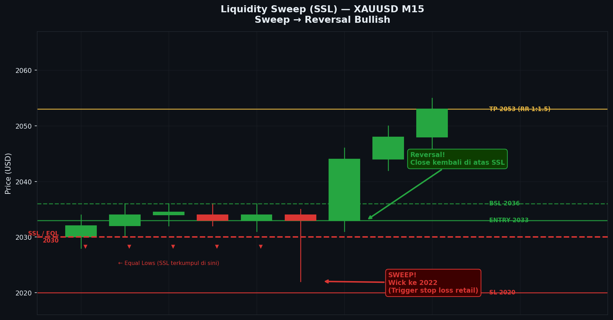

# Modul 08 — Liquidity (Likuiditas)

> **Level**: 🟡 MEDIUM | **Estimasi belajar**: 4-5 hari

---

## 8.1 Mengapa Likuiditas Sangat Penting?

Institusi besar tidak bisa langsung "klik beli" seperti retail. Mereka butuh **penjual** dalam jumlah besar untuk mengisi posisi beli mereka. 

Likuiditas = kumpulan order yang bisa dieksekusi institusi.

```
Institusi mau BUY 10.000 lot → butuh penjual 10.000 lot
→ Penjual terbesar = Stop Loss para retail buyer
→ Stop Loss retail buyer biasanya: DI BAWAH swing low, di bawah round number, di bawah EQL
→ Institusi gerakkan harga ke sana dulu, trigger stop → mereka dapat likuiditas
→ Setelah itu baru harga naik ke tujuan mereka yang sebenarnya
```

---

## 8.2 Buy Side Liquidity (BSL)

**BSL** = kumpulan order yang ada **di atas** harga saat ini.

Siapa yang membentuk BSL?
- Stop Loss para trader yang SELL (stop mereka ada di atas)
- Buy Stop order dari breakout trader
- Limit Sell order yang menunggu di swing high

```
─────────── Swing High / Equal High ← BSL ada di sini
                                       (stop loss para seller)
  Harga saat ini
─────────────────────────────────────
```

**Skenario**: Institusi ingin SELL. Mereka perlu beli dulu di harga lebih tinggi, jadi mereka push harga naik ke BSL, trigger stop loss seller → sekarang ada "penjual" → institusi masuk sell.

---

## 8.3 Sell Side Liquidity (SSL)

**SSL** = kumpulan order yang ada **di bawah** harga saat ini.

Siapa yang membentuk SSL?
- Stop Loss para trader yang BUY (stop mereka ada di bawah)
- Sell Stop order dari breakdown trader
- Limit Buy order yang menunggu di swing low

```
─────────────────────────────────────
  Harga saat ini

─────────── Swing Low / Equal Low ← SSL ada di sini
                                      (stop loss para buyer)
```

---

## 8.4 Jenis-Jenis Zona Likuiditas

### 1. Swing High/Low Liquidity
Area di atas swing high atau di bawah swing low — paling umum.

### 2. Equal Highs (EQH) / Equal Lows (EQL)
```
EQH: Dua atau lebih high yang berdekatan di level sama
─────── H1 ─── H2 ─── H3 ─── ← BSL (sangat kuat)

EQL: Dua atau lebih low yang berdekatan di level sama
─────── L1 ─── L2 ─── L3 ─── ← SSL (sangat kuat)
```

EQH/EQL lebih kuat karena lebih banyak stop loss yang terkumpul di satu level.

### 3. Round Number Liquidity
Level psikologis seperti 2000.00, 1.1000, 150.00 — banyak order ditempatkan di sini.

### 4. Previous High/Low (PWH/PWL)
- Previous Week High/Low
- Previous Day High/Low
- Previous Month High/Low

Level-level ini sangat diperhatikan institusi.

### 5. Trendline Liquidity
Stop loss trader yang mengikuti trendline ditempatkan di bawah/atas trendline.

---

## 8.5 Liquidity Sweep (Stop Hunt)

**Sweep** terjadi ketika harga menembus zona likuiditas — trigger semua stop — lalu **berbalik arah**.

```
Bullish Sweep (Sweep SSL untuk naik):
─────────────────────────────────────
 Harga turun ke SSL
 ─── SSL ─── ← Harga tembus ke bawah (trigger stop)
     ↓↓↓
     wick panjang ke bawah
     ↑↑↑
 Harga balik naik → THIS IS THE MOVE
─────────────────────────────────────
```

```
Bearish Sweep (Sweep BSL untuk turun):
─────────── BSL ─── ← Harga tembus ke atas (trigger stop)
                ↑↑↑
                wick panjang ke atas
                ↓↓↓
 Harga balik turun → THIS IS THE MOVE
─────────────────────────────────────
```

---

## 8.6 Cara Membaca Liquidity Sweep

### Ciri Sweep yang Valid:
1. Harga menembus level dengan **wick** (bukan close)
2. Setelah wick: candle berikutnya menutup **kembali** ke dalam range
3. Volume spike (jika tersedia)
4. Terjadi di zona SMC yang relevan (OB, FVG)

```
SWEEP VALID:
        │   ← Wick menembus ke bawah SSL
       ┌─┐
       │█│  ← Candle berikutnya close di atas SSL = sweep terkonfirmasi
       └─┘
────── SSL ─────

BUKAN SWEEP (Breakdown):
       ┌─┐
       │░│  ← Candle CLOSE di bawah SSL = ini bukan sweep, ini breakdown
       └─┘
────── SSL ─────
```

---

## 8.7 HTF vs LTF Liquidity

### HTF Liquidity (D1/W/MN)
- Swing high/low dari timeframe besar
- Bergerak jauh, perlu waktu berminggu-minggu
- Target TP jarak jauh

### ITF Liquidity (H4/H1)
- Swing high/low dari timeframe menengah
- Target TP jarak menengah

### LTF Liquidity (M15/M5)
- Swing micro / equal high/low kecil
- Digunakan untuk entry precision dan SL placement

---

## 8.8 Urutan Pergerakan Harga (Liquidity Logic)

Institusi selalu bergerak dari satu zona likuiditas ke zona likuiditas berikutnya:

```
1. Harga ada di area bawah
2. SSL di bawah → di-SWEEP dulu
3. Setelah sweep SSL → harga naik (likuiditas sudah dapat)
4. Harga naik menuju BSL di atas
5. BSL → di-SWEEP
6. Setelah sweep BSL → harga turun lagi
7. Menuju SSL berikutnya di bawah...
```

Ini seperti "hunt → move → hunt → move" yang berulang.

---

## 8.9 Drawing Liquidity Levels

### Cara Menandai di Chart:
1. Identifikasi semua Swing High dan Swing Low signifikan
2. Cari Equal High/Low (lebih dari 1 sentuhan di level yang sama)
3. Tandai Previous Day/Week High dan Low
4. Perhatikan round numbers

### Tips Visual:
- Gunakan garis horizontal putus-putus untuk liquidity
- Warna berbeda untuk BSL (biru/hijau) dan SSL (merah/orange)
- Jangan terlalu banyak level — fokus pada 3-5 yang paling jelas

---

## 8.10 Contoh Skenario Trading

### Skenario: SSL Sweep → Entry Bullish
```
Setup:
1. D1: Uptrend, HTF bias bullish
2. H4: Pullback, EQL terbentuk di bawah
3. H1: Harga mendekati EQL
4. M15: Candle wick panjang ke bawah EQL (sweep SSL)
5. M15: Candle berikutnya bullish engulfing, close di atas EQL
6. Entry: Buy di close engulfing
7. SL: Di bawah wick terendah
8. TP: BSL terdekat di atas
```

---

---

## Studi Kasus: Contoh Nyata di Chart

### Kasus 1: XAUUSD M15 — SSL Sweep → Bullish Reversal (London Open)

**Konteks:** XAUUSD H4 dalam uptrend. Di H1, terbentuk Equal Lows (EQL) yang sangat jelas di level 2038.50 setelah harga menyentuhnya dua kali. Ini adalah SSL yang kuat. Di London Open, harga turun tajam, sweep SSL tersebut, lalu berbalik naik — classic institutional liquidity hunt.

**Chart:**
```
XAUUSD M15 — SSL Sweep → Bullish Entry
Periode: London Open, Selasa 14:00–16:00 WIB

Harga
 2065 ─── BSL target (Swing High H1) ────────────────────
      │
 2060 │                                    ┌─┐ ← Rally kuat pasca sweep
      │                              ┌─┐   │█│
 2056 │                         ┌─┐  │█│   │█│
      │                    ┌─┐  │░│  │█│   │█│
 2052 │                    │░│  └─┘  └─┘   │█│
      │                    └─┘              │█│
 2048 │    ┌─┐  ┌─┐  ┌─┐                  └─┘
      │    │░│  │░│  │░│ ← Harga konsolidasi
 2044 │    └─┘  └─┘  └─┘
      │    ↑         ↑
      │  Touch 1   Touch 2 → Equal Lows terbentuk!
 2040 │
      │
 2038.50 ─── EQL (SSL) ─ Stop Loss buyer terkumpul di sini ───
      │                          │
      │                     ┌────┘ Harga turun mendekati EQL
 2036 │                     │
      │                    ┌─┐ ← Candle bearish sweep
 2034 │                    │░│   Wick menembus ke bawah 2038.50
      │                    │░│
 2033 ─── LOW SWEEP ───────┤ ├── ← Wick ke 2033.20 (250 pip di bawah SSL!)
      │                    │░│       Stop buyer ter-trigger!
 2035 │                    │█│ ← BODY candle close KEMBALI di atas 2038.50
      │                    │█│   → Sweep terkonfirmasi!
 2038.50 ─── EQL (SSL) ────└─┘────────────────────────────────
      │                         ┌─┐ ← Bullish engulfing setelah sweep
 2042 │                         │█│   ini = ENTRY SIGNAL
      │                         │█│
 2044 ─── ENTRY BUY ────────────┤ ├──────────────────────────
      │                         └─┘
      │
      ├──┬──┬──┬──┬──┬──┬──┬──┬──┬──┬──┬──┬──┬──┬──┬──┤
      T1 T2 T3 T4 T5 T6 T7 T8 T9 T10 T11 T12 T13 T14 T15 T16
     13:45      14:00           14:30         15:00 WIB

  Keterangan Timeline:
  T1–T6  : Asian session — harga menyentuh EQL dua kali (2038.50)
              Setiap kali bounce, menunjukkan ada buyer di sana
              Tapi juga menumpuk BANYAK stop loss di bawah 2038.50
  T7–T9  : London Open dimulai — harga terlihat sideways
  T10    : SUDDEN DROP — candle bearish besar (London trap move)
              Harga menembus ke bawah EQL
  T11    : Wick terendah 2033.20 — stop loss buyer ter-trigger!
              Institusi mendapat likuiditas yang mereka butuhkan
  T12    : Body candle CLOSE KEMBALI di atas 2038.50
              → SWEEP TERKONFIRMASI (bukan breakdown!)
  T13    : Bullish engulfing — sinyal reversal kuat
  T14    : Candle konfirmasi → ENTRY BUY
  T15–T16: Harga naik impulsif menuju BSL di atas

  Cara membedakan SWEEP vs BREAKDOWN:
  ┌─────────────────────────────────────────────────────┐
  │ SWEEP (yang kita mau):                              │
  │   Wick menembus EQL                                 │
  │   Body candle CLOSE kembali di atas EQL             │
  │   Candle berikutnya langsung bullish                │
  │                                                     │
  │ BREAKDOWN (hindari):                                │
  │   Candle CLOSE di bawah EQL                        │
  │   Candle berikutnya juga bearish                   │
  │   Tidak ada retracement ke atas EQL                │
  └─────────────────────────────────────────────────────┘

  ★ EQL = SSL paling kuat (2 sentuhan di level sama)
  ★ Wick menembus tapi body close kembali di atas = valid sweep
  ★ Bullish engulfing setelah sweep = high probability reversal
  ★ HTF uptrend mendukung setup ini
```

**Analisis Step-by-Step:**
1. Identifikasi EQL di H1/M15: dua kali bounce dari 2038.50 → SSL kuat
2. Perkirakan: institusi akan sweep SSL ini sebelum naik (likuiditas dibutuhkan untuk BUY besar)
3. London Open (14:00 WIB): monitor candle yang mendekati 2038.50
4. T10-T11: Candle bearish menusuk ke bawah 2038.50, wick ke 2033.20
5. Kritis: apakah BODY candle close di atas atau di bawah 2038.50?
6. T12: Body close di 2039.80 (di atas EQL) → SWEEP terkonfirmasi, bukan breakdown!
7. T13: Bullish engulfing langsung muncul → konfirmasi masuk
8. Entry BUY di close T14 atau open T15

**Hasil Trade:**
- Entry BUY: 2044.00 (close candle konfirmasi)
- SL: 2030.00 (2 pip di bawah wick terendah 2033.20) → 14 pip risk
- TP1: 2058.00 (Swing High H1 terdekat) → 14 pip
- TP2: 2065.00 (BSL H1 = next target) → 21 pip
- RR: 1:1.5 ke TP1, 1:2.2 ke TP2 (ambil 50% di TP1, 50% di TP2)
- Hasil: **Win** — TP1 dalam 4 candle M15, TP2 dalam 1.5 jam

---

### Kasus 2: EURUSD H1 — BSL Sweep → Bearish Reversal (NY Session)

**Konteks:** EURUSD D1 bearish. Di H4, terbentuk Equal Highs (EQH) yang sangat jelas di 1.0885 setelah dua kali gagal menembus level itu. Ini adalah BSL yang kuat. Di NY Session, harga naik tajam, sweep BSL, lalu berbalik turun — institusi membutuhkan pembeli untuk posisi jual besar mereka.

**Chart:**
```
EURUSD H1 — BSL Sweep → Bearish Entry
Periode: NY Open, Rabu 20:00–22:00 WIB

Harga
 1.0910 ─── HIGH SWEEP ─── 1.0908 ─────────────────────
        │              ← Wick ke atas, mencapai 1.0908
        │              ← Stop loss SELLER ter-trigger!
 1.0900 │
        │    ┌─┐    ┌─┐   ┌─┐ ← Wick panjang ke atas
 1.0895 │    │█│    │█│   │░│ ← Body close KEMBALI di bawah BSL
        │    └─┘    └─┘   └─┘   → SWEEP terkonfirmasi!
 1.0885 ─── EQH (BSL) ──────────────────────────────────
        │   H1 = 1.0884  H2 = 1.0884.5  (sangat dekat)
 1.0880 │        ↑            ↑
        │      Touch 1      Touch 2 → EQH terbentuk!
        │      BSL terkumpul di atas (stop loss seller)
 1.0875 │
        │    ┌─┐   ┌─┐             ← Bearish candle muncul
 1.0868 │    │░│   │░│                setelah body close di bawah BSL
        │    └─┘   └─┘
        │                    ┌─┐   ← Bearish engulfing = konfirmasi
 1.0862 ─── ENTRY SELL ──────┤ ├───────────────────────
        │                    │░│
        │                    └─┘
 1.0855 │                         ┌─┐
        │                         │░│ ← Continuation bearish
 1.0850 │                         └─┘
        │
 1.0840 ─── TP1 ─────────────────────────────────────────
 1.0820 ─── TP2 ─────────────────────────────────────────
        │
        ├──┬──┬──┬──┬──┬──┬──┬──┬──┬──┬──┬──┬──┬──┬──┤
        T1 T2 T3 T4 T5 T6 T7 T8 T9 T10 T11 T12 T13 T14 T15
       19:00       20:00           21:00        22:00 WIB

  Keterangan:
  T1–T4  : Harga sideways, dua kali menyentuh 1.0885 (EQH)
  T5–T8  : Harga konsolidasi di bawah EQH — seller menumpuk SL di atas
  T9     : NY Open — harga mulai naik
  T10    : Candle dengan wick ke 1.0908 (di atas EQH 1.0885)
              → Wick trigger stop loss seller di atas EQH
              → Body candle CLOSE di 1.0882 (di bawah EQH!) → sweep valid!
  T11    : Candle bearish mengkonfirmasi reversal
  T12    : Bearish engulfing → ENTRY SELL
  T13–T15: Continuation bearish, tidak ada pullback ke atas

  Ukuran Sweep:
  ─────────────────────────────────────────────────────
  Level EQH        : 1.0885
  Wick tertinggi   : 1.0908 → 23 pip di atas EQH
  Body close       : 1.0882 → 3 pip di bawah EQH
  Konfirmasi       : Close di bawah EQH = sweep terkonfirmasi ✓
  ─────────────────────────────────────────────────────

  ★ EQH = BSL paling kuat (dua sentuhan di level yang sama)
  ★ Sweep wick jauh ke atas = banyak stop terkumpul
  ★ Bearish close segera setelah sweep = institusi sudah dapat likuiditas
  ★ D1 downtrend mendukung setup ini
```

**Analisis Step-by-Step:**
1. Identifikasi EQH di H1: dua kali gagal menembus 1.0885 → BSL kuat di atas
2. Logika institusi: butuh "pembeli" untuk posisi sell besar → push ke BSL dulu
3. NY Open (20:00 WIB): harga mulai naik dengan cepat
4. T10: Wick mencapai 1.0908 → stop loss seller ter-trigger di atas EQH
5. Kritis: Body close di 1.0882 (di BAWAH EQH 1.0885) → sweep valid, bukan breakout!
6. T11: Bearish candle langsung muncul → konfirmasi pertama
7. T12: Bearish engulfing menutup di 1.0862 → konfirmasi kedua → ENTRY SELL
8. Pasang SL di atas wick tertinggi dengan buffer 3 pip

**Hasil Trade:**
- Entry SELL: 1.0862 (close bearish engulfing T12)
- SL: 1.0912 (5 pip di atas high sweep 1.0908) → 50 pip risk
- TP1: 1.0840 (SSL H1 terdekat) → 22 pip
- TP2: 1.0820 (SSL H4 / Previous Low) → 42 pip
- RR: 1:0.84 ke TP1 (tampak kecil tapi TP2 = 1:1.7)
- Manajemen: Partial close 60% di TP1, sisanya ke TP2
- Hasil: **Win** — TP1 dalam 2 jam, TP2 dalam sesi berikutnya

---


---

## 📊 Chart: Liquidity Sweep (SSL)



*Gambar: SSL Sweep — Equal Lows di-sweep dengan wick panjang, lalu harga close kembali di atas SSL dan rally. Ini adalah sinyal entry bullish terkuat.*

---
## 8.11 Kesimpulan Modul 08

- Likuiditas = target gerakan harga institusi
- BSL di atas (stop loss seller), SSL di bawah (stop loss buyer)
- EQH/EQL = likuiditas yang sangat kuat
- Sweep = harga tembus lalu balik (wick) = sinyal entry
- Market selalu bergerak dari satu zona likuiditas ke lainnya

---

> **Latihan**: Di XAUUSD H4, tandai 5 BSL dan 5 SSL yang paling jelas. Amati pergerakan harga 1 bulan ke belakang: berapa kali harga di-sweep sebelum berbalik? Apa yang terjadi setelah sweep?

---

**[← Modul 07](./07-fvg-imbalance.md)** | **[→ Modul 09: CISD](../03-HIGH/09-cisd.md)**
