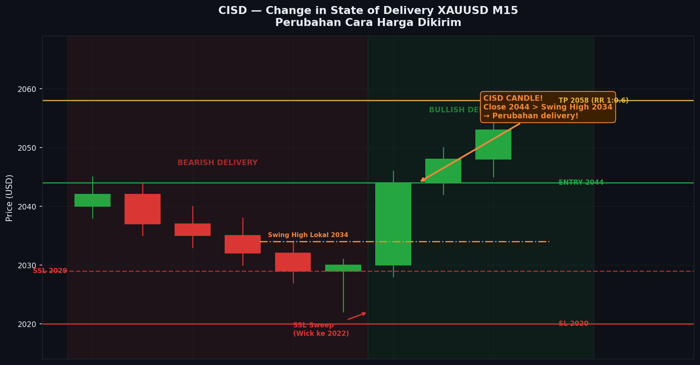

# Modul 09 — CISD (Change in State of Delivery)

> **Level**: 🔴 HIGH | **Estimasi belajar**: 5-7 hari

---

## 9.1 Apa itu CISD?

**CISD (Change in State of Delivery)** adalah konsep ICT yang mengidentifikasi **perubahan cara harga dikirimkan** — dari bearish delivery ke bullish delivery, atau sebaliknya.

"Delivery" dalam konteks ini mengacu pada **cara institusi mengeksekusi order** — apakah mereka sedang mendistribusikan (menjual) atau mengakumulasi (membeli).

```
State of Delivery = bagaimana harga bergerak dalam konteks yang lebih kecil

Bearish Delivery: Setiap rally diikuti lower high → trend turun
Bullish Delivery: Setiap pullback diikuti higher low → trend naik

CISD = momen ketika state ini BERUBAH
```

---

## 9.2 Ciri-Ciri CISD

### CISD Bullish (dari bearish ke bullish delivery)

**Kondisi sebelum**: Harga dalam bearish delivery (making LH/LL)

**CISD terjadi ketika**:
```
1. Harga membuat LL baru (SSL di-sweep)
2. Candle bullish yang kuat muncul
3. Candle ini MENUTUP DI ATAS swing high lokal sebelumnya
4. Ini menandai perubahan state dari bearish ke bullish

Visualisasi:
    LH
   /  \
  /    LL1
 /         \
/            LL2 (sweep SSL)
              ↑
              │ ← Candle CISD bullish
              │    Close di atas LH lokal
              │─────────────────────────
```

### CISD Bearish (dari bullish ke bearish delivery)

**Kondisi sebelum**: Harga dalam bullish delivery (making HH/HL)

**CISD terjadi ketika**:
```
1. Harga membuat HH baru (BSL di-sweep)
2. Candle bearish yang kuat muncul
3. Candle ini MENUTUP DI BAWAH swing low lokal sebelumnya
4. Ini menandai perubahan state dari bullish ke bearish

Visualisasi:
                HH2 (sweep BSL)
               /
            HL2
           /
        HH1
       /
     HL1
              ↓
              │ ← Candle CISD bearish
              │    Close di bawah HL lokal
              │─────────────────────────
```

---

## 9.3 CISD vs CHOCH

Banyak yang membingungkan CISD dan CHOCH. Ini perbedaannya:

| | CHOCH | CISD |
|--|-------|------|
| **Scope** | Perubahan struktur besar | Perubahan cara delivery lokal |
| **Timeframe** | Terlihat di ITF/HTF | Sering di LTF (M5/M15) |
| **Penggunaan** | Tentukan bias | Konfirmasi entry |
| **Validasi** | Close di luar swing point | Close yang mengubah momentum delivery |
| **Konteks** | Standalone signal | Digunakan setelah OB/FVG/sweep |

**Hubungan**: CISD sering terjadi SETELAH CHOCH sebagai konfirmasi entry — CHOCH di H1, lalu CISD di M15 untuk precision entry.

---

## 9.4 Cara Identifikasi CISD

### Step-by-Step

**Step 1**: Identifikasi state of delivery saat ini
```
Bearish delivery: Candle-candle membuat LH/LL berulang
Bullish delivery: Candle-candle membuat HH/HL berulang
```

**Step 2**: Cari area di mana perubahan mungkin terjadi
- Dekat OB atau FVG
- Setelah sweep likuiditas
- Di zona HTF yang signifikan

**Step 3**: Tunggu candle CISD
```
Untuk bullish CISD:
- Candle harus menutup di ATAS swing high lokal terakhir
- Body candle harus relatif besar (komitmen kuat)
- Idealnya ada wick bawah yang panjang (rejection)
```

**Step 4**: Konfirmasi
```
Setelah candle CISD: apakah candle berikutnya melanjutkan?
- Bullish CISD valid: candle berikutnya tidak turun ke bawah low CISD
- Jika turun ke bawah low CISD: CISD invalid / false signal
```

---

## 9.5 CISD Entry Model

### Model 1: CISD + OB
```
Setup Bullish:
1. HTF: Bias bullish
2. LTF: Harga dalam bearish delivery (pullback)
3. Harga masuk zona OB bullish
4. Dalam OB: Sweep SSL lokal
5. CISD bullish candle muncul (close di atas swing lokal)
6. ENTRY: Open candle setelah CISD atau close candle CISD
7. SL: Di bawah low CISD candle / di bawah low sweep
8. TP: BSL berikutnya / swing high HTF
```

### Model 2: CISD + FVG Fill
```
Setup Bullish:
1. Displacement bullish terjadi → FVG terbentuk
2. Harga pullback ke FVG
3. Dalam FVG: bearish delivery sementara
4. CISD bullish terjadi di dalam/di bawah FVG
5. ENTRY: Close CISD candle
6. SL: Di bawah low CISD
7. TP: High yang terbentuk sebelum pullback / likuiditas berikutnya
```

### Model 3: CISD setelah Liquidity Sweep
```
Setup Bullish:
1. EQL terbentuk (SSL kuat)
2. Harga sweep ke bawah EQL
3. Wick panjang ke bawah
4. Candle berikutnya: CISD bullish (close di atas level sweep)
5. ENTRY: Segera setelah close CISD
6. SL: Di bawah wick sweep
7. TP: EQH di atas / BSL terdekat
```

---

## 9.6 CISD pada Berbagai Timeframe

### HTF CISD (H4/D1)
- Jarang terjadi tapi sangat powerful
- Menandai perubahan bias besar
- Biasanya setelah weekly/monthly sweep

### ITF CISD (H1)
- Paling umum untuk setup trading
- Konfirmasi setelah CHOCH H4
- Entry area yang baik

### LTF CISD (M15/M5)
- Precision entry
- Digunakan setelah CISD H1 untuk timing lebih baik
- Risk/reward lebih baik karena SL lebih ketat

---

## 9.7 Candle Pattern yang Menandai CISD

### Bullish CISD Candle Types:
```
1. Strong Bullish Engulfing
   ┌─┐
   │█│ ← Close di atas swing lokal
   │█│    Body besar
   └─┘

2. Hammer dengan Body Bullish
     │
   ┌─┐
   │█│ ← Close di atas swing lokal
   └─┘

3. Marubozu Bullish
   ┌─┐
   │█│ ← Close di atas, tidak ada wick
   │█│
   └─┘
```

### Bearish CISD Candle Types (kebalikannya):
- Bearish Engulfing yang menutup di bawah swing lokal
- Shooting Star + Body Bearish
- Marubozu Bearish

---

## 9.8 Invalidasi CISD

CISD dianggap **invalid** jika:
```
1. Setelah CISD bullish: harga turun melewati LOW candle CISD
2. Setelah CISD bearish: harga naik melewati HIGH candle CISD
3. Tidak ada konfirmasi — candle CISD langsung diikuti candle berlawanan
```

Jika CISD invalid → jangan entry, atau jika sudah entry → keluar dari posisi.

---

## 9.9 Contoh Real Scenario

### XAUUSD M15 — CISD Bullish Entry
```
Konteks:
- D1: Uptrend, baru buat HH
- H4: Pullback ke OB H4
- H1: CHOCH bullish sudah terjadi
- M15: Harga masuk OB H1

Yang terjadi di M15:
Jam 14:30 WIB (London Open Kill Zone):
- Harga turun dulu ke bawah swing low M15 lokal (sweep SSL kecil)
- Candle 14:45: Bullish besar, close di atas swing high M15 sebelumnya → CISD!
- Konfirmasi: Candle 15:00 bullish, tidak kembali ke bawah

Entry:
- BUY di close candle 14:45 (atau open candle 15:00)
- SL: 5 pip di bawah low candle 14:45
- TP1: Swing high H1 (1:2 RR)
- TP2: BSL H4 (1:4 RR)
```

---

---

## Studi Kasus: Contoh Nyata di Chart

### Kasus 1: XAUUSD M15 — CISD Bullish di OB H1 (London Kill Zone)

**Konteks:** XAUUSD D1 uptrend. H4: CHOCH bullish baru terjadi. H1: Displacement bullish membentuk OB H1 yang jelas di area 2044-2052. Harga sedang pullback ke dalam OB ini dalam mode bearish delivery. Kita tunggu CISD bullish di dalam OB untuk entry precision.

**Chart:**
```
XAUUSD M15 — CISD Bullish di OB H1
Periode: London Kill Zone, Selasa 14:00–16:30 WIB

Harga
 2080 ─── BSL Target (H1 Swing High) ────────────────────
      │
 2075 │                                         rally pasca CISD
 2072 │                                    ┌─┐  ┌─┐  ┌─┐
      │                               ┌─┐  │█│  │█│  │█│
 2068 │                               │█│  │█│  │█│  │█│
      │                               │█│  └─┘  └─┘  └─┘
 2064 │                          ┌─┐  │█│
      │                          │█│  └─┘ ← BOS M15 (pasca CISD)
 2060 ─── Swing High M15 lokal ──┤ ├──────────────────────
      │   (yang akan ditembus     └─┘
      │    oleh candle CISD)
 2058 │
      │              ← CISD CANDLE ─────────────────────
 2056 │              ┌─┐  ← High: 2062 (menembus swing 2059!)
      │              │█│     Ini adalah candle CISD bullish
 2054 │              │█│     Body besar, wick bawah ada
 2052 ─── HIGH OB ───┤ ├──────────────────────────────────
      │   ┌─┐        │█│  ← Close: 2061 (di atas swing high 2059)
      │   │█│        └─┘     → CISD TERKONFIRMASI ✓
 2050 │   │█│   ┌─┐   ↑
      │   │█│   │░│   └─ Wick bawah ke 2046 (sweep SSL lokal)
 2048 │   └─┘   │░│
      │          │░│ ← Bearish delivery dalam OB
 2046 │   ┌─┐   └─┘
      │   │░│         ← SSL lokal yang di-sweep sebelum CISD
 2044 ─── LOW OB ────────────────────────────────────────
      │   └─┘
      │    ↑
      │   OB H1 (zona: 2044–2052)
 2042 │
      │
      │   DETAIL CANDLE BY CANDLE di M15:
      │
 2059 │   [Swing High Lokal] ← level kritis yang akan jadi trigger CISD
 2058 │        ┌─┐
      │        │░│ C-4: Bearish, Low 2054 (dalam OB)
 2055 │        └─┘
      │        ┌─┐
 2053 │        │░│ C-3: Bearish, Low 2049 (semakin dalam OB)
 2050 │        └─┘
      │        ┌─┐
 2048 │        │░│ C-2: Bearish TERAKHIR, Low 2045 ← SSL lokal = sweep target
 2045 │        └─┘─ SSL LOKAL TERBENTUK DI 2045
      │
      │        ┌────────────────────────────────────┐
      │        │ C-1 CISD CANDLE: (M15)             │
 2045 │        │ Open : 2046 (di area low C-2)      │
      │        │ High : 2062 ← menembus 2059!       │
 2062 │        │ Low  : 2044 (wick sweep SSL lokal) │
 2061 │        │ Close: 2061 ← di atas swing 2059   │
      │        │ Body : 15 pip (besar, kuat)        │
      │        │ ★ CISD TERKONFIRMASI!              │
      │        └────────────────────────────────────┘
      │
      ├──┬──┬──┬──┬──┬──┬──┬──┬──┬──┬──┬──┬──┬──┬──┤
      T1 T2 T3 T4 T5 T6 T7 T8 T9 T10 T11 T12 T13 T14 T15
     14:00       14:30           15:00        15:30 WIB

  Fase Bearish Delivery (T1–T9):
  T1  : H1 OB terbentuk, harga mulai pullback
  T2  : 2058 — candle bearish pertama masuk OB
  T3  : 2055 — semakin dalam
  T4  : 2054 — swing high lokal terbentuk di 2059 (sebelumnya)
  T5  : 2053 — bearish delivery berlanjut (LH/LL di M15)
  T6  : 2050 — dalam zona OB (2044–2052)
  T7  : 2048 — semakin dekat Low OB
  T8  : 2045 — SSL lokal M15 terbentuk (equal low dengan T6)
  T9  : 2044 — mendekati Low OB!

  Transisi CISD (T10):
  T10 : CANDLE CISD!
        → Open 2046 (dalam OB)
        → Wick bawah ke 2044 (sweep SSL lokal = grab likuiditas)
        → Rally kuat, High 2062
        → CLOSE 2061 (di atas swing high lokal 2059) → CISD!
        Artinya: State berubah dari bearish delivery ke bullish delivery

  Konfirmasi & Entry (T11–T15):
  T11 : Candle bullish, tidak turun ke bawah Low CISD (2044) → valid!
  T12 : BOS M15 — menembus swing high berikutnya
  T13 : Sedikit pullback tapi masih di atas Low CISD
  T14 : Continuation ke atas
  T15 : Approaching BSL target

  Invalidasi yang tidak terjadi:
  → Jika T11 turun ke bawah 2044 (Low CISD) → CISD invalid, tidak entry
  → Kita ENTRY hanya karena T11 tidak break low CISD
```

**Analisis Step-by-Step (Candle by Candle):**
1. **Setup HTF**: D1 uptrend → H4 CHOCH bullish → H1 OB di 2044-2052 → Bias: cari BUY
2. **Masuk zona**: Harga pullback ke H1 OB, mode bearish delivery di M15 (LH/LL)
3. **T1-T9**: Monitor candle M15 dalam OB — apakah ada tanda perubahan delivery?
4. **T8**: SSL lokal terbentuk di 2045 — ini yang akan di-sweep oleh CISD
5. **T10 (CISD candle)**:
   - Open dekat Low OB (2046) — bearish delivery masih terasa
   - Wick bawah ke 2044: sweep SSL lokal, grab likuiditas bullish
   - Lalu RALLY kuat dalam satu candle
   - CLOSE di 2061: menembus swing high lokal M15 (2059) → CISD!
6. **T11**: Candle berikutnya: apakah turun ke bawah Low CISD (2044)? Tidak! → CISD valid
7. **Entry**: Open T11 atau close T10, entry BUY
8. **SL**: 3 pip di bawah Low CISD (2044 − 3 = 2041)

**Hasil Trade:**
- Entry BUY: 2063.00 (open candle T11, setelah konfirmasi CISD)
- SL: 2041.00 (3 pip di bawah Low CISD 2044) → 22 pip risk
- TP1: 2075.00 (Swing High H1 / BSL intermediate) → 12 pip
- TP2: 2082.00 (BSL H4) → 19 pip
- RR: 1:1.8 ke TP2 (atau ambil partial: 50% di TP1, 50% di TP2)
- Hasil: **Win** — TP1 dalam 6 candle M15 (1.5 jam), TP2 dalam NY Session

---

### Kasus 2: EURUSD M5 — CISD Bearish setelah Liquidity Sweep (Precision Entry)

**Konteks:** EURUSD H1 bearish delivery. H4 CHOCH bearish baru terjadi. Di M5, harga membuat EQH (BSL kuat) di 1.0762. Harga kemudian sweep ke atas EQH, lalu CISD bearish terjadi — sinyal untuk entry SELL presisi.

**Chart:**
```
EURUSD M5 — CISD Bearish setelah BSL Sweep
Periode: NY Overlap, Rabu 20:00–21:30 WIB

Harga
 1.0775 ─── HIGH SWEEP (1.0774) ─────────────────────────
        │   ← Wick ke atas, trigger stop loss seller
 1.0770 │
        │
 1.0765 ─── CISD CANDLE BEARISH ─────────────────────────
        │   ┌─┐
        │   │░│ ← Open: 1.0768 (di dalam sweep area)
 1.0762 ─── EQH (BSL) ─── Equal Highs ──────────────────
        │   │░│   ← Swing Low Lokal (level yang akan ditembus CISD)
 1.0759 ─── │░│ ──── Swing Low Lokal M5 ────────────────
        │   │░│
 1.0755 │   └─┘ ← Close: 1.0754 (MENEMBUS swing low 1.0759!)
        │    ↓       → CISD BEARISH TERKONFIRMASI ✓
        │
        │   DETAIL SEQUENCE:
        │
 1.0762 ─── EQH H1 ─── (dua kali menyentuh di sini) ────
        │   High 1 ────│──── High 2 (EQH)
 1.0760 │    ┌─┐        ┌─┐
        │    │█│        │█│ ← Bullish delivery sementara (dalam koreksi)
 1.0758 │    │█│   ┌─┐  │█│   membentuk HH/HL lokal
        │    └─┘   │░│  └─┘
 1.0755 │          │░│
        │          └─┘ ← Setiap koreksi membuat HL (bullish local delivery)
        │
        │   ┌─────────────────────────────────────────┐
        │   │  SEQUENCE CANDLE BY CANDLE (M5):        │
        │   │                                         │
        │   │  M5-1: Bullish, High 1.0762 (EQH #1)   │
        │   │  M5-2: Koreksi kecil ke 1.0758          │
        │   │  M5-3: Bullish, High 1.0762 (EQH #2)   │
        │   │         → EQH terkonfirmasi = BSL kuat  │
        │   │  M5-4: Koreksi, Low 1.0756              │
        │   │  M5-5: Bullish, High 1.0764 — menembus! │
        │   │         → Wick ke 1.0774 (sweep BSL!)   │
        │   │         Body CLOSE: 1.0768               │
        │   │         Masih di atas EQH (1.0762)       │
        │   │  M5-6: Bearish mulai                     │
        │   │  M5-7: CISD CANDLE!                     │
        │   │    Open  : 1.0768                       │
        │   │    High  : 1.0769 (wick kecil)          │
        │   │    Low   : 1.0752 (wick bawah)          │
        │   │    Close : 1.0754 — menembus swing       │
        │   │            low lokal M5 (1.0759)!       │
        │   │    → CISD BEARISH ✓                     │
        │   │  M5-8: Konfirmasi — tidak naik ke       │
        │   │         atas High CISD (1.0769)          │
        │   │  M5-9: Bearish engulfing → ENTRY        │
        │   └─────────────────────────────────────────┘
        │
 1.0754 │                ← Entry SELL di sini
 1.0750 │
        │
 1.0742 ─── TP1 (SSL M5 lokal) ──────────────────────────
 1.0728 ─── TP2 (SSL H1) ─────────────────────────────────
        │
        ├──┬──┬──┬──┬──┬──┬──┬──┬──┬──┬──┬──┬──┬──┬──┤
        M1 M2 M3 M4 M5 M6 M7 M8 M9 M10 M11 M12 M13 M14 M15
       20:00       20:20         20:40        21:00 WIB

  Mengapa CISD ini valid:
  ✓ Bearish delivery di M5 sebelum CISD (LH/LL mikro saat pullback)
  ✓ BSL (EQH) di-sweep dengan wick → institusi dapat likuiditas
  ✓ CISD candle close di bawah swing low lokal M5 (1.0759)
  ✓ Candle berikutnya tidak naik ke atas High CISD (1.0769)
  ✓ Konteks HTF mendukung: H4 CHOCH bearish, H1 bearish delivery

  Invalidasi yang diwaspadai:
  ✗ Jika M5-8 naik ke atas 1.0769 (High CISD) → batal, tunggu sinyal baru
  ✗ Jika harga close kembali di atas EQH 1.0762 → struktur berubah
```

**Analisis Step-by-Step (Candle by Candle):**
1. **Setup HTF**: H4 CHOCH bearish → H1 bearish delivery → Bias: cari SELL di M5
2. **Identifikasi BSL**: EQH di M5 pada 1.0762 (dua sentuhan — kumpulan stop seller)
3. **M5-1 dan M5-3**: Dua kali menyentuh 1.0762 → konfirmasi EQH = BSL kuat
4. **M5-5 (Sweep candle)**:
   - Wick naik ke 1.0774 (12 pip di atas EQH) → stop loss seller ter-trigger
   - Body candle CLOSE di 1.0768 (masih di atas EQH) → belum CISD
5. **M5-6**: Bearish pertama setelah sweep — delivery mulai berubah
6. **M5-7 (CISD candle)**:
   - Open 1.0768 (area bekas sweep)
   - Close 1.0754: MENEMBUS swing low lokal M5 (1.0759) → CISD BEARISH!
   - Artinya: state berubah dari bullish delivery ke bearish delivery
7. **M5-8 (konfirmasi)**: Candle tidak naik ke atas High CISD (1.0769) → CISD valid!
8. **M5-9 (entry)**: Bearish engulfing → ENTRY SELL

**Hasil Trade:**
- Entry SELL: 1.0752 (close M5-9)
- SL: 1.0772 (3 pip di atas High CISD 1.0769) → 20 pip risk
- TP1: 1.0742 (SSL M5 lokal) → 10 pip
- TP2: 1.0728 (SSL H1) → 24 pip
- RR: 1:1.2 ke TP2 (agresif, tapi entry sangat presisi sehingga SL kecil)
- Manajemen: Ambil 70% profit di TP1, trailing stop sisanya ke TP2
- Hasil: **Win** — TP1 dalam 8 menit (M5 8 candle), TP2 dalam 30 menit

---


---

## 📊 Chart: CISD (Change in State of Delivery)



*Gambar: CISD Bullish — area merah = bearish delivery, area hijau = bullish delivery setelah CISD. Perhatikan: SSL sweep → candle besar menembus swing high lokal → perubahan state.*

---
## 9.10 Kesimpulan Modul 09

- CISD = perubahan cara harga dikirimkan oleh market maker
- Bullish CISD: candle close di atas swing high lokal dalam konteks bearish delivery
- Bearish CISD: candle close di bawah swing low lokal dalam konteks bullish delivery
- Paling powerful ketika terjadi di zona OB/FVG setelah sweep likuiditas
- Invalid jika harga menembus low/high candle CISD

---

> **Latihan**: Di XAUUSD M15, fokus pada London Kill Zone (14:00-16:00 WIB). Selama 2 minggu, amati dan catat setiap CISD yang terjadi. Hitung win rate: berapa yang dilanjutkan ke TP vs yang gagal?

---

**[← Modul 08](../02-MEDIUM/08-liquidity.md)** | **[→ Modul 10: Multi-Timeframe](./10-multi-timeframe.md)**
