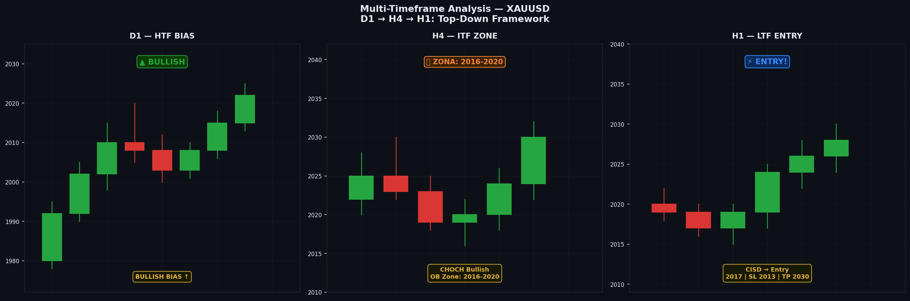

# Modul 10 — Multi-Timeframe Analysis (MTF)

> **Level**: 🔴 HIGH | **Estimasi belajar**: 5-7 hari

---

## 10.1 Mengapa Multi-Timeframe?

Satu timeframe memberikan gambaran **sebagian**. Multi-timeframe memberikan **gambaran utuh**.

```
Analogi:
Google Maps punya tampilan:
- Satelit (zoom out) = D1/W — gambaran besar, kota, negara
- Peta kota (zoom medium) = H4/H1 — jalan utama
- Navigasi jalan (zoom in) = M15/M5 — belokan kecil

Kamu butuh ketiganya untuk sampai tujuan dengan benar.
```

---

## 10.2 Hierarki Timeframe SMC

```
┌────────────────────────────────────────┐
│ MONTHLY (MN) — Bias Jangka Panjang    │ HTF Macro
│ WEEKLY (W)   — Bias Besar            │ HTF
├────────────────────────────────────────┤
│ DAILY (D1)   — Struktur Utama        │ HTF/ITF
│ H4           — Konfirmasi Arah       │ ITF
├────────────────────────────────────────┤
│ H1           — Zona Entry            │ ITF/LTF
│ M15          — Refinement            │ LTF
├────────────────────────────────────────┤
│ M5           — Precision Entry       │ LTF
│ M1           — Ultra Precision       │ LTF (opsional)
└────────────────────────────────────────┘
```

### Rekomendasi Kombinasi Timeframe:

| Gaya Trading | HTF | ITF | LTF |
|--------------|-----|-----|-----|
| **Swing** | D1/W | H4 | H1/M15 |
| **Day Trade** | D1/H4 | H1 | M15/M5 |
| **Scalp** | H4/H1 | M15 | M5/M1 |

---

## 10.3 Prinsip Top-Down Analysis

Selalu analisis dari **atas ke bawah** (HTF → LTF), bukan sebaliknya.

```
SALAH: "Saya lihat setup bagus di M5, langsung entry"
BENAR: "D1 bilang bullish → H4 konfirmasi → H1 ada OB → M15 CISD → entry"
```

### Framework Top-Down:

**Step 1 — HTF (D1/W): BIAS**
```
Pertanyaan: Ke mana arah utama market?
Yang dilihat:
- Trend (HH/HL atau LH/LL?)
- BOS terbaru ke mana?
- Harga sekarang di area apa? (OB HTF? FVG HTF?)
- Key level penting apa yang ada?

Output: BULLISH BIAS atau BEARISH BIAS
```

**Step 2 — ITF (H4/H1): AREA**
```
Pertanyaan: Di area mana akan ada setup?
Yang dilihat:
- CHOCH atau BOS H4 terbaru
- OB H4/H1 yang relevan
- FVG H4/H1
- Likuiditas yang belum di-sweep
- Apakah sedang pullback atau continuation?

Output: ZONA ENTRY (range harga tertentu)
```

**Step 3 — LTF (M15/M5): ENTRY**
```
Pertanyaan: Di mana tepatnya saya masuk?
Yang dilihat:
- CISD di dalam zona entry
- Sweep likuiditas LTF
- Candle konfirmasi (engulfing, hammer)
- Apakah harga menunjukkan rejection?

Output: ENTRY PRICE, SL, TP
```

---

## 10.4 Contoh Analisis MTF — XAUUSD Bullish

### D1 Analysis
```
- Trend: HH dan HL terbentuk dalam 2 bulan terakhir
- BOS terbaru: Bullish (ke atas)
- Harga saat ini: Pullback ke area FVG D1
- Key resistance: 2080 (PWH)
- Bias: BULLISH ✓
```

### H4 Analysis
```
- Struktur H4: Masih dalam pullback dari HH D1
- CHOCH bullish H4: Sudah terjadi 2 candle lalu ✓
- OB H4 bullish: Ada di range 2020-2025
- FVG H4: Ada di range 2018-2022 (overlap dengan OB)
- Target area: 2018-2025 sebagai zona entry
```

### H1 Analysis
```
- Harga mendekati zona 2018-2025
- H1 struktur: Bearish delivery (pullback normal)
- OB H1 bullish: Ada di 2019-2021
- Likuiditas: EQL di bawah 2017 (SSL)
- Expect: Harga mungkin sweep ke 2015-2017 dulu
```

### M15 Entry
```
- Harga turun ke 2016 (sweep SSL) → wick panjang ke bawah
- Candle M15: CISD bullish! Close di atas swing high M15 lokal
- Konfirmasi: Candle M15 berikutnya bullish

ENTRY: 2020.50 (close CISD candle)
SL: 2014.00 (di bawah wick sweep, 6.5 pip buffer)
TP1: 2035 (swing high H1) — RR 1:2.2
TP2: 2055 (swing high H4) — RR 1:5.3
TP3: 2080 (PWH/BSL D1) — RR 1:9.2
```

---

## 10.5 HTF sebagai Filter Bias

HTF adalah **filter** yang menentukan hanya setup searah bias yang diambil.

```
HTF Bullish:
✅ Setup BUY di LTF → ambil
❌ Setup SELL di LTF → skip

HTF Bearish:
❌ Setup BUY di LTF → skip
✅ Setup SELL di LTF → ambil
```

**Pengecualian**: Counter-trend trade bisa dilakukan jika:
1. Ada CHOCH HTF yang signifikan
2. Setup LTF sangat strong
3. Risk/reward sangat besar (minimal 1:4)
4. Ukuran posisi dikurangi (lebih kecil dari biasanya)

---

## 10.6 Konfluensi (Confluence)

**Konfluensi** = beberapa faktor yang mendukung setup yang sama di timeframe berbeda.

```
Semakin banyak konfluensi = semakin valid setup

Contoh konfluensi bullish:
✓ D1: Bias bullish
✓ H4: OB bullish belum dimitigasi
✓ H1: CHOCH bullish sudah terjadi
✓ H1: FVG bullish di zona sama dengan OB H4
✓ M15: Liquidity sweep (SSL)
✓ M15: CISD bullish
✓ London Kill Zone timing

= 7 konfluensi → Setup sangat kuat
```

### Minimum Konfluensi untuk Entry:
- **Minimum 3 konfluensi** untuk entry standar
- **5+ konfluensi** untuk entry dengan size lebih besar
- Jika hanya 1-2 konfluensi → skip atau size sangat kecil

---

## 10.7 Market Correlation

Beberapa pair berkorelasi satu sama lain:

| Pair A | Pair B | Korelasi |
|--------|--------|---------|
| EURUSD | GBPUSD | Positif (keduanya vs USD) |
| EURUSD | USDCHF | Negatif (mirror) |
| XAUUSD | DXY | Negatif (gold vs dollar) |
| NAS100 | SPX | Positif (sama-sama US equity) |

**Cara gunakan korelasi**:
```
Jika DXY (Dollar Index) sedang bullish kuat:
→ EURUSD cenderung bearish
→ XAUUSD cenderung bearish
→ Bias SELL untuk pair-pair tersebut
```

---

## 10.8 Cheat Sheet: Pertanyaan per Timeframe

### D1/W:
- [ ] Trend apa? (HH/HL atau LH/LL?)
- [ ] BOS terbaru ke mana?
- [ ] Harga di area apa? (Premium atau Discount?)
- [ ] Target harga berikutnya? (BSL atau SSL terdekat?)

### H4:
- [ ] CHOCH sudah terjadi? Ke mana?
- [ ] OB bullish/bearish mana yang belum dimitigasi?
- [ ] FVG mana yang relevan?
- [ ] Likuiditas mana yang belum di-sweep?

### H1:
- [ ] Struktur H1 searah bias H4?
- [ ] Ada OB atau FVG H1 di dalam zona H4?
- [ ] Kapan Kill Zone berikutnya?

### M15/M5:
- [ ] CISD sudah terjadi?
- [ ] Sweep SSL/BSL lokal sudah terjadi?
- [ ] Candle konfirmasi ada?
- [ ] Entry, SL, TP sudah dihitung?

---


---

## 📊 Chart: Multi-Timeframe Analysis



*Gambar: Top-down analysis — D1 (Bias Bullish), H4 (Zona Entry), H1 (Precision Entry dengan CISD). Tiga timeframe yang saling melengkapi.*

---
## 10.9 Kesimpulan Modul 10

- MTF analysis = fondasi entry yang berkualitas tinggi
- Selalu dari HTF ke LTF (top-down)
- HTF = bias, ITF = zona, LTF = entry
- Cari konfluensi sebanyak mungkin
- Minimal 3 faktor yang align sebelum entry

---

> **Latihan**: Lakukan analisis MTF lengkap (D1 → H4 → H1 → M15) untuk XAUUSD hari ini. Tulis dalam format: Bias, Zona, Entry Plan. Apakah ada setup valid? Dokumentasikan di trading journal.

---

**[← Modul 09](./09-cisd.md)** | **[→ Modul 11: Entry Model](./11-entry-model.md)**
