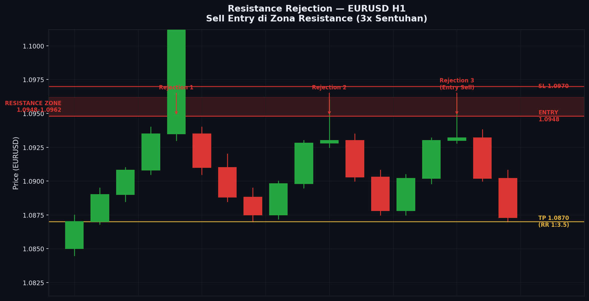

# Modul 01 — Apa itu Support & Resistance (SnR)?

**Level:** 🟢 LOW  
**Estimasi waktu baca:** 15–20 menit  
**Prasyarat:** Bisa membaca candlestick dasar

---

## Tujuan Modul

Setelah membaca modul ini, kamu akan:
- Memahami definisi support dan resistance secara tepat
- Mengerti mengapa harga "menghormati" level tertentu
- Memahami psikologi dan mekanisme di balik SnR
- Mampu mengidentifikasi level SnR secara visual di chart

---

## 1. Definisi Support dan Resistance

### Support

**Support** adalah level harga di mana tekanan **beli (demand)** cukup kuat untuk menghentikan atau membalikkan pergerakan harga yang turun.

> Bayangkan support sebagai "lantai" — saat harga jatuh dan menyentuh lantai ini, ia cenderung memantul kembali ke atas.

### Resistance

**Resistance** adalah level harga di mana tekanan **jual (supply)** cukup kuat untuk menghentikan atau membalikkan pergerakan harga yang naik.

> Bayangkan resistance sebagai "langit-langit" — saat harga naik dan menyentuh langit-langit ini, ia cenderung berbalik turun.

---

## 2. Visualisasi Dasar SnR

```
CONTOH DASAR: Support Bounce 3x

Harga (USD)
│
1.1200 ─────────────────────────────────────────── RESISTANCE
│                    ╭───╮
│               ╭────╯   │
│          ╭────╯        │
│     ╭────╯             │
│     │                  │
1.0800 ─── SUPPORT ──────────────────────────────
│     │    ↑             │    ↑              ↑
│    ┌┴┐   Bounce 1     ┌┴┐  Bounce 2      ┌┴┐
│    │░│                │░│                │░│
│    └┬┘                └┬┘                └┬┘
│    ─┘                  ─                  ─
│
└────────────────────────────────────────────────→ Waktu

Keterangan:
↑ = Titik di mana harga menyentuh support dan memantul
░ = Candle yang terjadi di area support
```

```
CONTOH DASAR: Resistance Rejection 3x

Harga (USD)
│
1.1200 ─────────────────────────────────────────── RESISTANCE
│          ↓             ↓              ↓
│         ┌┴┐           ┌┴┐            ┌┴┐
│         │▓│           │▓│            │▓│
│         └┬┘           └┬┘            └┬┘
│     ╮    │        ╮    │         ╮    │
│     │╮   │        │╮   │         │╮   │
│     │╰───╯        │╰───╯         │╰───╯
│     ╰──────       ╰──────        ╰──────
│
1.0800 ─── SUPPORT ──────────────────────────────
│
└────────────────────────────────────────────────→ Waktu

Keterangan:
↓ = Titik di mana harga menyentuh resistance dan ditolak turun
▓ = Bearish candle (candle merah) yang muncul di area resistance
```

---

## 3. Mengapa Harga "Menghormati" Level SnR?

Ini bukan sihir atau kebetulan. Ada penjelasan logis di baliknya:

### 3.1 Memory Market (Ingatan Kolektif)

Trader yang membeli di support sebelumnya **ingat** bahwa harga pernah naik dari situ. Ketika harga kembali ke level yang sama, mereka cenderung membeli lagi. Ini menciptakan **tekanan beli berulang** di level yang sama.

Sebaliknya, trader yang menjual di resistance sebelumnya ingat bahwa harga pernah turun dari situ. Ketika harga naik kembali, mereka cenderung menjual lagi.

### 3.2 Order Clustering (Penumpukan Order)

Di level-level penting, banyak trader memasang pending order:
- **Buy Limit** di area support (beli saat harga turun ke sana)
- **Sell Limit** di area resistance (jual saat harga naik ke sana)
- **Stop Loss** dari posisi yang berlawanan

Penumpukan order ini menciptakan "dinding" yang mempengaruhi pergerakan harga.

### 3.3 Self-Fulfilling Prophecy

Karena jutaan trader di seluruh dunia melihat chart yang sama dan menggambar level di tempat yang sama, mereka semua bereaksi di tempat yang sama. Ini membuat level SnR menjadi "ramalan yang terwujud sendiri."

---

## 4. Psikologi di Balik SnR

Untuk memahami SnR lebih dalam, kita perlu memahami 3 tipe trader yang terjebak di setiap level:

```
SKENARIO: Resistance di 1.1200

Situasi awal: Harga berada di 1.1200

                    1.1200 ─── RESISTANCE

Trader A: Beli di 1.1000, sekarang profit. Mungkin TP di 1.1200
          → Mereka JUAL di resistance = tambah supply

Trader B: Jual di 1.1200, sekarang breakeven. Mau keluar kalau harga kembali
          → Mereka JUAL lagi saat harga kembali ke 1.1200 = tambah supply

Trader C: Beli di 1.1200 sebelumnya, sekarang rugi. Menunggu break even
          → Mereka JUAL saat harga kembali ke 1.1200 = tambah supply

Hasilnya: Tiga kelompok trader semua JUAL di level yang sama
          → Supply sangat besar → Harga sulit naik → Resistance terbentuk
```

```
SKENARIO: Support di 1.0800

                    1.0800 ─── SUPPORT

Trader A: Jual dari 1.1000, profit besar. TP di 1.0800
          → Mereka BELI untuk close posisi = tambah demand

Trader B: Beli di 1.0800 sebelumnya, breakeven. Mau beli lagi
          → Mereka BELI lagi saat harga kembali ke 1.0800 = tambah demand

Trader C: Jual di 1.0800 sebelumnya, sekarang rugi. Menunggu break even
          → Mereka BELI untuk close saat harga kembali = tambah demand

Hasilnya: Tiga kelompok trader semua BELI di level yang sama
          → Demand sangat besar → Harga sulit turun → Support terbentuk
```

---

## 5. Studi Kasus: EURUSD D1 — Resistance Menjadi Magnet Harga

```
Studi Kasus: EURUSD Daily Chart — Resistance Sebagai Target
═══════════════════════════════════════════════════════════════

Periode: Januari — Maret (ilustrasi)

Harga
│
1.1350 ─────────────────────────────────────────────────────
│              ↓ RESISTANCE KUAT                    ← Target
│         ╭───┴───╮
│    ╭────╯        ╰──────────────────────────────
│    │                           ╭─────────────────
│    │                      ╭────╯
│    │                 ╭────╯
│    │            ╭────╯
│    │       ╭────╯
│    ╰───────╯
│
1.0850 ─────────────────────────────────────────────────────
│    ↑ SUPPORT (previous low)
│
└────────────────────────────────────────────────────────────→ Waktu
     Jan          Feb          Mar

Narasi:
1. Harga membentuk HIGH di 1.1350 (Resistance pertama kali terbentuk)
2. Harga turun ke support di 1.0850
3. Harga mulai rally dari support
4. Setiap kali harga mendekati 1.1350, ia "tertarik" ke level itu
   seperti magnet sebelum akhirnya ditolak
5. Trader yang memantau level ini siap dengan setup di sana

Observasi Penting:
- Level 1.1350 bukan dipilih sembarangan — ia adalah HIGH historis
- Semakin lama sebuah level bertahan, semakin "kuat" ia sebagai magnet
- Volume biasanya meningkat saat harga mendekati level penting

Setup Trading dari Studi Kasus:
├── Entry: Jual saat harga menyentuh 1.1350 dengan konfirmasi bearish candle
├── SL: Di atas 1.1350 + buffer (misal 1.1380)
├── TP: Kembali ke support 1.0850
└── RR: ≈ 1:10 (sangat favorable untuk swing trade)
```

---

## 6. Kekuatan Level SnR

Tidak semua level SnR sama kuatnya. Berikut faktor yang mempengaruhi kekuatan level:

| Faktor | Pengaruh pada Kekuatan Level |
|--------|------------------------------|
| Jumlah sentuhan | Semakin banyak, semakin kuat |
| Timeframe | HTF (Daily, Weekly) lebih kuat dari LTF |
| Volume saat pembentukan | Volume tinggi = level lebih valid |
| Berapa lama level bertahan | Lama = lebih banyak trader tahu |
| Apakah bersamaan dengan psych level | Round number (1.1000, 1.1200) = lebih kuat |

```
PERBANDINGAN KEKUATAN LEVEL:

Level LEMAH:                    Level KUAT:
─────────────                   ─────────────────────────
1.1234 ←── 1 sentuhan           1.1200 ←── 4+ sentuhan
           timeframe M15                   timeframe H4/D1
           volume rendah                   round number
           baru terbentuk                  sudah bertahan lama
           ─────────────                   ─────────────────────────
           Probabilitas bounce: ~30%       Probabilitas bounce: ~65%+
```

---

## 7. Kesalahan Umum Pemula

### Kesalahan 1: Menganggap SnR sebagai garis pasti

```
SALAH:
1.1200 ════════════════ (garis tepat — harga HARUS berhenti di sini)

BENAR:
1.1210 ─ ─ ─ ─ ─ ─ ─ ─ ─ (batas atas zone)
1.1200 ═══════════════════ (level utama)
1.1190 ─ ─ ─ ─ ─ ─ ─ ─ ─ (batas bawah zone)
```

### Kesalahan 2: Mengira level pasti akan dihormati

SnR adalah area **probabilitas tinggi**, bukan kepastian. Harga BISA menembus level manapun. Yang kita cari adalah area di mana probabilitas reaksi lebih tinggi dari average.

### Kesalahan 3: Terlalu banyak level

```
TERLALU BANYAK LEVEL (buruk):           LEVEL YANG TEPAT (baik):
────────────────────────                ─────────────────────────
─────────── 1.1250                      ═══════════════ 1.1200 (KEY)
─────────── 1.1230
─────────── 1.1200                      ─────────────── 1.1050 (minor)
─────────── 1.1180
─────────── 1.1150                      ═══════════════ 1.0900 (KEY)
─────────── 1.1130
─────────── 1.1100                      ─────────────── 1.0750 (minor)
─────────── 1.1070
─────────── 1.1050                      ═══════════════ 1.0600 (KEY)
─────────── 1.1020
(chart penuh garis → chaos)             (3-5 level KEY → jelas)
```

---

## 8. Checklist Modul 01

Sebelum lanjut ke modul berikutnya, pastikan kamu bisa menjawab:

- [ ] Apa bedanya support dan resistance?
- [ ] Mengapa harga bisa menghormati level yang sama berkali-kali?
- [ ] Apa 3 tipe trader yang menciptakan tekanan di level SnR?
- [ ] Faktor apa saja yang membuat sebuah level lebih kuat?
- [ ] Apakah SnR adalah jaminan atau probabilitas?

---

## 9. Latihan Praktis

### Latihan 1: Identifikasi Level di Chart Historis
1. Buka TradingView, pilih pair XAUUSD
2. Ubah timeframe ke Daily (D1)
3. Lihat 6 bulan ke belakang
4. Tandai **3 level support** dan **3 level resistance** yang paling jelas
5. Cek: apakah masing-masing level minimal 2x dihormati harga?

### Latihan 2: Hitung Kekuatan Level
Untuk setiap level yang kamu temukan di Latihan 1, isi tabel berikut:

| Level | Jumlah Sentuhan | Timeframe | Round Number? | Nilai Kekuatan (1-5) |
|-------|----------------|-----------|---------------|----------------------|
| ?     | ?              | D1        | Ya/Tidak      | ?                    |
| ?     | ?              | D1        | Ya/Tidak      | ?                    |
| ?     | ?              | D1        | Ya/Tidak      | ?                    |

### Latihan 3: Psikologi Market
Pilih satu level support yang kamu temukan dan tuliskan:
- Siapa yang membeli di sana?
- Siapa yang menjual di sana dan sekarang rugi?
- Siapa yang akan beli lagi saat harga kembali?
- Mengapa level itu mungkin akan dihormati lagi?

---

## Ringkasan

| Konsep | Poin Utama |
|--------|------------|
| Support | Level di mana demand mengalahkan supply → harga memantul ke atas |
| Resistance | Level di mana supply mengalahkan demand → harga ditolak ke bawah |
| Mengapa berulang | Memory market, order clustering, self-fulfilling prophecy |
| Psikologi | 3 tipe trader terjebak yang semua bereaksi di level yang sama |
| Kekuatan | Jumlah sentuhan, timeframe, volume, durasi, round number |

---

**Modul Berikutnya:** [02 — Cara Menggambar Level SnR yang Benar](./02-cara-menggambar-level.md)


---

## 📊 Chart: Support Bounce


---

## 📊 Chart: Resistance Rejection



