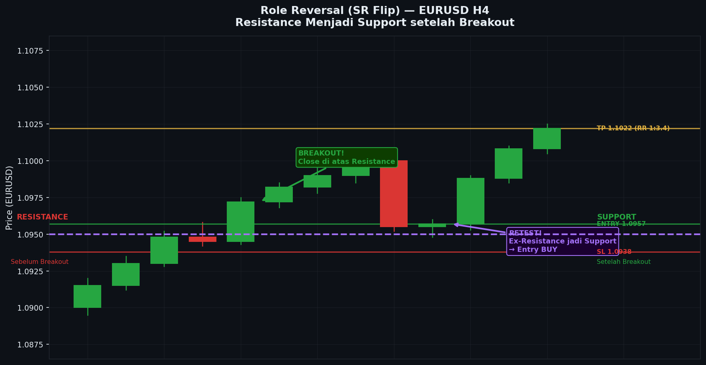

# Modul 06 — Role Reversal: Support Jadi Resistance (SR Flip)

**Level:** 🟡 MEDIUM  
**Estimasi waktu baca:** 25–30 menit  
**Prasyarat:** Modul 01–05

---

## Tujuan Modul

Setelah membaca modul ini, kamu akan:
- Memahami konsep SR Flip (Support/Resistance Role Reversal)
- Tahu mengapa fenomena ini terjadi secara psikologis
- Bisa mengidentifikasi SR Flip di chart nyata
- Menggunakan retest setelah breakout sebagai peluang entry berkualitas tinggi

---

## 1. Konsep Role Reversal

**Role Reversal** (juga disebut SR Flip atau Polarity Change) adalah fenomena di mana:
- **Support yang ditembus → berubah menjadi Resistance**
- **Resistance yang ditembus → berubah menjadi Support**

Ini adalah salah satu konsep paling kuat dalam SnR trading karena memberikan:
1. Konfirmasi bahwa breakout valid (bukan false breakout)
2. Entry berkualitas tinggi dengan SL kecil
3. Konteks trend yang jelas

---

## 2. Support Menjadi Resistance (Bearish SR Flip)

```
SUPPORT → RESISTANCE (Bearish SR Flip):

FASE 1: Support masih aktif
Harga
│
│    ╭───╮        ╭───╮
│    │   │        │   │
│    │   ╰────────╯   │
│    │                │
1.1000 ══════════════════════════════  ← Support (3x bounce)
│    ↑ bounce         ↑ bounce
│

FASE 2: Support ditembus (breakout)
Harga
│
│    ╭───╮        ╭───╮
│    │   │        │   │   ╭──╮
│    │   ╰────────╯   │   │  │
│    │                │   │  │
1.1000 ══════════════════════════════  ← Level yang sama
│                         │  │
│                         │  ╰──────── HARGA TURUN MENEMBUS!
│                         ↓
│                    Breakout bearish!
│                    Volume tinggi

FASE 3: Retest — Support lama menjadi Resistance baru
Harga
│
│                              ╭──── (mencoba naik kembali)
│                         ╭───╯
│                    ╭────╯
1.1000 ─ ─ ─ ─ ─ ─ ─ ─ ─ ─ ─ ─ ─ ─ ─ ─ ─ ─  ← SEKARANG JADI RESISTANCE!
│                    │ ← Retest! Harga naik ke level lama
│                    │   tapi langsung ditolak
│                    ↓
│               ╭────╯
│          ╭────╯
│     ╭────╯
│     │
│     ↓ Lanjut turun

KESIMPULAN:
1.1000 dulu = Support (harga memantul ke atas)
1.1000 sekarang = Resistance (harga ditolak ke bawah)
→ Role Reversal lengkap!
```

---

## 3. Resistance Menjadi Support (Bullish SR Flip)

```
RESISTANCE → SUPPORT (Bullish SR Flip):

FASE 1: Resistance masih aktif
Harga
│
1.1500 ══════════════════════════════  ← Resistance (2x rejection)
│         ↓               ↓
│        ─┼──╮           ─┼──╮
│    ╭────╯  ╰────────────╯  ╰─────
│    │
│    │

FASE 2: Resistance ditembus (breakout bullish)
Harga
│                              ← Harga naik dengan kuat
│                         ╭───────────────────────────
│                    ╭────╯
│               ╭────╯
1.1500 ═════════╪══════════════════  ← Level lama
│         ↓     │ ← BREAKOUT! Candle besar menembus level
│        ─┼──╮  │
│    ╭────╯  ╰──╯ ← Volume tinggi saat breakout
│    │

FASE 3: Pullback — Resistance lama menjadi Support baru
Harga
│
│   ╭──────────────────────────────── (rally berlanjut)
│   │
│   ╰──────────────── (sedikit pullback)
1.1500 ─ ─ ─ ─ ─ ─ ─ ─ ─ ─ ─ ─ ─ ─ ─ ─ ─ ─  ← SEKARANG JADI SUPPORT!
│              ↑ Retest! Harga turun ke level lama
│              │ tapi langsung memantul ke atas
│          ╭───╯
│     ╭────╯
│╭────╯

KESIMPULAN:
1.1500 dulu = Resistance (harga ditolak turun)
1.1500 sekarang = Support (harga memantul naik)
→ Role Reversal bullish!
```

---

## 4. Mengapa Role Reversal Terjadi? (Psikologi Market)

```
PENJELASAN PSIKOLOGIS — Bearish SR Flip:

SEBELUM BREAKOUT (Support aktif di 1.1000):
├── Trader A: Beli di 1.1000, profit
├── Trader B: Beli di 1.1000 sebelumnya, masih hold
└── Trader C: Beli di 1.1000, belum TP

SAAT BREAKOUT (Harga tembus 1.1000 ke bawah):
├── Trader A: Sekarang merugi (entry 1.1000, harga di 1.0950 → rugi)
├── Trader B: Sama, dalam posisi loss
└── Trader C: Sama, dalam posisi loss
+ Trader baru yang SHORT memanfaatkan breakout

SAAT RETEST (Harga kembali ke 1.1000 dari bawah):
├── Trader A: "Akhirnya! Harga kembali ke entry saya. Saya bisa close BEP!"
│   → DIA JUAL di 1.1000 → Menambah SUPPLY
├── Trader B: Sama → JUAL di 1.1000 → Menambah SUPPLY
├── Trader C: Sama → JUAL di 1.1000 → Menambah SUPPLY
├── Trader SHORT baru: "1.1000 sekarang resistance, ini kesempatan SHORT lagi"
│   → DIA JUAL di 1.1000 → Menambah SUPPLY
└── Smart money: "Ini SR Flip — saya SHORT di retest"
    → JUAL di 1.1000 → Menambah SUPPLY

HASILNYA:
Semua orang JUAL di 1.1000 → Supply sangat besar
→ Harga tidak bisa naik → 1.1000 menjadi RESISTANCE yang kuat!
```

---

## 5. Cara Trading SR Flip (Retest Strategy)

SR Flip memberikan **salah satu setup terbaik** dalam SnR trading karena:
- Entry setelah konfirmasi (bukan spekulasi apakah breakout valid)
- SL kecil dan jelas
- Context trend sangat jelas
- Sering menghasilkan pergerakan besar setelah retest

### Setup Bullish SR Flip (Resistance → Support):

```
SETUP BULLISH SR FLIP — Detail Entry:

Harga
│                                   ← Tujuan TP
│   ╭──────────────────────────────────────────── (lanjut naik)
│   │
│   │
│   │   (pullback setelah breakout)
1.1500 ─ ─ ─ ─ ─ ─ ─ ─ ─ ─ ─ ─ ─ ─ ─ ─ ─ ─ ─  ← SR FLIP ZONE
│   │    ↑ Harga turun ke zona    │
│   │    ↑ Konfirmasi: Hammer     │
│   │    ↑ Entry BUY di sini      │
│   │                             │
│   │                             │
│   │←── SL di bawah zona ────────│
│   │    (1.1470 misalnya)        │
│   │
│   ╰────── (sebelum breakout: resistance)

Checklist Entry Bullish SR Flip:
[ ] Ada breakout yang jelas (candle besar, volume tinggi)
[ ] Harga sudah naik signifikan setelah breakout (bukan langsung retest)
[ ] Harga turun kembali ke zona SR flip
[ ] Ada konfirmasi candle bullish (hammer, engulfing, doji + follow-through)
[ ] Volume menurun saat retest (pulback lemah) → bagus
[ ] Tidak ada level resistance yang dekat di atas entry

Entry: Saat close candle konfirmasi
SL: Di bawah zona SR flip (bukan di bawah candle konfirmasi saja)
TP1: Swing high terdekat
TP2: Measured move (sejauh breakout)
```

### Setup Bearish SR Flip (Support → Resistance):

```
SETUP BEARISH SR FLIP — Detail Entry:

Harga
│
│   ╭──── (sebelum breakout: support)
│   │
│   │   ↓ Breakout ke bawah (bearish)
1.1000 ─ ─ ─ ─ ─ ─ ─ ─ ─ ─ ─ ─ ─ ─ ─ ─ ─ ─ ─  ← SR FLIP ZONE
│          │ ← Retest ke zona
│          │ ← Konfirmasi: Shooting Star
│          │ ← Entry SELL di sini
│          │
│         ─┘  ← SL di atas zona (1.1030 misalnya)
│
│   ╭────╯ (retest selesai, harga lanjut turun)
│   │
│   ↓   ← TP1: Swing low terdekat
│   ↓   ← TP2: Measured move ke bawah
│
Checklist Entry Bearish SR Flip:
[ ] Breakout bearish yang jelas
[ ] Harga sudah turun signifikan setelah breakout
[ ] Harga naik kembali ke zona SR flip
[ ] Konfirmasi candle bearish (shooting star, evening star, bearish engulfing)
[ ] Volume rendah saat retest (rally lemah) → bagus
[ ] Tidak ada support kuat yang dekat di bawah entry
```

---

## 6. Studi Kasus Lengkap: XAUUSD H4 — Breakout dan Retest

```
Studi Kasus: XAUUSD H4 — Bearish SR Flip
══════════════════════════════════════════

Tanggal fiktif: Week 1 Januari (illustrasi)
Pair: XAUUSD (Gold)
Timeframe: H4

CHART LENGKAP:

Harga
│
2100 ─── TP Area ────────────────────────────────────────────
│
│
2050 ─── Batas atas zone ─────────────────────────────────────
│         │ ↓ Rejection di sini (S1)    │ ↓ Rejection (S2)
│        ─┤─                           ─┤─
│         │                             │
│        ┌┴┐  ← Shooting Star          ┌┴┐ ← Bearish Engulfing
│        │▓│                           │▓│
2030 ─────╪──────────────────────────────╪─── Level Resistance utama
│        └┬┘                           └┬┘
│         │                             │
│    ╭────╯                        ╭────╯
│    │                             │
│    │                             │
2020 ─ ─ ─ ─ ─ ─ ─ ─ ─ ─ ─ ─ ─ ─ ─ ─ ─ ─ ─ Batas bawah zone
│
│   (2 rejection dari zone 2020-2050: RESISTANCE ZONE terbentuk)
│
│   ────────────────────────────────────────────────────────────
│   BREAKOUT FASE:
│
│                   ╭─────────────────────────────────
│                   │  ← Candle bullish besar (kuat)
│                   │  ← Volume sangat tinggi
│                   │  ← Close di atas 2050
│              ╭────╯
│         ╭────╯  ← Akselerasi naik
│    ╭────╯
│    │
2030 ─ ─ ─ ─ ─ ─ ─ ─ ─ ─ ─ ─ ─ ─ ─ ─ ─ ─ ─ ─ (breakout di sini)
2020 ─ ─ ─ ─ ─ ─ ─ ─ ─ ─ ─ ─ ─ ─ ─ ─ ─ ─ ─ ─
│
│   Harga rally ke 2120 (70 pip dari breakout)
│
│   ────────────────────────────────────────────────────────────
│   RETEST FASE (SR Flip):
│
2120 ────────────────── ← Harga mencapai area ini
│         ╭────────────────────── (rally stop)
│    ╭────╯
│    │
│    │   ↓ Pullback dimulai
│    │
│    ╰────────────────── Turun ke zona
│                        2020-2050
│
│   ZONA SR FLIP: 2020 - 2050
│   (Dulu RESISTANCE → Sekarang jadi SUPPORT!)
│
2050 ─ ─ ─ ─ ─ ─ ─ ─ ─ ─ ─ ─ ─ ─ ─ ─ ─ ─ ─ ─ ← Batas atas zona flip
│              │  ← Harga turun ke zona
│              │  ← Candle: Hammer muncul di 2035
│              │  ← Volume: Rendah (pullback lemah = bagus)
│              │  ← ENTRY BUY: 2038
│              │
2020 ─ ─ ─ ─ ─ ─ ─ ─ ─ ─ ─ ─ ─ ─ ─ ─ ─ ─ ─ ─ ← Batas bawah zona flip
│
│   SL: 2010 (di bawah batas bawah zona + buffer 10)
│   Risk: 28 pip
│
│   TP1: 2080 (previous minor resistance)
│   TP2: 2120 (area high sebelum pullback)
│
│   Target TP1: 42 pip → RR: 1.5
│   Target TP2: 82 pip → RR: 2.9

ANALISIS TRADE:

Parameter         Nilai
─────────────     ──────────────────────────────
Pair              XAUUSD
Timeframe         H4
Setup             Bullish SR Flip Retest
Entry             2038 (close hammer candle)
SL                2010 (28 pip risk)
TP1               2080 (partial close 50%)
TP2               2120 (sisa posisi)
RR TP1            1:1.5
RR TP2            1:2.9
Konfirmasi        Hammer + Low volume retest

Outcome (jika trade ini berjalan):
- Harga bounce dari zona SR flip
- TP1 hit → partial close di 2080 → profit 42 pip (50% posisi)
- Harga lanjut ke 2120 → TP2 hit → profit 82 pip (50% posisi)
- Average profit: 62 pip per lot
- Risiko awal: 28 pip
- Overall RR efektif: 1:2.2
```

---

## 7. SR Flip vs False Breakout

Tidak semua breakout diikuti SR Flip. Kadang harga "pura-pura" breakout lalu kembali ke dalam range. Ini disebut **False Breakout**.

```
TRUE BREAKOUT (diikuti SR Flip) vs FALSE BREAKOUT:

TRUE BREAKOUT:

Harga
│
│   ╭──────────────────────── (rally berlanjut kuat)
│   │
│   │   ← Candle breakout besar, close jauh dari level
│   │   ← Volume tinggi
1.1500 ─╪─ ─ ─ ─ ─ ─ ─ ─ ─ ─ ─ ─ ─ ─ ─ ─ ─ ─  ← Level
│   │
│   │ ← Retest (pullback normal, volume rendah)
│   ╰─── ← Bounce dari SR Flip → lanjut naik
│
│   Ciri TRUE BREAKOUT:
│   ✓ Candle breakout besar (body besar)
│   ✓ Volume spike saat breakout
│   ✓ Harga rally/decline signifikan setelah breakout
│   ✓ Retest dengan volume rendah
│   ✓ Candle konfirmasi di SR Flip zone

FALSE BREAKOUT (Fakeout):

Harga
│
│                    ← Candle kecil menembus
│              ╭─── ← Wick panjang di atas level
│              │     ← Body kecil, close dekat level
1.1500 ─ ─ ─ ─╪─ ─ ─ ─ ─ ─ ─ ─ ─ ─ ─ ─ ─ ─ ─  ← Level
│              │ ← Harga langsung berbalik!
│              ╰────────────────────────────────
│                   ← Tidak ada rally signifikan
│
│   Ciri FALSE BREAKOUT:
│   ✗ Body candle kecil (close dekat level)
│   ✗ Volume rendah atau tidak ada spike
│   ✗ Harga langsung berbalik
│   ✗ Tidak ada momentum setelah "breakout"
│   ✗ Biasanya terjadi di akhir sesi (liquidity tipis)
```

---

## 8. Checklist SR Flip Trading

**Konfirmasi Breakout Valid:**
- [ ] Candle breakout menutup dengan body penuh di sisi lain level
- [ ] Ada volume spike yang jelas saat breakout
- [ ] Harga bergerak signifikan setelah breakout (minimal 50% dari range zone)
- [ ] Tidak ada immediate reversal dalam 2-3 candle berikutnya

**Konfirmasi Retest (SR Flip Entry):**
- [ ] Harga kembali ke zona yang baru saja ditembus
- [ ] Volume saat retest lebih rendah dari saat breakout (pullback lemah)
- [ ] Ada candle konfirmasi di zona SR flip
- [ ] Retest tidak menembus zona secara signifikan (tidak kembali ke "sisi lama")

**Pengelolaan Trade:**
- [ ] SL ditempatkan di sisi yang salah dari zona SR flip
- [ ] TP1 di resistance/support terdekat yang jelas
- [ ] Partial close di TP1 untuk lock profit
- [ ] Trail SL setelah TP1 hit

---

## 9. Latihan Praktis

### Latihan 1: Identifikasi SR Flip Historis
Buka XAUUSD D1 chart (1 tahun ke belakang):
1. Identifikasi 5 breakout yang signifikan
2. Cek apakah masing-masing diikuti retest (SR Flip)
3. Catat: apakah retest berhasil (harga bereaksi) atau failed (harga terus)?
4. Hitung: berapa % dari breakout diikuti retest? Berapa % retest berhasil?

### Latihan 2: Deteksi True vs False Breakout
Dari 5 breakout di Latihan 1, klasifikasikan:
- Mana yang True Breakout?
- Mana yang False Breakout?
- Apa ciri-ciri yang membedakan keduanya?

### Latihan 3: Simulasi SR Flip Trade
Pilih 3 SR Flip yang paling jelas dari analisis kamu. Untuk masing-masing:
- Tentukan entry, SL, TP
- Hitung RR
- Cek apakah trade ini profitable di chart historis

---

## Ringkasan

| Konsep | Penjelasan |
|--------|------------|
| SR Flip | Level yang ditembus berbalik peran: support jadi resistance atau sebaliknya |
| Mengapa terjadi | Trader yang terjebak di sisi salah semua bereaksi di level yang sama saat retest |
| Setup terbaik | Entry saat retest ke zona SR flip dengan konfirmasi candle |
| True vs False breakout | Volume, ukuran candle, dan magnitude pergerakan setelah breakout |
| SL placement | Di sisi salah dari zona SR flip (bukan di tengah zona) |

---

**Modul Sebelumnya:** [05 — Zone vs Line](./05-zone-vs-line.md)  
**Modul Berikutnya:** [07 — SnR Multi-Timeframe](../03-HIGH/07-snr-multi-timeframe.md)


---

## 📊 Chart: Role Reversal (SR Flip)



